# PKN Healing Mobile App (Pendidikan Karakter Nabawiyah & Tazkiyatun Nafs)

[](https://flutter.dev)
[](https://dart.dev)
[](lib/)
[](test/)
[](analysis_options.yaml)
[](DESIGN_SYSTEM.md)
[](design/)

> **Aplikasi micro-learning dan penyembuhan jiwa (*Tazkiyatun Nafs*) berbasis Manhaj Pendidikan Karakter Nabawiyah (PKN).**  
> Dirancang untuk mendampingi orang tua (Ayah & Bunda), pendidik/guru, pengelola lembaga pendidikan, serta generasi muda dalam menumbuhkan fitrah insan secara bertahap, tanpa bentakan, tanpa beban kognitif berlebih, dan tanpa jebakan gamifikasi adiktif.

---

## Daftar Isi
1. [Konsep Inti Aplikasi](#1-konsep-inti-aplikasi)
   - [Latar Belakang & Masalah Riil](#latar-belakang--masalah-riil)
   - [Pilar Filosofis Manhaj Nabawiyah](#pilar-filosofis-manhaj-nabawiyah)
   - [Prinsip Anti-Guilt UX & Non-Gamification](#prinsip-anti-guilt-ux--non-gamification)
   - [Trio Format Micro-Learning](#trio-format-micro-learning)
   - [Taksonomi 6 Pilar MOC (Maps of Content)](#taksonomi-6-pilar-moc-maps-of-content)
2. [Ekosistem Persona & User Journeys](#2-ekosistem-persona--user-journeys)
3. [Flowchart Aplikasi dari Perwakilan Persona](#3-flowchart-aplikasi-dari-perwakilan-persona)
   - [Flowchart Global Arsitektur Aplikasi](#a-flowchart-global-arsitektur-aplikasi)
   - [Flowchart 1: Persona Ayah (Qawwamun & Penegak Visi)](#b-flowchart-persona-ayah-qawwamun--penegak-visi)
   - [Flowchart 2: Persona Bunda (Madrasah Utama & Pengasuh Harian)](#c-flowchart-persona-bunda-madrasah-utama--pengasuh-harian)
   - [Flowchart 3: Persona Guru Fase Tamyiz (SD / Pendidik Adab KBM)](#d-flowchart-persona-guru-fase-tamyiz-sd--pendidik-adab-kbm)
   - [Flowchart 4: Persona Santri & Pemuda (Penjelajah Bakat TB-40)](#e-flowchart-persona-santri--pemuda-penjelajah-bakat-tb-40)
   - [Flowchart 5: Persona Pengelola Lembaga Formal / Mudir (KOSP & Maqashid)](#f-flowchart-persona-pengelola-lembaga-formal--mudir-kosp--maqashid)
   - [Flowchart 6: Persona Pembelajar Mandiri (Tazkiyatun Nafs & Sakinah)](#g-flowchart-persona-pembelajar-mandiri-tazkiyatun-nafs--sakinah)
4. [Showcase Desain Antarmuka (Figma & OpenPencil)](#4-showcase-desain-antarmuka-figma--openpencil)
5. [Arsitektur Simulasi Virtual & Gamifikasi (Flame + Bonfire + Rive)](#5-arsitektur-simulasi-virtual--gamifikasi-flame--bonfire--rive)
6. [Struktur Direktori Proyek](#6-struktur-direktori-proyek)
7. [Panduan Instalasi & Pengujian](#7-panduan-instalasi--pengujian)

---

## 1. Konsep Inti Aplikasi

### Latar Belakang & Masalah Riil
Banyak orang tua dan pendidik hari ini mengalami **kelelahan pengasuhan (*caregiver burnout*)** dan terjebak dalam rasa bersalah yang melelahkan hati (*parenting guilt*). Di sisi lain:
* **Ayah** sering terjebak anggapan bahwa peran kepala keluarga hanyalah penyedia nafkah finansial, bingung membangun dialog emosional mendalam dengan anak, atau menggunakan kekerasan fisik karena tidak memahami batas toleransi syar'i.
* **Bunda** seharian mengasuh anak hingga kehabisan energi (*emotional exhaustion*), sering panik menghadapi ledakan tantrum anak balita, dan mudah terpancing berteriak lalu menyesal di malam hari.
* **Guru & Pendidik** terbebani tumpukan administrasi kaku, memaksakan beban akademis dini (seperti calistung kaku di TK), atau menghukum murid dengan amarah tanpa sentuhan *Bahasa Hati*.
* **Generasi Muda (Santri/Siswa)** gelisah mencari jati diri, merasa tidak berbakat karena sistem ranking sekolah konvensional, serta rentan terjerumus godaan digital.

**PKN Healing Mobile App** hadir bukan sekadar sebagai aplikasi penyedia artikel, melainkan sebagai **sahabat saku penenteram jiwa** yang memberikan solusi terarah per situasi nyata, berbasis dalil shahih, dan dapat diakses tuntas dalam hitungan menit.

---

### Pilar Filosofis Manhaj Nabawiyah
Aplikasi ini dibangun di atas kaidah-kaidah tarbiyah kanonikal yang dirumuskan dalam literatur PKN:

```
          ┌──────────────────────────────────────────────┐
          │         HAKIKAT INSAN & TUJUAN HIDUP         │
          │   (Penyucian Jiwa / Tazkiyatun Nafs Syar'i)  │
          └──────────────────────┬───────────────────────┘
                                 │
         ┌───────────────────────┴───────────────────────┐
         ▼                                               ▼
┌─────────────────────────────────┐   ┌─────────────────────────────────┐
│       MANHAJ SALAFUSH SHALIH    │   │      TIGA BAHASA MENDIDIK       │
│ • Iman Sebelum Al-Qur'an        │   │ 1. Bahasa Tubuh (Tenang & Aman) │
│ • Adab Sebelum Ilmu             │   │ 2. Bahasa Mata (Tatap Cinta)    │
│ • Ilmu Sebelum Amal             │   │ 3. Bahasa Hati (Tautkan Ruh)    │
└────────────────┬────────────────┘   └────────────────┬────────────────┘
                 │                                     │
                 └──────────────────┬──────────────────┘
                                    │
         ┌──────────────────────────┴──────────────────────────┐
         ▼                                                     ▼
┌─────────────────────────────────┐   ┌─────────────────────────────────┐
│     4 FASE PERKEMBANGAN FITRAH  │   │      TALENTS-BASED 40 (TB-40)   │
│ • Thufulah  (2–7 th): Bermain   │   │ • Al-Qiyadah   (Kepemimpinan)   │
│ • Tamyiz    (7–10 th): Shalat   │   │ • Al-Fashahah  (Komunikasi)     │
│ • Murahaqah (10–14 th): Sanksi  │   │ • Al-Idarah    (Manajemen)      │
│ • Syabab    (14–18+ th): Mukallaf│  │ • Al-Fikriyyah (Analisis/Ide)   │
└─────────────────────────────────┘   └─────────────────────────────────┘
```

1. **Iman Sebelum Al-Qur'an & Adab Sebelum Ilmu**:  
   Merujuk pada atsar Jundub bin Abdillah dan Abdullah bin Umar radhiyallahu 'anhum. Anak diajak mencintai Allah dan Rasul-Nya terlebih dahulu secara riang, menata adab keseharian, sebelum dibebani hafalan atau hukum-hukum teoritis berat.
2. **Tiga Bahasa Mendidik**:
   * **Bahasa Tubuh**: Postur yang tenang, mendekat dan berlutut setara tinggi mata anak, dekapan yang memberi rasa aman.
   * **Bahasa Mata**: Kontak mata teduh yang memancarkan penerimaan, bukan sorot mata kemarahan yang mengintimidasi.
   * **Bahasa Hati**: Komunikasi jiwa yang tulus, memvalidasi perasaan anak sebelum meluruskan perilakunya (*connection before correction*).
3. **4 Fase Usia Perkembangan Fitrah**:
   * **Fase Thufulah (2–7 Tahun)**: Fitrah keimanan dan fitrah bermain; haram sanksi fisik; tanpa dogma menakut-nakuti neraka.
   * **Fase Tamyiz (7–10 Tahun)**: Nalar pembedaan baik-buruk; pembiasaan shalat 5 waktu secara bertahap dan menggembirakan tanpa hukuman fisik.
   * **Fase Murahaqah (10–14 Tahun)**: Pemisahan tempat tidur (*madhaji'*), batas kedisiplinan syar'i sanksi 10 tahun (tanpa memukul wajah), penguatan rasa malu (*haya'*).
   * **Fase Baligh & Syabab (14–18+ Tahun)**: Kematangan aqil baligh penuh (mukallaf), kemandirian finansial & sosial, penjagaan kehormatan (*iffah*), dan penemuan peran peradaban (*syakilah*).
4. **Talents-Based 40 (TB-40)**:
   Instrumen pemetaan 40 ragam bakat fitrah ciptaan Allah yang dikelompokkan ke dalam 4 kluster utama: *Al-Qiyadah* (Kepemimpinan), *Al-Fashahah* (Komunikasi), *Al-Idarah* (Pengelolaan/Manajemen), dan *Al-Fikriyyah* (Analisis & Strategi).

---

### Prinsip Anti-Guilt UX & Non-Gamification
Berbeda dengan aplikasi modern yang mengeksploitasi dopamin melalui gamifikasi toksik:
* **Tanpa Streak Shaming**: Tidak ada notifikasi pemaksa (*"Kamu kehilangan streak 10 hari!"*). Pengguna yang rehat diterima dengan salam kehangatan dan doa ketenangan jiwa.
* **Tanpa Leaderboard Komparatif**: Tidak ada perlombaan skor antar-orang tua atau antar-santri yang memicu riya', ujub, atau rasa rendah diri.
* **Metrik Adab Kualitatif Otentik**: Menilai perkembangan adab menggunakan rubrik fitrah:
  * **BT** (*Belum Tampak*): Perilaku adab belum muncul secara konsisten.
  * **MT** (*Mulai Tampak*): Mulai muncul dengan stimulasi atau pengingat santun.
  * **BK** (*Berkembang*): Muncul atas kesadaran mandiri di sebagian besar kesempatan.
  * **MM** (*Membudaya*): Telah menjadi karakter alami dan menginspirasi lingkungan sekitar.

---

### Trio Format Micro-Learning
Untuk mengakomodasi kesibukan harian orang tua dan pendidik:

1. **10-Second Lead TL;DR**:  
   Setiap kartu gagasan memuat intisari eksekutif 2–3 kalimat di baris paling atas. Saat anak tantrum di tempat umum atau saat jam shalat tiba, pengguna dapat langsung membaca tindakan dan kalimat yang harus diucapkan dalam 10 detik.
2. **5-Minute Interactive Deck**:  
   Modul belajar tuntas yang disajikan dalam 5 kartu swipe vertikal:
   * *Kartu 1*: Fenomena Nyata & Kesalahan Umum yang Sering Dilakukan
   * *Kartu 2*: Kaidah Manhaj & Teks Dalil Inti
   * *Kartu 3*: Kuis Interaktif / Simulasi Pilihan Respons Lapangan
   * *Kartu 4*: Kalimat Respons Praktis (*Actionable Script*)
   * *Kartu 5*: Do'a Refleksi Jiwa & Muhasabah
3. **Pemutar Audio Sirah & Tazkiyah Hands-Free**:  
   Mendukung pemutaran audio di latar belakang dengan narasi suara teduh, memungkinkan ayah menyimak saat menyetir pulang kerja atau ibu menyimak sambil menidurkan balita di malam hari.

---

### Taksonomi 6 Pilar MOC (Maps of Content)
Seluruh materi diatur dalam 6 Pilar Pengetahuan PKN yang dinavigasi melalui filter chip interaktif di beranda:

| Kode | Nama Pilar | Warna Token | Fokus & Cakupan Materi |
| :---: | :--- | :---: | :--- |
| **P1** | **Mulai di Sini** | Gold `#F59E0B` | Peta konsep dasar, glosarium istilah fitrah, orientasi belajar bertahap. |
| **P2** | **Tumbuh Kembang** | Teal `#0D9488` | 4 fase usia anak (Thufulah, Tamyiz, Murahaqah, Baligh), batas syar'i & fitrah. |
| **P3** | **Bakat TB-40** | Indigo `#6366F1` | 40 Ragam Bakat Nabawiyah, asesmen syakilah, 4 kluster potensi insan. |
| **P4** | **Praktik Keluarga** | Green `#10B981` | Solusi krisis rumah, peran Ayah Qawwamun, Bunda Madrasah, tangki cinta. |
| **P5** | **Lembaga & Guru** | Blue `#3B82F6` | KBM kelas, apersepsi sirah 5 menit, SOP iklim adab, filter program Maqashid. |
| **P6** | **Khazanah Dalil** | Purple `#8B5CF6` | Verifikasi nash Qur'an, takhrij hadits, derajat sanad, syarah ulama turats. |

---

## 2. Ekosistem Persona & User Journeys

Aplikasi ini menaungi **17 persona pengguna** dalam 5 ranah ekosistem peran, diadaptasi secara utuh dari repositori `wiki-pkn`:

* 📂 **Profil Lengkap Tiap Persona**: Lihat di [`docs/personas/`](docs/personas/)
  * [01a — Ayah / Bapak (Kepala Keluarga & Penegak Visi)](docs/personas/01a-ayah-bapak.md)
  * [01b — Ibu / Bunda (Madrasah Utama & Pengasuh Harian)](docs/personas/01b-ibu-bunda.md)
  * [01 — Orang Tua Pemula (Transisi Pasutri Baru)](docs/personas/01-orang-tua-pemula.md)
  * [02a — Guru Fase Thufulah (PAUD & TK, 2–7 thn)](docs/personas/02a-guru-thufulah.md)
  * [02b — Guru Fase Tamyiz (SD Kelas Bawah, 7–10 thn)](docs/personas/02b-guru-tamyiz.md)
  * [02c — Guru Fase Murahaqah (SMP & MTs, 10–14 thn)](docs/personas/02c-guru-murahaqah.md)
  * [02d — Guru & Pembimbing Fase Baligh & Syabab (SMA & Pemuda)](docs/personas/02d-guru-baligh-syabab.md)
  * [02e — Instruktur & Pembimbing Fase Dewasa (Pra-Nikah & Konseling)](docs/personas/02e-pembimbing-dewasa.md)
  * [02 — Guru Pelaksana (Umum)](docs/personas/02-guru-pelaksana.md)
  * [03a — Pengelola Lembaga Formal (SIT, Madrasah, KOSP)](docs/personas/03a-pengelola-lembaga-formal.md)
  * [03b — Pengelola Lembaga Non-Formal (Kuttab, Homeschooling, TPQ)](docs/personas/03b-pengelola-lembaga-nonformal.md)
  * [03 — Pengelola Lembaga (Umum)](docs/personas/03-pengelola-lembaga.md)
  * [04 — Fasilitator Kajian & Da'i](docs/personas/04-fasilitator-kajian.md)
  * [05 — Penelaah Sumber & Peneliti Dalil](docs/personas/05-penelaah-sumber.md)
  * [06 — Siswa & Santri (Pelajar Muda & TB-40)](docs/personas/06-siswa-santri.md)
  * [07 — Masyarakat Umum & Pembelajar Mandiri (Self-Improvement)](docs/personas/07-masyarakat-pengembangan-diri.md)
* 🗺️ **Peta Detail User Journey**: Telusuri alur lengkap, JTBD, dan titik gesek di [`docs/USER_JOURNEYS.md`](docs/USER_JOURNEYS.md).

---

## 3. Flowchart Aplikasi dari Perwakilan Persona

Berikut adalah diagram alur (flowchart) interaksi aplikasi untuk perwakilan persona utama dari masing-masing ranah:

### A. Flowchart Global Arsitektur Aplikasi

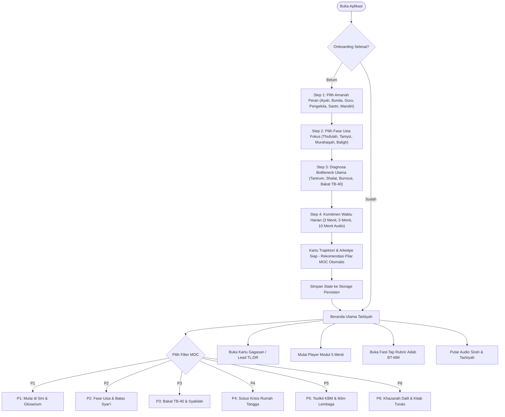

---

### B. Flowchart Persona Ayah (Qawwamun & Penegak Visi)
*Skenario: Ayah lelah pulang kerja, anak menolak shalat saat ditegur.*

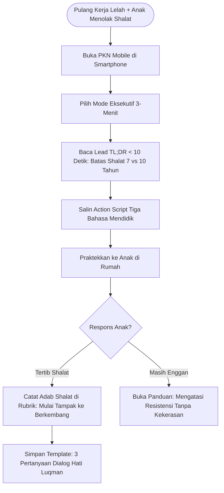

---

### C. Flowchart Persona Bunda (Madrasah Utama & Pengasuh Harian)
*Skenario: Balita usia 3 tahun tantrum hebat di lantai, ibu mengalami kelelahan batin (caregiver burnout).*

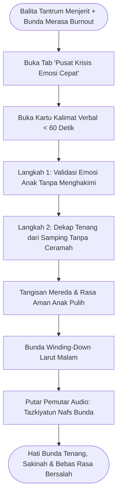

---

### D. Flowchart Persona Guru Fase Tamyiz (SD / Pendidik Adab KBM)
*Skenario: Menyiapkan pembiasaan shalat Zhuhur berjamaah dan mencatat observasi adab tanpa sistem ranking.*

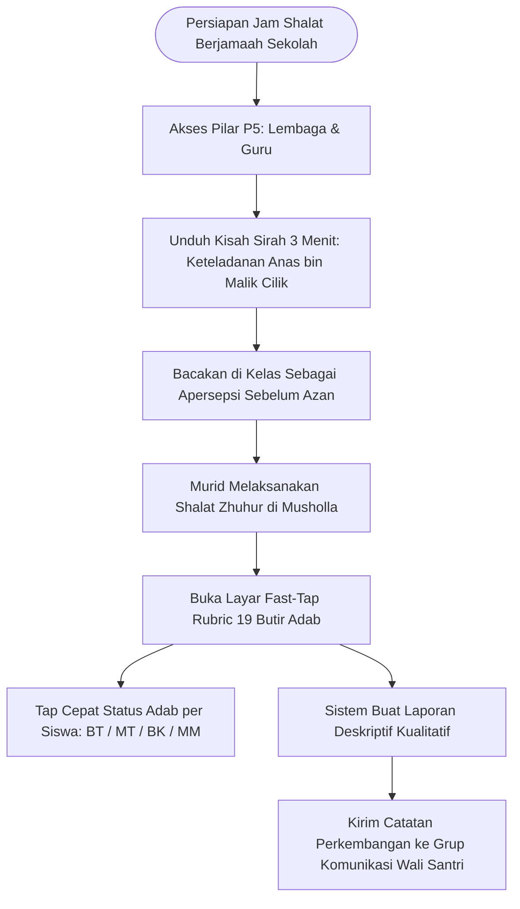

---

### E. Flowchart Persona Santri & Pemuda (Penjelajah Bakat TB-40)
*Skenario: Santri kelas 11 SMA gelisah memilih jurusan kuliah dan merasa tidak memiliki bakat menonjol.*

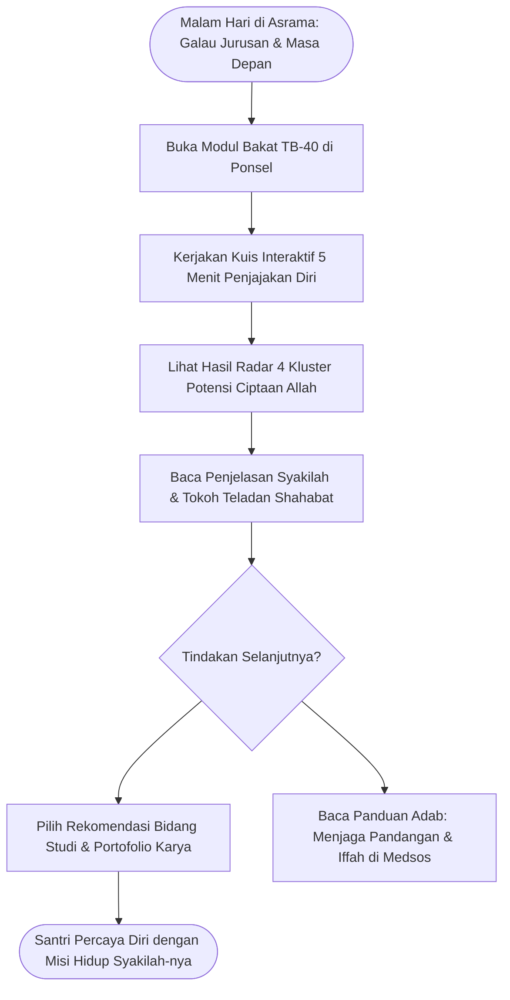

---

### F. Flowchart Persona Pengelola Lembaga Formal / Mudir (KOSP & Maqashid)
*Skenario: Rapat kerja tahunan menyusun program sekolah agar guru tidak mengalami institutional burnout.*

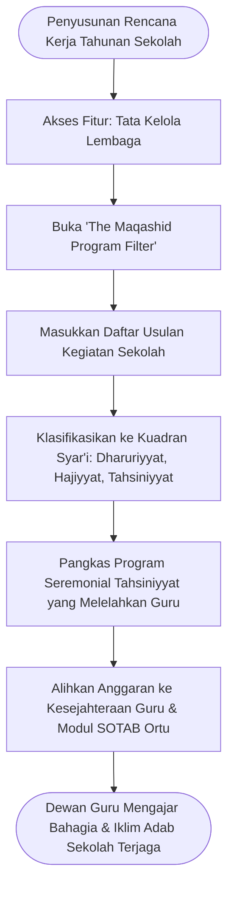

---

### G. Flowchart Persona Pembelajar Mandiri (Tazkiyatun Nafs & Sakinah)
*Skenario: Profesional kantor mengalami stres, mudah marah, dan merasa hampa secara spiritual.*

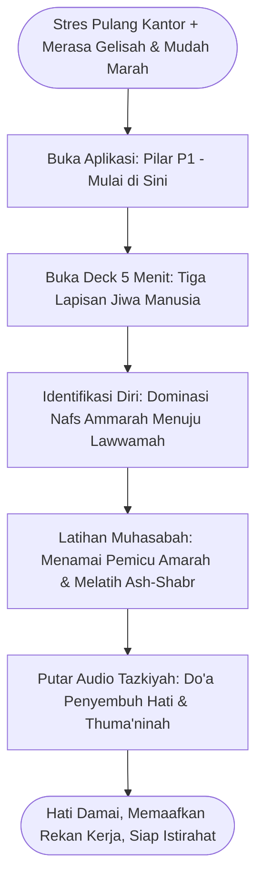

---

## 4. Showcase Desain Antarmuka (Figma & OpenPencil)

Desain antarmuka aplikasi dibangun mengikuti token visual yang ketat, kontras tinggi, dan ramah aksesibilitas (WCAG 2.1 AA target sentuh $\ge 48\times 48\text{ dp}$):

| Preview Screen | Nama Layar & Fungsi Kunci |
| :---: | :--- |
| 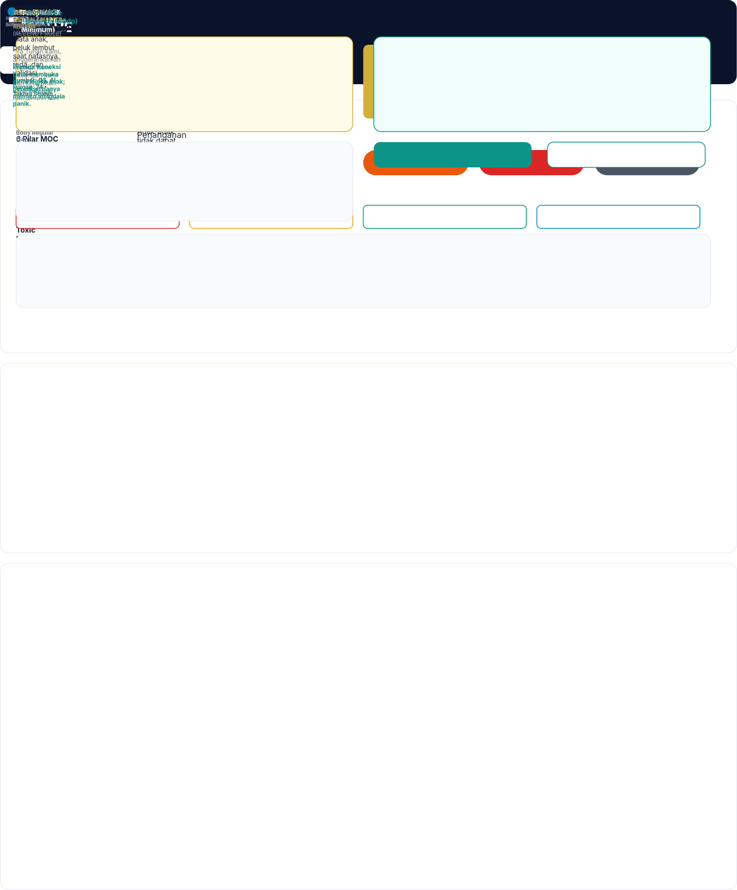 | **00. Design System & Typography Tokens**<br>Palette warna *Deep Charcoal* `#121417`, *Brand Gold* `#F59E0B`, sistem elevasi bayangan halus, dan tipografi Inter modern. |
| 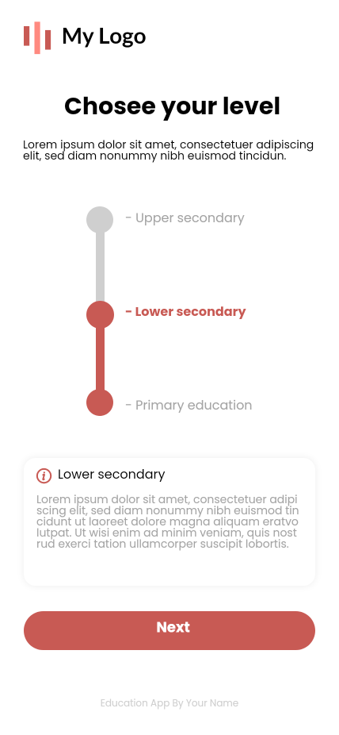 | **Screen 01. JTBD Diagnostic Onboarding**<br>Alur 4 langkah penentuan peran (Ayah, Bunda, Guru, dll.), fase usia, dan bottleneck mendesak untuk kurasi feed harian. |
| 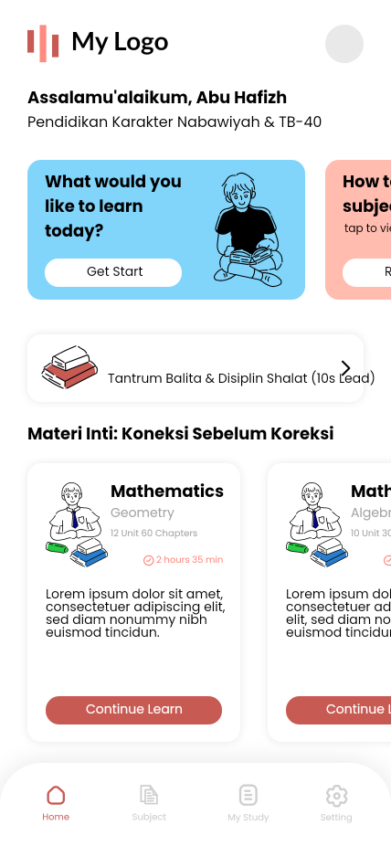 | **Screen 02. Beranda Tarbiyah & Filter 6 Pilar MOC**<br>Navigasi pilar MOC interaktif (P1 s.d. P6), kartu gagasan berfitur *Lead TL;DR*, tombol simpan bookmark, dan durasi baca. |
| 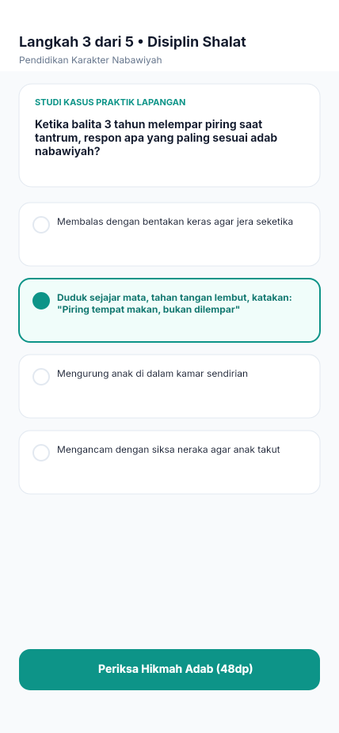 | **Screen 03. Pemain Modul Interaktif 5 Menit**<br>Format swipe deck vertikal: teks dalil berharakat, apersepsi sirah, simulasi kuis pilihan ganda, dan doa muhasabah. |
| 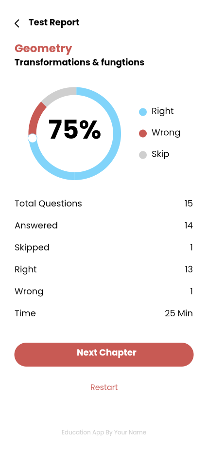 | **Screen 04. Fast-Tap Rubric & Laporan Adab Kualitatif**<br>Pelacakan 19 butir adab nabawiyah berbasis 4 level fitrah (**BT - MT - BK - MM**) tanpa poin angka yang mendiskriminasi. |
| 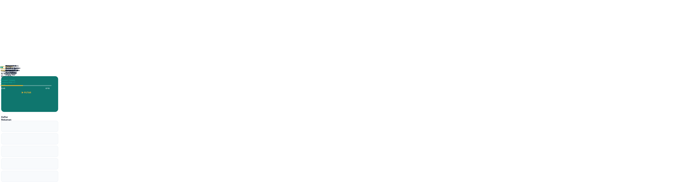 | **Screen 05. Pemutar Audio Sirah & Tazkiyah Hands-Free**<br>Pemutar audio terintegrasi dengan gelombang suara, kontrol mundur/maju 15 detik, serta transkrip kajian tersinkronisasi. |
| 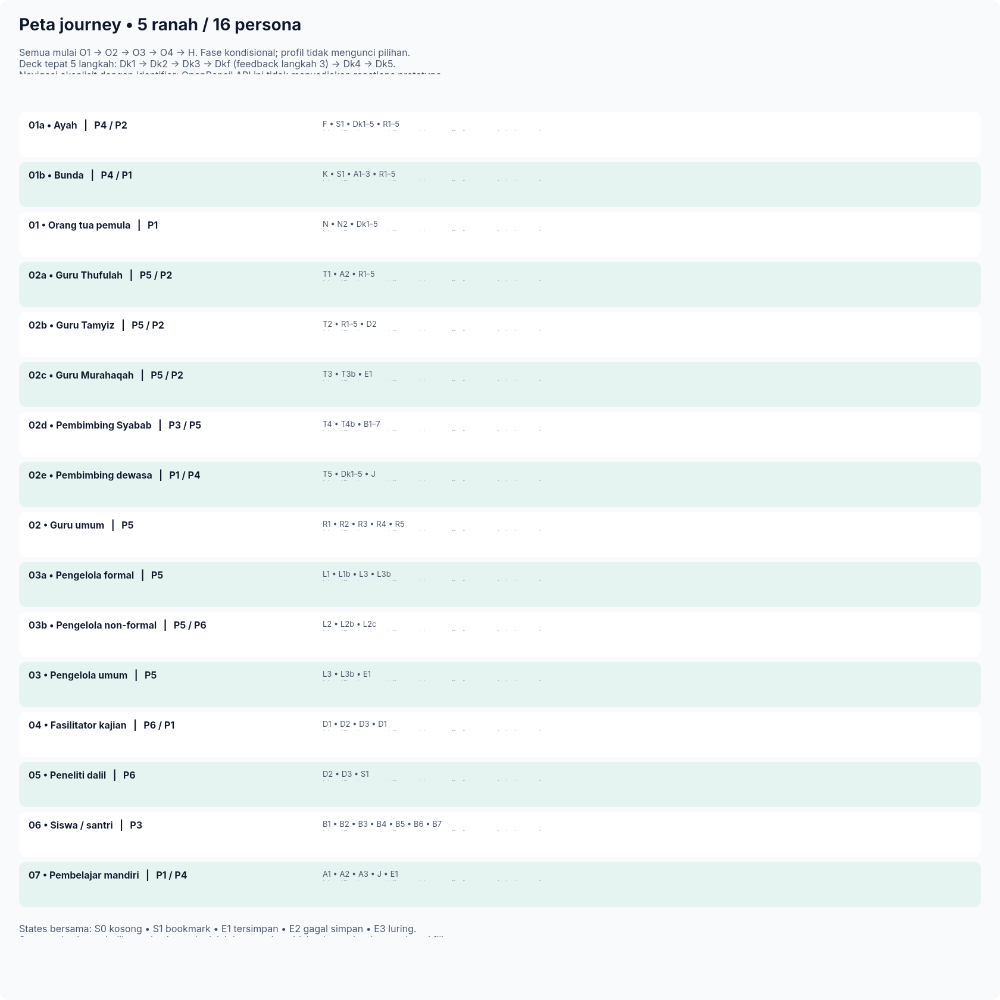 | **Parcours 16 Persona Master Map (`0:1627`)**<br>Peta SceneGraph Figma yang memetakan 53 layar spesifik untuk seluruh ranah persona (Keluarga, Guru, Lembaga, Dalil, Santri). |
| 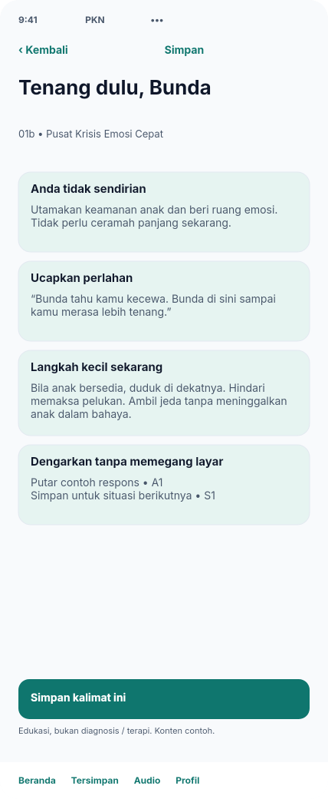 | **Layar Krisis Bunda — "Tenang Dulu, Bunda" (`0:325`)**<br>Protokol penanganan tantrum anak < 1 menit dengan validasi emosi dan dekapan tanpa ceramah. |
| 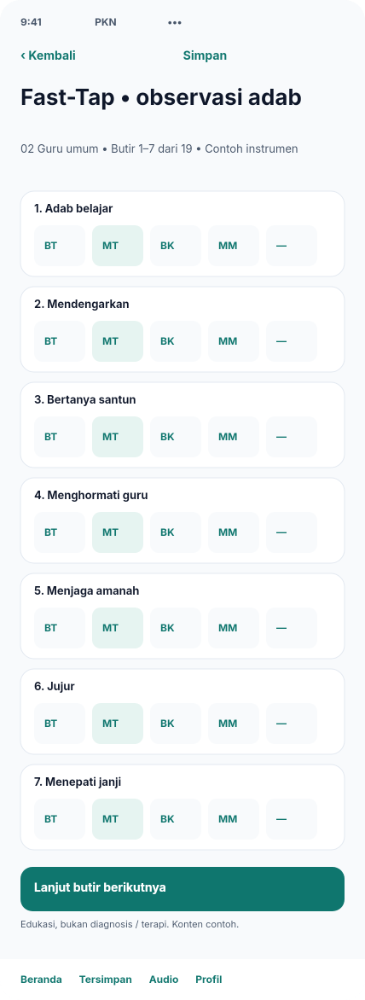 | **Layar Observasi Cepat Guru — Fast-Tap Rubric (`0:557`)**<br>Pencatatan adab 19 butir secara langsung di kelas tanpa kertas berserakan. |
| 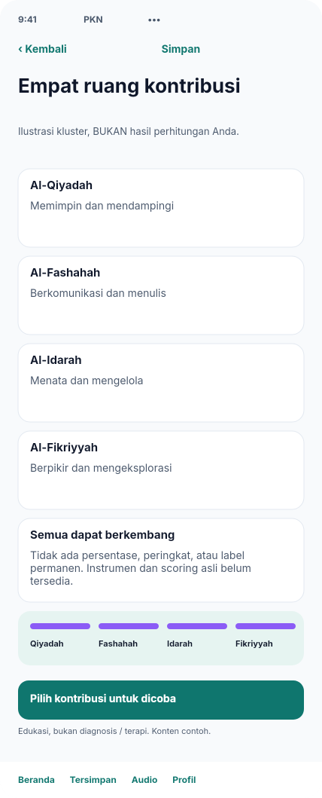 | **Layar Potensi Santri — 4 Kluster Bakat TB-40 (`0:1265`)**<br>Visualisasi 4 kluster (*Al-Qiyadah, Al-Fashahah, Al-Idarah, Al-Fikriyyah*) untuk pemetaan peran kontribusi syakilah. |

> Berkas desain master Figma SceneGraph tersimpan di [`design/PKN_Healing_App_Design.fig`](design/PKN_Healing_App_Design.fig). Dokumentasi lengkap 53 layar per persona tersedia di [`design/README.md`](design/README.md).

---

## 5. Arsitektur Simulasi Virtual & Gamifikasi (Flame + Bonfire + Rive)

Untuk menghadirkan modul gamifikasi simulasi kehidupan insan dan komunitas (*"Baitul Fitrah & Madinah Virtual"*) dalam **satu bundle Flutter terpadu** tanpa aplikasi terpisah, proyek ini mengadopsi tumpukan teknologi murni Dart paling ringan:

```
┌────────────────────────────────────────────────────────────────────────┐
│                   UNIFIED FLUTTER BUNDLE (ANDROID & iOS)               │
├───────────────────────────────────┬────────────────────────────────────┤
│     MODUL EDUKASI & UTILITY       │       MODUL SIMULASI & GAME        │
│  • Feed 6 Pilar MOC PKN           │  • 7 Venue Komunitas Virtual       │
│  • Micro-learning Deck 5 Menit    │  • Virtual Human (Tangki Cinta)    │
│  • Pemutar Audio Sirah Latar      │  • Simulasi Waktu Otonom (AFK)     │
│  • Fast-Tap Rubric 19 Butir Adab  │  • Skenario Pilihan Respons Adab   │
├───────────────────────────────────┴────────────────────────────────────┤
│                    FRAMEWORK GAME & ENGINE TERPILIH                    │
│ • FLAME ENGINE: Game loop 2D isometrik murni Dart (+3 MB APK)          │
│ • BONFIRE: Sistem pergerakan karakter, tabrakan, dialog & pencahayaan  │
│ • RIVE: Animasi vektor ekspresi jiwa (Tangki Cinta & Nafs, ~200 KB)    │
│ • ISAR DATABASE: Penyimpanan cepat luring untuk Welcome Back Ledger    │
│ • WORKMANAGER: Kalkulasi delta-time AFK ramah baterai saat offline     │
└────────────────────────────────────────────────────────────────────────┘
```

### Mengapa Framework Ini Dipilih?
1. **Paling Ringan di Android & iOS**: Tambahan ukuran instalasi hanya **~3–5 MB** (total aplikasi $< 40\text{ MB}$), sangat kontras dengan engine 3D berat seperti Unity yang membengkak $+70\text{ s.d. }120\text{ MB}$.
2. **Hemat RAM & Baterai**: Pemakaian RAM hanya **35–50 MB**, bebas panas perangkat, dan FPS stabil 60–120 FPS di perangkat entry-level.
3. **Ekspresi Jiwa yang Luwes (Rive State Machine)**: Parameter *Tangki Cinta* dan *Lapisan Jiwa (Nafs)* menggerakkan ekspresi wajah avatar (menangis tantrum, tersenyum haru, shalat, berpelukan) secara halus tanpa frame pecah.
4. **Interaksi Multi-Venue (Bonfire)**: Menavigasi 7 lokasi (Rumah, Sekolah, Masjid, Taman, Pasar, Asrama, Tetangga) dengan pathfinding otomatis dan sistem dialog *Bahasa Hati*.
5. **Simulasi Latar Belakang (Idle / AFK)**: Menggunakan algoritma *Timestamp Delta*—saat pemain kembali login, sistem menyajikan **"The Welcome Back Ledger"** berisi rekaman peristiwa adab dan krisis yang menunggu keputusan pemain tanpa menguras baterai saat ditinggal.

> Analisis teknis perbandingan lengkap dengan opsi 3D (Unity, Godot, Flutter Scene) dapat dipelajari di [`docs/TECH_STACK_GAME_ANALYSIS.md`](docs/TECH_STACK_GAME_ANALYSIS.md), dan rancangan skenario game di [`docs/GAME_CONCEPT_VIRTUAL_FITRAH.md`](docs/GAME_CONCEPT_VIRTUAL_FITRAH.md).

---

## 6. Struktur Direktori Proyek

Proyek ini menggunakan pola **Feature-First Clean Architecture** yang modular dan mudah diuji:

```text
PKN-healing-mobile-app/
├── lib/
│   ├── app/                                # Konfigurasi global & routing
│   │   ├── app.dart                        # MaterialApp dengan light/dark theme
│   │   ├── router/
│   │   │   ├── app_router.dart             # GoRouter declarative configuration
│   │   │   └── route_paths.dart            # Konstanta rute navigasi
│   │   └── theme/
│   │       ├── app_theme.dart              # Theme data generator
│   │       ├── color_palette.dart          # Palette warna hex kanonikal
│   │       ├── pkn_tokens.dart             # Spacing, radius, elevasi & durasi
│   │       └── typography.dart             # Konfigurasi GoogleFonts Inter
│   ├── core/                               # Komponen dan utilitas bersama
│   │   ├── network/
│   │   │   └── lesson_bundle_service.dart  # Offline JSON package bundle loader
│   │   ├── storage/
│   │   │   └── storage_service.dart        # SharedPreferences persistence layer
│   │   └── widgets/
│   │       ├── adab_badge.dart             # Badge status adab BT-MT-BK-MM
│   │       ├── arabic_dalil_card.dart      # Kartu teks Arab berharakat & takhrij
│   │       ├── domain_badge.dart           # Badge domain kategori
│   │       ├── moc_pilar_chip.dart         # Filter chip 6 Pilar MOC (P1 s.d. P6)
│   │       ├── pkn_audio_player_sheet.dart # Modal bottom sheet audio player
│   │       ├── pkn_button.dart             # Tombol interaktif aksesibel (>=48dp)
│   │       ├── pkn_callout_box.dart        # Kotak catatan & peringatan adab
│   │       ├── segmented_progress_bar.dart # Indikator kemajuan step onboarding
│   │       └── takeaway_badge.dart         # Tag intisari aksi praktis
│   ├── features/
│   │   ├── feed/                           # Beranda Tarbiyah & Eksplorasi MOC
│   │   │   ├── data/
│   │   │   │   ├── mock_ideas.dart         # Bank gagasan tarbiyah dengan Lead TL;DR
│   │   │   │   └── models/idea_card.dart   # Model domain kartu gagasan
│   │   │   └── presentation/
│   │   │       ├── controllers/            # FeedController & BookmarksProvider
│   │   │       ├── screens/feed_screen.dart# Tampilan beranda utama
│   │   │       └── widgets/                # IdeaCardWidget
│   │   ├── lessons/                        # Pemain Modul Pembelajaran 5 Menit
│   │   │   ├── data/                       # Mock lessons & JSON package parser
│   │   │   └── presentation/
│   │   │       ├── controllers/            # LessonPlayerController state machine
│   │   │       ├── screens/                # LessonPlayerScreen & AdabGrowthReport
│   │   │       └── widgets/cards/          # Step views (text, quiz, poll, blank)
│   │   ├── onboarding/                     # Diagnostik JTBD & Personalisasi
│   │   │   ├── data/jtbd_data.dart         # Bank kuesioner diagnosa 4 langkah
│   │   │   ├── domain/onboarding_state.dart# Logika pemetaan 6 kluster arketipe
│   │   │   └── presentation/screens/       # JTBDFlowScreen & ActivationalInsight
│   │   └── profile/                        # Profil Pengguna & Pengaturan
│   └── main.dart                           # Entrypoint aplikasi (Riverpod ProviderScope)
├── docs/
│   ├── USER_JOURNEYS.md                    # Peta komprehensif perjalanan 17 persona
│   └── personas/                           # 17 Berkas profil persona dari wiki-pkn
├── design/
│   ├── PKN_Healing_App_Design.fig          # Berkas master Figma SceneGraph
│   └── previews/                           # Hasil render resolusi tinggi antarmuka
├── test/                                   # Rangkaian pengujian unit & widget
│   └── features/
│       ├── feed/feed_controller_test.dart
│       ├── lessons/lesson_player_controller_test.dart
│       └── onboarding/onboarding_controller_test.dart
├── DESIGN_SYSTEM.md                        # Spesifikasi token desain lengkap
└── pubspec.yaml                            # Konfigurasi dependensi Flutter
```

---

## 7. Panduan Instalasi & Pengujian

### Prasyarat
* Flutter SDK versi 3.24 atau lebih tinggi
* Dart SDK versi 3.5 atau lebih tinggi

### Menjalankan Aplikasi
```bash
# 1. Unduh seluruh dependensi paket
flutter pub get

# 2. Periksa kualitas kode dan linting
flutter analyze

# 3. Jalankan seluruh rangkaian tes otomatis
flutter test

# 4. Jalankan aplikasi di emulator atau perangkat fisik
flutter run
```

---

## Kontribusi & Lisensi
Proyek ini dikembangkan secara terbuka untuk mendukung gerakan pendidikan keluarga dan generasi berkarakter nabawiyah. Seluruh konten manhaj bersumber dari kajian dan literatur **Pendidikan Karakter Nabawiyah (PKN)**.
