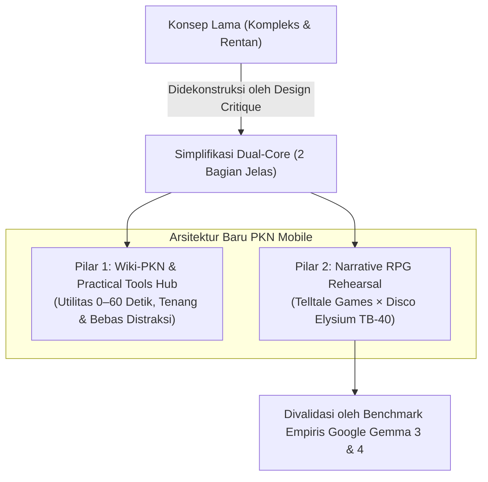

# 📑 Dokumentasi Komprehensif Temuan Riset & Arah Baru Produk
## *(Kritik Desain, Arsitektur Dual-Core, Mekanik TB-40 Disco Elysium, & Benchmark Google Gemma)*

> **Dokumen:** Rangkuman Resmi Hasil Riset, Pengujian, & Keputusan Arsitektur  
> **Tanggal:** 8 Oktober 2026  
> **Status:** Terverifikasi Secara Empiris & Siap Diintegrasikan ke Roadmap Proyek  
> **Repositori Terkait:** `PKN-healing-mobile-app` & `wiki-pkn`

---

## 1. Eksekutif Ringkasan: Transformasi Arah Produk

Melalui rangkaian analisis terhadap berkas-berkas terkini, pengujian kode, dan eksperimen kecerdasan buatan lokal, proyek PKN Healing Mobile App mengalami **titik balik strategis yang menyederhanakan visi besar menjadi produk yang realistis, aman, dan berdampak nyata**.

---

## 2. Empat Temuan Utama (Major Findings)

### Temuan 1: Kritik Desain, Beban Kognitif & Inkonsistensi Keamanan
*(Merujuk pada [`design/DESIGN_CRITIQUE.md`](../design/DESIGN_CRITIQUE.md) dan [`design/IDEA_REFINEMENT.md`](../design/IDEA_REFINEMENT.md))*

1. **Inkonsistensi Redaksi Keamanan (Temuan F1 - Tingkat Tinggi):**
   * Di dalam kode Flutter aktif ([`feed_screen.dart:187,270,275`](../prototype/v0/lib/features/feed/presentation/screens/feed_screen.dart)), ditemukan instruksi: *"hadirkan pelukan penenteram jiwa"* dan *"peluk saat ia marah"*. Ini bertentangan dengan kaidah penanganan tantrum anak (memaksakan kontak fisik saat anak meronta/disregulasi sensorik dapat mencederai anak dan memicu trauma).
   * Redaksi *"larangan keras memukul sebelum usia 10 tahun"* berisiko disalahpahami sebagai legalisasi pemukulan keras setelah usia 10 tahun. Perlu diselaraskan dengan batas syar'i: kelembutan diutamakan, sanksi fisik ringan setelah 10 tahun harus *ghairu mubarrih* (pantang melukai dan haram memukul wajah).
2. **Kebocoran Taksonomi Internal (Temuan F2):**
   * Pengguna disajikan kode internal engineering seperti `P1–P6`, `T1–T5`, `R1`, `L1–L3`, `D2`. Ini membingungkan orang tua yang butuh pertolongan darurat. Harus digantikan label tugas nyata (*Job-to-be-Done*).
3. **Risiko Etis Numerik Jiwa (Temuan F9):**
   * Persentase angka kaku pada *Tangki Cinta (misal: 20%)* atau label *Nafs Ammarah* pada anak nyata berisiko disalahartikan sebagai instrumen psikometrik atau vonis spiritual terhadap anak kandung.

---

### Temuan 2: Simplifikasi Menjadi Arsitektur Dual-Core
*(Merujuk pada [`docs/RISET_DUAL_CORE_WIKI_DAN_NARRATIVE_RPG.md`](RISET_DUAL_CORE_WIKI_DAN_NARRATIVE_RPG.md))*

Menghilangkan kebingungan antara kebutuhan "baca artikel/alat darurat" dan "bermain game kota virtual", aplikasi dipecah menjadi 2 modul independen:

1. **Pilar 1: Wiki-PKN & Practical Tools Hub:**
   * **Sumber Ilmu:** Ensiklopedia 6 Pilar MOC, 4 Fase Fitrah, 40 Bakat TB-40, Takhrij Dalil Al-Qur'an (Amiri font) & Hadits shahih.
   * **Tools Praktis:** *Lead TL;DR (< 10 Detik)* untuk krisis darurat, *Fast-Tap Rubric Adab (BT–MT–BK–MM)* untuk observasi non-shaming, *Pemutar Audio Sirah Hands-Free*, dan *Maqashid Program Filter*.
   * **Filosofi Antarmuka:** *Oiloil UI* — lapang, tenang (*calm tech*), bebas distraksi, teks 15–16pt, instan tanpa login.
2. **Pilar 2: Narrative RPG (Telltale × Disco Elysium Nabawiyah):**
   * Menggantikan engine game sandbox 2D yang berat dengan format **karya sastra interaktif**.
   * Pemain melatih empati pengasuhan melalui dilema relasional keluarga dengan konsekuensi nyata tanpa *Game Over*.

---

### Temuan 3: Transformasi Mekanik Skill Disco Elysium ke TB-40
*(Merujuk pada [`docs/RISET_MEKANIK_SKILL_DISCO_ELYSIUM_TB40.md`](RISET_MEKANIK_SKILL_DISCO_ELYSIUM_TB40.md))*

Sistem 24 skill Disco Elysium berhasil ditransformasikan secara sempurna ke dalam **40 Bakat Nabawiyah (TB-40)**:

1. **Suara Fitrah (The Voices of Syakilah):**
   * Bakat TB-40 bukan angka pasif, melainkan **suara batin yang bersuara di kepala karakter** (Ayah, Ibu, Guru, Santri).
2. **Dialektika Tazkiyatun Nafs (Sisi Ihsan vs Sisi Afat):**
   * *Sisi Ihsan:* Suara luhur saat bakat dibimbing oleh *Nafs Muthma'innah* (kelembutan, ketegasan syariat).
   * *Sisi Afat (Over-Investment):* Suara jebakan saat bakat dikuasai oleh *Nafs Ammarah* (misal: *Himmah* berubah menjadi riya' menuntut kesempurnaan anak, *Firaasah* berubah menjadi su'uzhan paranoid, *Syajaa'ah* berubah menjadi ghadhab/kemarahan).
3. **Mekanik Gameplay:**
   * **Passive Checks:** Bakat bersuara otomatis di teks dialog saat mendeteksi situasi tersembunyi.
   * **Debat Antar-Bakat:** Bakat ketegasan (*Al-Qiyadah*) berdebat dengan bakat kasih sayang (*Al-Fashahah*) di batin pemain.
   * **Active Checks (2D6):** White Check (bisa diulang setelah wudhu/istighfar) & Red Check (keputusan krusial).
   * **Kabinet Muhasabah (Thought Cabinet):** Internalisasi konsep tarbiyah (misal: *"Koneksi Sebelum Koreksi"*) yang membuka opsi dialog tier terbaik (*Mumtaz*).
   * **Jalur Islah & Rekonsiliasi (No Game Over):** Respon salah membuka cabang pemulihan dan naskah minta maaf kepada anak.

---

### Temuan 4: Validasi Empiris Model AI Google (Gemma 3 & Gemma 4)
*(Merujuk pada [`docs/LAPORAN_PENGUJIAN_GEMMA3_TB40.md`](LAPORAN_PENGUJIAN_GEMMA3_TB40.md))*

Eksperimen benchmark lokal menggunakan Ollama untuk mensimulasikan perdebatan antar-bakat TB-40 menghasilkan temuan teknis yang sangat jelas:

| Model yang Diuji | Ukuran | Kecepatan | Kualitas Peran TB-40 | Status & Kesimpulan |
|---|---|---|---|---|
| **`gemma3:270m`** | 291 MB | 93.8 t/s | ❌ Gagal (*Mode collapse* & membocorkan prompt) | **Tidak layak** untuk roleplay kepribadian adab. |
| **`gemma3:1b`** | 815 MB | 36.0 t/s | ✅ **Berhasil Luar Biasa** (tajam, puitis, membedakan watak) | **Rekomendasi Utama untuk On-Device / Edge**. |
| **`gemma4:e2b`** | 4.6 GB | ~15–20 t/s | 💎 **Sastrawi & Filosofis Mendalam** | **Rekomendasi Terbaik untuk Studio Pipeline**. |

**Contoh Kutipan Asli Debat Batin yang Dihasilkan:**
> ⚡ **SYAJAA'AH:** *"Kasih sayang tidak menggugurkan kewajiban. Shalat adalah pondasi, bukan pilihan..."*  
> 🕊️ **RIFQ:** *"Ayah, tarik napas dulu. Zaid sedang fokus pada dunianya, kita sambut dulu dengan kelembutan. Ingat, kasih sayang kita adalah kunci..."*  
> 🧠 **HIKMAH (Penengah):** *"Dengarkan keduanya. Tegaslah dalam prinsip, lembutlah dalam cara. Ayah segera dekati Zaid, katakan dengan tenang namun tegas: 'Zaid, sekarang waktunya shalat. Ayah dan kamu shalat bersama, ya.'"*

---

## 3. Peta Berkas & Dokumen Terkait

Berikut adalah direktori seluruh dokumen riset dan artefak yang telah dibuat dan terhubung:

| Topik / Deliverable | Lokasi Berkas | Keterangan |
|---|---|---|
| **Riset Dual-Core Blueprint** | [`docs/RISET_DUAL_CORE_WIKI_DAN_NARRATIVE_RPG.md`](RISET_DUAL_CORE_WIKI_DAN_NARRATIVE_RPG.md) | Cetak biru pemisahan Wiki-Tools vs Narrative RPG |
| **Mekanik TB-40 Disco Elysium** | [`docs/RISET_MEKANIK_SKILL_DISCO_ELYSIUM_TB40.md`](RISET_MEKANIK_SKILL_DISCO_ELYSIUM_TB40.md) | Spesifikasi antropomorfis 40 bakat & sistem cek adab |
| **Laporan Uji Coba Gemma 3** | [`docs/LAPORAN_PENGUJIAN_GEMMA3_TB40.md`](LAPORAN_PENGUJIAN_GEMMA3_TB40.md) | Hasil benchmark kuantitatif & kualitatif model 270m vs 1b |
| **Contoh Skenario JSON Graph** | [`prototype/v0/assets/data/scenarios/skenario_krisis_shalat_rumah.json`](../prototype/v0/assets/data/scenarios/skenario_krisis_shalat_rumah.json) | Struktur data luring skenario POV Relay & Jalur Islah |
| **Data Mentah Benchmark 1B** | `scratch/benchmark_gemma3_1b.json` (lokal) | Log lengkap latensi, token/sec, dan teks respon gemma3:1b |
| **Data Mentah Benchmark 270M** | `scratch/benchmark_gemma3_270m.json` (lokal) | Log lengkap pengujian gemma3:270m |
| **Script Eksekutor Benchmark** | `scratch/run_gemma3_benchmarks.py` (lokal) | Script Python penguji otomatis multi-turn Ollama |
| **Handoff & Roadmap Utama** | [`TODO_HANDOFF.md`](../TODO_HANDOFF.md) | Panduan pengembang dan daftar tugas fase berjalan |

---

## 4. Rencana Tindak Lanjut (Next Action Plan)

Berdasarkan seluruh temuan di atas, langkah kerja berikutnya dikelompokkan dalam skala prioritas:

1. **Prioritas 0 (Penyelarasan Keamanan & Konten Segera):**
   * Perbaiki redaksi instruksi penanganan krisis di [`feed_screen.dart`](../prototype/v0/lib/features/feed/presentation/screens/feed_screen.dart) (hindari pemaksaan pelukan saat anak marah; perjelas formulasi usia 10 tahun).
2. **Prioritas 1 (Arsitektur Engine Data Naratif di Flutter):**
   * Buat model Dart dan parser unit test untuk struktur data [`skenario_krisis_shalat_rumah.json`](../prototype/v0/assets/data/scenarios/skenario_krisis_shalat_rumah.json) di bawah direktori `prototype/v0/lib/features/narrative/`.
3. **Prioritas 2 (Antarmuka Dialog Split-Viewport):**
   * Rancang widget panel monolog batin Flutter native (menampilkan suara bakat TB-40, pilihan berjenjang Mumtaz s.d. Munkar, dan popover *Educational Tooltip* dalil saat opsi terkunci).
4. **Prioritas 3 (Penyederhanaan Navigasi Aplikasi):**
   * Atur bottom navigation bar Flutter menjadi 2 gerbang utama: **Khazanah & Tools** (Wiki-PKN) dan **Cerita Fitrah** (Narrative RPG).
