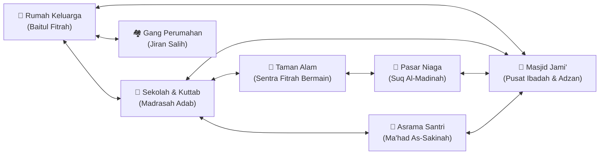
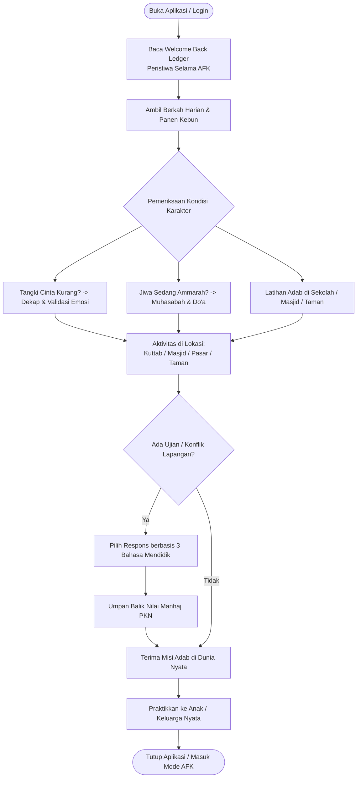
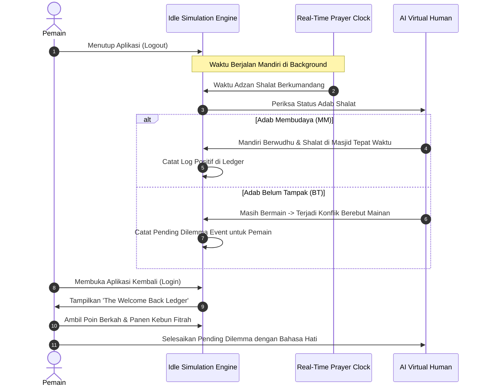

# Game Design Document (GDD): "Baitul Fitrah & Madinah Virtual"
### Simulasi Kehidupan Insan, Komunitas Sosial & Idle AFK Tarbiyah Nabawiyah

> **Status:** Dokumen Konsep & Rancangan Arsitektur Gamifikasi  
> **Target Platform:** Mobile (iOS / Android) & Web Companion  
> **Genre:** *Life Simulation*, *Virtual Human & Family Care*, *Idle / AFK Social Simulation*, *Edutainment Syar'i*  
> **Inspirasi Mekanik:** *The Sims* (dinamika ruang & komunitas), *Tamagotchi / Virtual Pet* (kelekatan batin & pengasuhan personal), *Animal Crossing* (ketenangan ritme & interaksi warga), *Fallout Shelter / Neko Atsume* (simulasi otonom saat pemain *offline/AFK*).

---

## Daftar Isi
1. [Visi & Filosofi Gamifikasi Syar'i](#1-visi--filosofi-gamifikasi-syari)
2. [Anatomi & Dinamika Karakter (Virtual Human)](#2-anatomi--dinamika-karakter-virtual-human)
   - [Parameter Vital Fitrah (Kebutuhan Hidup)](#parameter-vital-fitrah-kebutuhan-hidup)
   - [4 Fase Tumbuh Kembang Karakter](#4-fase-tumbuh-kembang-karakter)
   - [Pohon 40 Bakat Nabawiyah (TB-40)](#pohon-40-bakat-nabawiyah-tb-40)
3. [Peta Wilayah & Multi-Venue Simulation](#3-peta-wilayah--multi-venue-simulation)
   - [Venue 1: Rumah Keluarga (Baitul Fitrah)](#venue-1-rumah-keluarga-baitul-fitrah)
   - [Venue 2: Sekolah & Kuttab (Madrasah Adab)](#venue-2-sekolah--kuttab-madrasah-adab)
   - [Venue 3: Masjid Jami' & Menara Adzan](#venue-3-masjid-jami--menara-adzan)
   - [Venue 4: Taman Alam & Sentra Fitrah (Hadiqatul Fitrah)](#venue-4-taman-alam--sentra-fitrah-hadiqatul-fitrah)
   - [Venue 5: Pasar & Sentra Niaga Syar'i (Suq Al-Madinah)](#venue-5-pasar--sentra-niaga-syari-suq-al-madinah)
   - [Venue 6: Asrama Pesantren (Ma'had As-Sakinah)](#venue-6-asrama-pesantren-mahad-as-sakinah)
   - [Venue 7: Lingkungan Tetangga & Gang Perumahan (Jiran Salih)](#venue-7-lingkungan-tetangga--gang-perumahan-jiran-salih)
4. [Sistem AFK (Away From Keyboard) & Simulasi Otonom](#4-sistem-afk-away-from-keyboard--simulasi-otonom)
   - [Siklus Waktu Nyata (Real-Time Living Clock)](#siklus-waktu-nyata-real-time-living-clock)
   - [AI Karakter Mandiri Berdasarkan Level Adab](#ai-karakter-mandiri-berdasarkan-level-adab)
   - [Buku Kejadian Saat Kembali (The Welcome Back Ledger)](#buku-kejadian-saat-kembali-the-welcome-back-ledger)
5. [Mekanik "Real-to-Virtual Bridge" (Anti-Kecanduan Layar)](#5-mekanik-real-to-virtual-bridge-anti-kecanduan-layar)
6. [Diagram Alur & Loop Gameplay](#6-diagram-alur--loop-gameplay)
   - [Core Gameplay Loop](#a-core-gameplay-loop)
   - [Alur AFK & Welcome Back Ledger](#b-alur-afk--welcome-back-ledger)
7. [Roadmap Pengembangan Bertahap](#7-roadmap-pengembangan-bertahap)

---

## 1. Visi & Filosofi Gamifikasi Syar'i

### Pergeseran Paradigma dari Game Konvensional
Mayoritas game simulasi kehidupan (*The Sims*) dibangun di atas pilar materialisme barat: mengumpulkan uang sebanyak-banyaknya (*Simoleons*), membeli perabotan mewah, mengejar karier korporat, dan membiarkan interaksi sosial tanpa batas aurat dan adab.

**"Baitul Fitrah & Madinah Virtual"** membalik paradigma tersebut:
1. **Tujuan Hakiki**: Membangun manusia yang beradab, menenteramkan jiwa (*Tazkiyatun Nafs*), dan menciptakan ekosistem komunitas yang saling tolong-menolong dalam kebaikan.
2. **Anti-Guilt & Anti-Addiction**: Game tidak menghukum pemain dengan *streak loss* atau kematian karakter karena ditinggal offline. Sebaliknya, game ini dirancang dengan mekanisme **Idle / AFK** yang penuh kasih, di mana dunia virtual terus bernafas dengan damai mengikuti ritme ibadah.
3. **Screen-to-Real-Life Catalyst**: Kemenangan di dalam game diukur dari seberapa harmonis hubungan nyata pemain dengan anak, pasangan, murid, dan tetangga di dunia nyata.

---

## 2. Anatomi & Dinamika Karakter (Virtual Human)

Karakter dalam game ini bukan sekadar objek pixel, melainkan representasi jiwa insan yang memiliki lapisan ruh, jasad, nafs, akal, dan qalb.

```
                  ┌───────────────────────────────┐
                  │    ANATOMI VIRTUAL HUMAN      │
                  └──────────────┬────────────────┘
                                 │
         ┌───────────────────────┼───────────────────────┐
         ▼                       ▼                       ▼
┌─────────────────┐     ┌─────────────────┐     ┌─────────────────┐
│   TANGKI CINTA  │     │   BAROMETER NAFS│     │  ADAB KUALITATIF│
│  (Love Tank %)  │     │  (Kondisi Jiwa) │     │   (BT-MT-BK-MM) │
│ • Pelukan Fisik │     │ • Nafs Ammarah  │     │ • 19 Butir Adab │
│ • Tatapan Kasih │     │ • Nafs Lawwamah │     │ • Keteraturan   │
│ • Validasi Hati │     │ • Muthmainnah   │     │ • Kejujuran     │
└─────────────────┘     └─────────────────┘     └─────────────────┘
         │                       │                       │
         └───────────────────────┼───────────────────────┘
                                 │
         ┌───────────────────────┴───────────────────────┐
         ▼                                               ▼
┌─────────────────────────────────┐     ┌─────────────────────────────────┐
│     4 FASE USIA TUMBUH FITRAH   │     │    40 BAKAT NABAWIYAH (TB-40)   │
│ • Thufulah  : Fitrah Bermain    │     │ • Al-Qiyadah   (Memimpin)       │
│ • Tamyiz    : Tertib Shalat     │     │ • Al-Fashahah  (Komunikasi)     │
│ • Murahaqah : Batas Malu/Kasur  │     │ • Al-Idarah    (Manajemen)      │
│ • Syabab    : Kematangan Mukallaf│    │ • Al-Fikriyyah (Strategi)       │
└─────────────────────────────────┘     └─────────────────────────────────┘
```

### Parameter Vital Fitrah (Kebutuhan Hidup)

1. **Tangki Cinta (*Love Tank*) [0% – 100%]**:
   * Menunjukkan tingkat kelekatan emosional (*attachment*) anak dengan orang tua atau murid dengan gurunya.
   * *Jika Tangki Cinta < 30%*: Avatar anak mudah menangis, tantrum, membanting mainan, atau menarik diri dari pergaulan.
   * *Cara Mengisi*: Didekati avatar orang tua, diberikan dekapan (*Bahasa Tubuh*), kontak mata lembut (*Bahasa Mata*), dan mendengarkan keluh kesahnya (*Bahasa Hati*).
2. **Barometer Kondisi Jiwa (*Nafs State*)**:
   * **Nafs Ammarah (Warna Merah)**: Hati didominasi hawa nafsu, amarah meledak, keras kepala, egois.
   * **Nafs Lawwamah (Warna Kuning/Emas)**: Muncul rasa penyesalan setelah berbuat salah, mulai mau mendengarkan nasihat, ada dorongan muhasabah.
   * **Nafs Muthmainnah (Warna Hijau Zamrud)**: Hati tenang (*thuma'ninah*), ridha, santun beradab, bersemangat dalam ibadah dan membantu sesama.
3. **Adab Kualitatif Meter (19 Butir Adab Nabawiyah)**:
   * Menggantikan status exp/leveling game konvensional. Setiap adab diukur melalui 4 tahapan fitrah:
     * **BT** (*Belum Tampak*): Belum memiliki kesadaran adab tersebut.
     * **MT** (*Mulai Tampak*): Muncul jika ada stimulasi atau pengingat orang tua.
     * **BK** (*Berkembang*): Muncul secara mandiri di sebagian besar waktu.
     * **MM** (*Membudaya*): Telah menjadi karakter alami tanpa perlu diingatkan lagi.
4. **Kebugaran Jasmani & Thaharah**:
   * Energi fisik, status suci wudhu, kebersihan pakaian, serta ritme istirahat tidur siang (*qailulah*).

### 4 Fase Tumbuh Kembang Karakter
Avatar bertumbuh melalui 4 fase usia dengan kebutuhan pedagogis unik:
* **Fase Thufulah (Usia 2–7 Tahun)**: Membutuhkan ruang bermain luas, cerita dongeng sirah nabi, interaksi sentuhan penuh kasih sayang; dilarang keras diberi sanksi disiplin fisik.
* **Fase Tamyiz (Usia 7–10 Tahun)**: Membutuhkan pembiasaan shalat 5 waktu yang menggembirakan, pelatihan adab makan dan berbicara, pembiasaan tidur tepat waktu.
* **Fase Murahaqah (Usia 10–14 Tahun)**: Membutuhkan privasi kamar terpisah antara putra dan putri (*farriqu fil madhaji'*), pendampingan perubahan hormon pubertas, serta penegakan batas kedisiplinan yang tegas dan berwibawa.
* **Fase Syabab (Usia 14–18+ Tahun)**: Kematangan aqil baligh mukallaf, penjagaan pandangan (*iffah*), kemandirian ekonomi/sosial, dan penemuan arah karya masa depan (*syakilah*).

### Pohon 40 Bakat Nabawiyah (TB-40)
Setiap avatar memiliki kombinasi unik dari 40 bakat fitrah yang dikelompokkan ke dalam 4 kuadran:
* **Al-Qiyadah (Kepemimpinan & Keberanian)**: Cocok menjadi ketua kelompok di kelas, imam shalat, atau koordinator kegiatan sosial.
* **Al-Fashahah (Komunikasi & Diplomasi)**: Berbakat dalam bercerita, menulis jurnal, menyampaikan khutbah, atau mendamaikan pihak yang berselisih.
* **Al-Idarah (Keteraturan & Manajemen)**: Rapih menyusun jadwal, teliti dalam merawat barang, jujur dalam mengelola uang saku di kantin kejujuran.
* **Al-Fikriyyah (Analisis, Sains & Renungan)**: Senang meneliti fenomena alam, merenungkan ayat kauniyah di kebun, memecahkan teka-teki logika.

---

## 3. Peta Wilayah & Multi-Venue Simulation

Pemain dapat memantau dan mengarahkan interaksi avatar di 7 lokasi komunitas utama yang saling terhubung:



---

### Venue 1: Rumah Keluarga (*Baitul Fitrah*)
Pusat kehangatan dan pondasi pertama peradaban anak.
* **Zona Ruang Keluarga**:
  * Meja makan adab (makan dengan tangan kanan, membaca basmalah, zona bebas gadget).
  * Karpet dialog hati: tempat Ayah menyimak cerita harian anak dan Bunda memulihkan energi batin.
* **Zona Kamar Tidur Syar'i**:
  * Mekanik pemisahan tempat tidur (*madhaji'*): saat avatar genap usia 10 tahun, pemain harus menata kamar terpisah untuk anak laki-laki dan perempuan. Jika belum dipisah, indikator *Rasa Malu (Haya')* akan berkedip kuning.
  * Meja belajar dan pojok membaca do'a sebelum tidur.
* **Zona Musholla Rumah**:
  * Tempat latihan adzan anak laki-laki, shalat sunnah bersama keluarga, dan halaqah subuh membaca surah pendek.

---

### Venue 2: Sekolah & Kuttab (*Madrasah Adab*)
Pusat penempaan adab penuntut ilmu (*Adab Thalabul Ilmi*).
* **Ruang Kelas Halaqah**:
  * Meja disusun melingkar/lesehan. Guru menyampaikan apersepsi kisah sirah 5 menit.
  * Interaksi: Murid mengangkat tangan dengan santun saat bertanya; guru menegur kesalahan tanpa mempermalukan di depan kelas.
* **Kantin Kejujuran (*Honesty Canteen*)**:
  * Avatar anak mengambil makanan sehat dan memasukkan koin uang saku sendiri ke kotak amanah.
  * *Ujian Integritas*: Bila Tangki Cinta anak rendah, ada peluang avatar tergoda mengambil lebih tanpa membayar. Pemain diuji untuk menanganinya dengan dialog tabayyun di ruang konseling.
* **Ruang Bimbingan & Konseling (*Ghurfatun Nashihah*)**:
  * Tempat guru memanggil murid dan orang tua untuk menyelaraskan catatan portofolio adab naratif.

---

### Venue 3: Masjid Jami' & Menara Adzan
Jantung spiritual seluruh komunitas virtual.
* **Shaf Shalat Berjamaah**:
  * Setiap masuk waktu shalat nyata (Subuh, Dzuhur, Ashar, Maghrib, Isya), masjid berbunyi adzan merdu.
  * Avatar warga dan anak-anak berbondong-bondong berjalan ke masjid dengan tenang (*sakinah*).
* **Menara Muadzin Cilik**:
  * Anak fase Tamyiz yang memiliki capaian adab tinggi berkesempatan terpilih menjadi muadzin cilik, mengumandangkan adzan di kampung virtual.
* **Selasar Halaqah Al-Qur'an**:
  * Tempat anak-anak belajar makhraj huruf dan talaqqi dengan asatidzah berakhlak mulia.

---

### Venue 4: Taman Alam & Sentra Fitrah (*Hadiqatul Fitrah*)
Sentra pembelajaran fitrah alam bebas tanpa sekat dinding.
* **Zona Bermain Bebas Balita (Thufulah)**:
  * Kolam pasir, lumpur alamiah, batang pohon panjat, dan ayunan kayu.
  * Balita diizinkan kotor secara sehat; sistem menghargai stimulasi motorik kasar dan rasa ingin tahu alamiah (*fitrah eksplorasi*).
* **Kebun Nabawiyah & Tanaman Obat**:
  * Pohon kurma, tin, zaitun, delima, dan bidara.
  * Anak-anak merawat tanaman, menyiram bibit, dan belajar menghargai tanda-tanda kebesaran Allah (*Ayat Kauniyah*).
* **Arena Olahraga Sunnah**:
  * Lintasan lari ketangkasan, arena memanah busur tradisional, dan kolam renang dengan jadwal terpisah antara ikhwan dan akhwat.

---

### Venue 5: Pasar & Sentra Niaga Syar'i (*Suq Al-Madinah*)
Tempat aktivasi bakat TB-40 dan perniagaan berkeberkahan.
* **Lapak Wirausaha Santri**:
  * Pemuda fase Syabab memamerkan hasil karya mereka (kerajinan tangan, roti halal, buku catatan sirah, madu murni).
* **Pojok Muamalah Bebas Riba**:
  * Menampilkan adab jual-beli: tidak mengurangi timbangan, saling meridhai, dan membagi sebagian keuntungan ke kas baitul mal komunitas.

---

### Venue 6: Asrama Pesantren (*Ma'had As-Sakinah*)
Simulasi kemandirian hidup santri di lingkungan berasrama.
* **Kamar Santri & Ranjang Tertib**:
  * Membiasakan bangun sebelum subuh, merapikan selimut, dan menjaga kebersihan kamar mandi bersama.
* **Ruang Mediasi Konflik Remaja**:
  * Saat terjadi perselisihan antar santri usia 12–14 tahun, musyrif asrama menggunakan prosedur mediasi PKN: tabayyun fakta, meredam emosi ammarah, dan membangun rekonsiliasi jiwa.

---

### Venue 7: Lingkungan Tetangga & Gang Perumahan (*Jiran Salih*)
Panggung interaksi sosial bertetangga (*Huququl Jiwar*).
* **Jalur Mengantar Makanan**:
  * Avatar Bunda atau anak mengantarkan semangkuk kuah masakan ke rumah tetangga terdekat sesuai anjuran nabawiyah.
* **Pos Ronda & Menjenguk Tetangga Sakit**:
  * Warga saling menyapa dengan salam, menanyakan kabar tetangga yang beberapa hari tidak terlihat di masjid, dan menjenguk yang tertimpa musibah.

---

## 4. Sistem AFK (Away From Keyboard) & Simulasi Otonom

Fitur ini menjawab kebutuhan utama pengguna: **mereka tidak harus terus-menerus menatap layar HP**. Kehidupan di kampung virtual terus berdenyut secara alamiah di latar belakang (*background execution*).

```
   ┌────────────────────────────────────────────────────────┐
   │          PEMAIN MENUTUP APLIKASI (PERGI AFK)           │
   └──────────────────────────┬─────────────────────────────┘
                              │
                              ▼
   ┌────────────────────────────────────────────────────────┐
   │           SIMULASI OTONOM BERJALAN DI LATAR            │
   │  • Jam virtual berdetik sinkron waktu nyata            │
   │  • Avatar beraktivitas mengikuti tingkat adab          │
   │  • Dinamika sekolah, masjid, dan rumah terjadi mandiri │
   └──────────────────────────┬─────────────────────────────┘
                              │
                              ▼
   ┌────────────────────────────────────────────────────────┐
   │           PEMAIN MEMBUKA APLIKASI KEMBALI              │
   └──────────────────────────┬─────────────────────────────┘
                              │
                              ▼
   ┌────────────────────────────────────────────────────────┐
   │       LAYAR SINEMATIK: THE WELCOME BACK LEDGER         │
   │  1. Rekap Peristiwa Adab (Pagi/Siang/Sore)             │
   │  2. Krisis / Dilema yang Menunggu Keputusan Pemain     │
   │  3. Pengumpulan Berkah, Panen Kebun, & Jurnal Jiwa     │
   └────────────────────────────────────────────────────────┘
```

### Siklus Waktu Nyata (*Real-Time Living Clock*)
* Game sinkron dengan jam lokal perangkat.
* Pada jam 04.30 (Subuh), lampu-lampu rumah menyala, lentera menyala di jalan setapak menuju masjid.
* Pada jam 07.00, tas sekolah tersandang, avatar berjalan riang menuju Kuttab.
* Pada jam 12.30, aktivitas pasar rehat sejenak untuk menunaikan shalat Zhuhur dan istirahat *qailulah*.
* Pada jam 21.00, seluruh lampu rumah redup, ayat kursi terlantun pelan, dan suasana kampung hening menenteramkan.

### AI Karakter Mandiri Berdasarkan Level Adab
Bagaimana avatar bersikap saat pemain sedang AFK ditentukan oleh **Tingkat Adab** yang berhasil ditumbuhkan sebelumnya:

| Status Adab Anak | Perilaku Otonom Saat Pemain AFK (Misal: Jam Shalat Zhuhur) |
| :--- | :--- |
| **BT (Belum Tampak)** | Avatar masih asyik bermain bola di halaman sekolah sampai bel bunyi tiga kali; perlu dipanggil guru; shalat terburu-buru. |
| **MT (Mulai Tampak)** | Avatar berhenti bermain saat mendengar adzan, namun menunggu temannya mengajak berwudhu; shalat tertib jika ada guru mendampingi. |
| **BK (Berkembang)** | Avatar bergegas mengambil wudhu sendiri begitu adzan usai; menata sandalnya rapi di rak musholla; khusyuk shalat. |
| **MM (Membudaya)** | Avatar berinisiatif mengajak adik kelasnya berwudhu, merapikan shaf makmum yang renggang, dan berdzikir tenang setelah salam. |

### Buku Kejadian Saat Kembali (*The Welcome Back Ledger*)
Ketika pemain membuka aplikasi setelah berjam-jam offline, game menampilkan lembar jurnal estetik (*newspaper / narrative scroll*) yang menceritakan dinamika yang terjadi:

1. **Laporan Peristiwa Indah (*Sakinah Moments*)**:
   * *"Pukul 07.15: Zaid meletakkan sepatunya di rak sekolah tanpa disuruh guru. (Adab Keteraturan +1 MT $\rightarrow$ BK)."*
   * *"Pukul 13.00: Maryam membagikan separuh bekal rotinya kepada teman yang lupa bawa uang saku di Kuttab."*
2. **Dilema yang Menunggu Arahan Pemain (*Pending Decision Events*)**:
   * *"Pukul 16.30: Terjadi perselisihan di taman bermain! Ayunan diperebutkan antara Zaid dan anak tetangga. Zaid sedang menahan tangis dan menunggu nasihat Bunda."*
   * $\rightarrow$ **Pemain masuk ke mode interaktif untuk memilih kalimat respons Bahasa Hati**.
3. **Koleksi Barakah & Hasil Panen Fitrah**:
   * Mengumpulkan tetesan embun keberkahan (*Barakah Dews*), hasil panen pohon kurma/zaitun di kebun, dan catatan jurnal muhasabah yang ditulis avatar remaja semalam.

---

## 5. Mekanik "Real-to-Virtual Bridge" (Anti-Kecanduan Layar)

Game ini memegang prinsip ketat: **dunia virtual hanyalah cermin pembantu; dunia nyata adalah tempat pembuktian sesungguhnya.**

```
                     ┌───────────────────────────────┐
                     │          DUNIA NYATA          │
                     │  (Rumah, Anak & Keluarga Asli)│
                     └───────────────┬───────────────┘
                                     │
      [1. Pemain Praktikkan Adab/    │  [3. Hubungan Keluarga
          Bahasa Hati di Rumah Asli] │      Nyata Makin Sakinah]
                                     ▼
                     ┌───────────────────────────────┐
                     │       CHECK-IN DI APLIKASI    │
                     │ (Jurnal Harian / Refleksi PKN)│
                     └───────────────┬───────────────┘
                                     │
      [2. Energi Barakah &           │
          Tangki Cinta Game Naik]    ▼
                     ┌───────────────────────────────┐
                     │         DUNIA VIRTUAL         │
                     │ (Baitul Fitrah & Kampung Game)│
                     └───────────────────────────────┘
```

1. **Aksi Nyata Mengisi Energi Virtual**:
   * *Misi Nyata*: *"Peluk anak kandung Anda selama 20 detik tanpa memegang HP hari ini."*
   * Saat pemain menekan tombol konfirmasi check-in di aplikasi:
     * Tangki Cinta avatar anak di game seketika terisi penuh!
     * Muncul efek kilau emas (*Aura Sakinah*) di atas rumah keluarga virtual.
2. **Kuis Skenario Mengasah Keterampilan Lapangan**:
   * Saat pemain berhasil memecahkan kuis pilihan respons krisis tantrum di game, pemain mendapatkan teks *Script Bahasa Hati* yang dapat dicoba langsung ke anak kandung di rumah sore harinya.
3. **Batas Waktu Layar Syar'i (*Screen-Time Governor*)**:
   * Game memiliki pembatas alami: setelah pemain menyelesaikan interaksi dan menyimak laporan ledger selama 10–15 menit, game akan menyarankan secara santun:
     * *"Alhamdulillah, keluarga virtualmu telah damai dan beristirahat. Sekarang saatnya hadir seutuhnya bersama keluargamu di dunia nyata."*

---

## 6. Diagram Alur & Loop Gameplay

### A. Core Gameplay Loop



---

### B. Alur AFK & Welcome Back Ledger



---

## 7. Roadmap Pengembangan Bertahap

Untuk mewujudkan konsep ini secara realistis tanpa membebani pengembangan aplikasi mobile utama:

```
┌────────────────────────────────────────────────────────────────────────┐
│                        ROADMAP PENGEMBANGAN GAME                       │
├────────────────────────────────┬───────────────────────────────────────┤
│ FASE 1: PROTOTIPE 2D ISOMETRIK │ • Fokus pada 1 Lokasi: Baitul Fitrah  │
│ (Virtual Room & Love Tank)     │   (Ruang Keluarga & Kamar Tidur)      │
│                                │ • Mekanik dasar Tangki Cinta & Nafs   │
│                                │ • 5 Skenario Ujian Respons Pengasuhan │
│                                │ • Terintegrasi di dalam aplikasi      │
│                                │   Flutter saat ini                    │
├────────────────────────────────┼───────────────────────────────────────┤
│ FASE 2: SIMULASI AFK & LEDGER  │ • Integrasi Real-Time Living Clock    │
│ (Background Time & Logging)    │ • Engine otonom perilaku karakter     │
│                                │ • Layar 'The Welcome Back Ledger'     │
│                                │ • Penambahan Lokasi: Masjid & Kuttab  │
│                                │ • Uji coba Adab BT-MT-BK-MM otonom    │
├────────────────────────────────┼───────────────────────────────────────┤
│ FASE 3: KOMUNITAS MADINAH UTUH │ • Pembukaan seluruh 7 Lokasi: Taman,  │
│ (Multi-Venue & Social Economy) │   Pasar Suq Al-Madinah, Asrama, dsb.  │
│                                │ • Aktivasi Pohon 40 Bakat (TB-40)     │
│                                │ • Interaksi antar-keluarga virtual    │
│                                │   terkurasi (komunitas bertetangga)   │
│                                │ • Standalone build (Flutter Flame /   │
│                                │   Unity 2.5D Mobile)                  │
└────────────────────────────────┴───────────────────────────────────────┘
```

---

---

## 8. Sistem Simulasi Narasi Multikarakter & Prerequisite Choice Gating

Untuk semakin memantapkan pemahaman praktis materi PKN di lapangan, game menghadirkan sistem narasi interaktif berbasis skenario terstruktur (*Pre-Authored Graph Node Tree*) dengan mekanik kontrol multi-karakter dan evaluasi pilihan berbasis fitrah.

### 8.1. Kendali Bergantian Lintas 6 Fase Usia (Thufulah s.d. Syaikh)
Pemain tidak terkunci pada satu avatar tunggal, melainkan dapat mengendalikan berbagai karakter dengan rentang usia fitrah lengkap:
1. **Fase Thufulah (2–7 Tahun):** Mengalami dunia dari kacamata fitrah bermain, kelekatan fisik, dan kepolosan batin.
2. **Fase Tamyiz (7–10 Tahun):** Menghadapi dilema nalar awal, godaan menunda shalat, kejujuran bicara, dan interaksi sebaya.
3. **Fase Murahaqah (10–14 Tahun):** Mengalami gejolak pubertas dini, rasa malu (*haya'*), batas privasi tempat tidur, dan penjagaan pandangan.
4. **Fase Baligh (14–17 Tahun):** Menghadapi tanggung jawab mukallaf penuh, pencarian jati diri peran, dan kemandirian ibadah.
5. **Fase Syabab & Dewasa (18–40 Tahun):** Menjalankan amanah kepemimpinan keluarga (Ayah Qawwamun, Bunda Madrasah), pengelolaan emosi kerja, dan nafkah barakah.
6. **Fase Syaikh / Sesepuh (40+ Tahun):** Berperan sebagai murabbi, kakek/nenek bijak, mediator konflik keluarga, dan sumber ketenangan ruhiyah.

### 8.2. Format Antologi Episodik & Mode Estafet Multi-Perspektif (POV Relay)
Sistem narasi mengadopsi format fleksibel (*hybrid*):
* **Solo Character Episode:** Pemain memainkan 1 karakter khusus untuk menuntaskan tantangan spesifik fasenya (misal: Santri baligh menelusuri bakat TB-40 di Asrama).
* **Multi-Perspective POV Relay (Estafet Kasus):** Dalam satu insiden krisis yang sama di satu venue (misal: krisis shalat di Baitul Fitrah), pemain mengendalikan aksi dan reaksi secara bergantian:
  * *Babak 1:* Mengendalikan Anak Tamyiz yang lelah bermain.
  * *Babak 2:* Berganti mengendalikan Ayah Syabab yang letih pulang kerja untuk merespon anak.
  * *Babak 3:* Berganti mengendalikan Kakek Syaikh untuk memberikan mediasi hikmah jika terjadi gesekan.

### 8.3. Hierarki Pilihan Jawaban & Prasyarat Gating (Turned Off Choices)
Seluruh opsi respon ditampilkan secara transparan di layar, diurutkan dari tingkatan adab tertinggi hingga terburuk:
* **Mumtaz (Tier Terbaik - Adab Nabawiyah):** Respon berbasis Tiga Bahasa Mendidik, kelembutan, dan dalil shahih.
* **Jayyid Jiddan / Jayyid (Tier Baik/Cukup):** Respon wajar yang aman secara syar'i namun belum mencapai kelembutan puncak.
* **Dha'if (Tier Sub-Optimal):** Respon kompromistis, menunda, atau menuruti kelelahan sesaat.
* **Munkar (Tier Terburuk):** Bentakan emosional, ancaman fisik balita, atau labeling toksik.

**Mekanisme Gating (Kunci Prasyarat):**
Sebagian pilihan tampil dalam status *turned off* (abu-abu nonaktif dengan ikon gembok) apabila karakter belum memenuhi kombinasi prasyarat:
1. **Afinitas Bakat TB-40:** Memerlukan level kluster tertentu (*Al-Fashahah, Al-Qiyadah, Al-Idarah, Al-Fikriyyah*).
2. **Kematangan Adab (BT/MT/BK/MM):** Memerlukan status adab terkait yang sudah terasah (misal: *Adab Tahan Amarah* minimal BK).
3. **Akumulasi Poin Keterampilan (Skill Points):** Poin kemahiran yang dikumpulkan dari keberhasilan skenario sebelumnya.
4. **Kondisi Jiwa & Tangki Cinta Real-Time:** Pilihan respon terbaik terkunci jika Tangki Cinta karakter menipis (<50%) atau sedang dikuasai *Nafs Ammarah*.

### 8.4. Nilai Pedagogis: Inspeksi Edukatif (Learning Tooltip)
Pilihan yang terkunci tidak disembunyikan, melainkan dapat diinspeksi oleh pemain:
* Saat mengetuk pilihan nonaktif, muncul modal edukasi berisi **Teks Dalil & Hikmah Syar'i** yang menjelaskan mengapa respon tersebut adalah standar keteladanan tertinggi.
* Menampilkan **Analisis Gap Fitrah**: rincian prasyarat apa yang saat ini belum dimiliki karakter (contoh: *"Terkunci: Ayah sedang kelelahan sehingga Tangki Cinta di bawah 60% dan Adab Lemah Lembut masih bertaraf MT"*).

### 8.5. Dinamika Tanpa Game Over: Alur Islah & Rekonsiliasi Jiwa
Sesuai prinsip *Anti-Guilt UX*:
* Jika pemain terpaksa atau sengaja memilih opsi sub-optimal/buruk, sistem **TIDAK memberikan hukuman Game Over**.
* Konsekuensi alami terjadi (Tangki Cinta anjlok, anak menangis, suasana tegang).
* Narasi secara otomatis bercabang ke **Fase Islah (Pemulihan & Rekonsiliasi)**: karakter diarahkan untuk beristighfar, mengakui kesalahan, meminta maaf kepada anak, memeluk hangat, atau meminta nasihat sesepuh. Pemain belajar bagaimana cara bangkit dan memperbaiki kesalahan pengasuhan nyata di rumah.

### 8.6. Struktur Format Data Luring (Graph Node Tree JSON)
Seluruh cabang kemungkinan cerita disimpan sebagai berkas JSON statis luring di `prototype/v0/assets/data/scenarios/*.json` dengan format graf berarah (Node ID, Venue ID, Active Character ID, Choices Array, Prerequisites Object, Consequence Pointers).

---

## 9. Kesimpulan

Rancangan **"Baitul Fitrah & Madinah Virtual"** menjembatani dunia digital anak muda dan orang tua masa kini dengan kedalaman manhaj Pendidikan Karakter Nabawiyah. 

Dengan memadukan visualisasi kebutuhan batin (*Tangki Cinta*), simulasi pergaulan sosial di 7 lokasi komunitas islami, kepraktisan mekanisme **Idle / AFK**, serta kedalaman narasi **Multikarakter Berprasyarat Fitrah**, game ini berpotensi menjadi sarana belajar adab yang menghibur, mendidik, sekaligus menyembuhkan jiwa (*syifa'un lima fis-sudur*).
