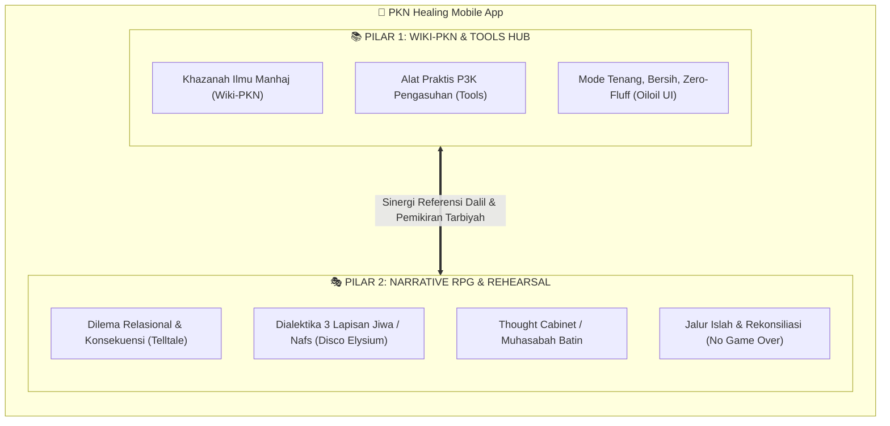
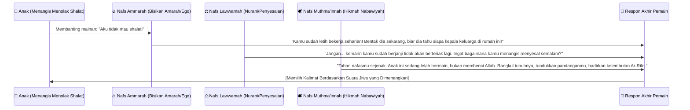
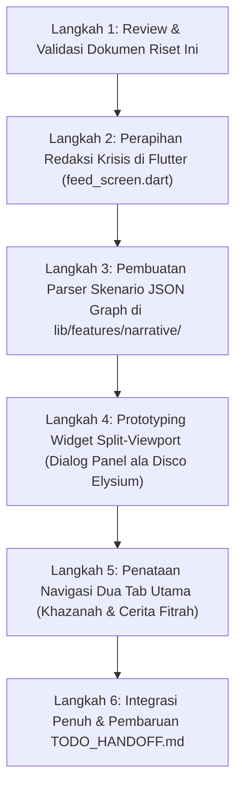

# 🧭 Riset & Cetak Biru: Simplifikasi Dual-Core PKN Mobile
## *(Pilar 1: Wiki-PKN & Tools Hub × Pilar 2: Narrative RPG Telltale & Disco Elysium)*

> **Status Dokumen:** Dokumen Riset Konseptual & Eksplorasi Desain Arsitektur Mandiri (*Pre-Integration Research*).  
> **Tanggal:** 8 Oktober 2026  
> **Tujuan:** Menyederhanakan ekosistem aplikasi dari fragmentasi fitur yang terlalu luas menjadi **dua pilar pengalaman yang koheren, terarah, dan saling melengkapi**.

---

## 1. Latar Belakang & Rasionalisasi Simplifikasi

### 1.1. Problem: Disonansi Kognitif pada Konsep Multikompleks
Dalam iterasi sebelumnya, PKN Mobile memuat spektrum ambisi yang sangat lebar:
* 16–17 Persona pengguna di 5 ranah ekosistem ([`docs/USER_JOURNEYS.md`](USER_JOURNEYS.md)).
* Simulasi kota virtual 7 venue isometrik dengan engine game berat (*Flame + Bonfire + Rive*).
* Modul AFK, akumulasi energi berkebun, dan mekanik idle simulator.
* Asesmen psikometrik/bakat TB-40 komparatif yang rawan disalahartikan sebagai penilaian resmi anak.

Kritik desain pada [`design/DESIGN_CRITIQUE.md`](../design/DESIGN_CRITIQUE.md) dan [`design/IDEA_REFINEMENT.md`](../design/IDEA_REFINEMENT.md) menegaskan risiko besar dari pendekatan ini:
1. **Beban Pengguna di Saat Krisis:** Orang tua yang lelah tidak butuh navigasi game sandbox 2D untuk menemukan satu kalimat yang harus diucapkan saat anak tantrum.
2. **Beban Baterai & Engine:** Menjalankan loop render terus-menerus terasa asing (*alien*) bagi pengguna aplikasi utilitas harian.
3. **Risiko Etis Pengukuran Batin:** Menampilkan angka meteran cinta/jiwa secara numerik kaku berisiko membuat orang tua mengira aplikasi sedang mendiagnosis anak kandung mereka.

### 1.2. Solusi: Arsitektur Dual-Core (Dua Belahan Aplikasi)
Menjawab kebutuhan tersebut, aplikasi disederhanakan menjadi **dua belahan fungsional independen namun bersinergi**:



* **Pilar 1 (Kiri/Depan) — Khazanah Ilmu & Alat Praktis:** Untuk kebutuhan **informasi instan, rujukan dalil, dan tindakan cepat di dunia nyata** (0–60 detik). Karakter antarmuka: tenang (*calm technology*), minim distraksi, cepat diakses secara offline.
* **Pilar 2 (Kanan/Eksplorasi) — Narrative RPG & Latihan Batin:** Untuk kebutuhan **refleksi, empati, dan latihan pengambilan keputusan** saat orang tua/pendidik memiliki waktu luang (5–15 menit). Karakter antarmuka: sastrawi, atmosferik, dramatis, mengeksplorasi pergulatan jiwa manusia.

---

## 2. Pilar 1: Wiki-PKN & Practical Tools Hub

Pilar ini mengintegrasikan seluruh repositori pengetahuan dari ekosistem `wiki-pkn` menjadi ensiklopedia saku dan kotak perkakas praktis yang siap pakai di lapangan.

```
┌────────────────────────────────────────────────────────┐
│ 📚 PILAR 1: WIKI-PKN & PRACTICAL TOOLS HUB            │
├──────────────────────────┬─────────────────────────────┤
│ 1. Ensiklopedia Khazanah │ 2. Kotak Perkakas Praktis   │
│   • 6 Pilar MOC (P1–P6)  │   • Lead TL;DR (<10 Detik)  │
│   • 4 Fase Usia Fitrah   │   • Fast-Tap Rubric (BT–MM) │
│   • 40 Bakat Nabawiyah   │   • Pemutar Audio Hands-Free│
│   • Takhrij Dalil & Nash │   • Maqashid Program Filter │
│   • Glosarium Turats     │   • Naskah Dialog Ayah Luqman│
└──────────────────────────┴─────────────────────────────┘
```

### 2.1. Sumber Ilmu (The Wiki-PKN Knowledge Vault)
Diadaptasi langsung dari struktur `wiki-pkn` (berbasis Quartz/Obsidian):
1. **6 Pilar Maps of Content (MOC):**
   * **P1 (Mulai di Sini):** Peta dasar manhaj, orientasi fitrah, glosarium thuma'ninah.
   * **P2 (Tumbuh Kembang):** 4 fase fitrah (Thufulah 2–7 thn, Tamyiz 7–10 thn, Murahaqah 10–14 thn, Baligh/Syabab 14–18+ thn). Batasan syar'i perlindungan anak.
   * **P3 (Bakat TB-40):** 40 ragam bakat fitrah dalam 4 kluster (*Al-Qiyadah, Al-Fashahah, Al-Idarah, Al-Fikriyyah*).
   * **P4 (Praktik Keluarga):** Solusi krisis rumah, peran Ayah Qawwamun, Bunda Madrasah Utama.
   * **P5 (Lembaga & Guru):** SOP iklim adab, apersepsi sirah 5 menit, budaya sekolah tanpa ranking shaming.
   * **P6 (Khazanah Dalil):** Verifikasi nash Al-Qur'an (Amiri font, terjemah resmi), derajat takhrij hadits, syarah ulama salaf.
2. **Pencarian Cerdas & Tautan Balik (*Bidirectional Linking*):** Pengguna dapat menelusuri artikel secara offline, melompat dari satu konsep ke konsep lain tanpa jeda jaringan.

### 2.2. Kotak Perkakas Praktis (The Practical Utility Tools)
Menjawab kebutuhan riil harian orang tua dan pendidik:
1. **Pusat Respon Krisis (10-Second Lead TL;DR):**
   * Kartu pertolongan darurat saat anak tantrum, mogok shalat, atau adiksi gawai.
   * *Formula:* 1 tindakan pertama + 1 kalimat yang harus diucapkan + 1 batasan keselamatan syar'i.
2. **Fast-Tap Rubric Observasi Adab (BT–MT–BK–MM):**
   * Instrumen pencatatan adab anak/santri dalam 3 ketukan layar tanpa angka desimal: *Belum Tampak (BT)*, *Mulai Tampak (MT)*, *Berkembang (BK)*, *Membudaya (MM)*.
   * Ekspor laporan naratif deskriptif yang santun untuk orang tua.
3. **Pemutar Audio Sirah & Tazkiyah Hands-Free:**
   * Audio pengantar tidur atau teman menyetir di mobil, dengan tombol besar ramah jemari.
4. **The Maqashid Program Filter:**
   * Alat evaluasi kegiatan sekolah/rumah tangga ke dalam 3 kuadran syar'i: *Dharuriyyat* (pokok), *Hajiyyat* (kebutuhan), *Tahsiniyyat* (pelengkap), untuk mencegah kejenuhan (*burnout*).
5. **Generator Naskah Dialog Akhir Pekan (Kisah Luqman):**
   * Pemantik percakapan mendalam (*heart-to-heart*) antara ayah dan anak saat santai.

### 2.3. Prinsip UI/UX Pilar 1: Adopsi *Oiloil UI*
* **Calm Technology:** Latar lembut, ruang bernapas luas (*generous whitespace*), tipografi bersih (Inter 15–16pt untuk teks isi).
* **Zero Cognitive Fluff:** Menghilangkan label teknis internal (`P1–P6`, `T1–T5`, `D2`) dari antarmuka pengguna; digantikan label tugas manusiawi (*"Bantuan Saat Anak Marah"*, *"Rujukan Ayat & Hadits"*).
* **Tanpa Syarat Masuk:** Dapat digunakan sepenuhnya tanpa registrasi akun, tanpa koneksi internet, dan tanpa sistem gamifikasi paksa.

---

## 3. Pilar 2: Narrative RPG (Telltale × Disco Elysium Nabawiyah)

Pilar kedua adalah sarana **latihan simulasi empati dan pengambilan keputusan adab** (*interactive rehearsal*). Alih-alih membangun simulasi sandbox dunia terbuka yang melelahkan, pilar ini menggunakan kekuatan **penceritaan interaktif (narrative-driven RPG)**.

```
┌─────────────────────────────────────────────────────────────────┐
│ 🎭 PILAR 2: NARRATIVE RPG & REHEARSAL                          │
├────────────────────────────────┬────────────────────────────────┤
│ Inspirasi TELLTALE GAMES       │ Inspirasi DISCO ELYSIUM        │
│   • Dilema moral pengasuhan    │   • Dialektika 3 Lapisan Jiwa  │
│   • "Ananda mengingat tatapmu" │     (Ammarah, Lawwamah,        │
│   • Percabangan konsekuensi    │      Muthma'innah)             │
│   • Tiga Bahasa Mendidik       │   • Thought Cabinet (Muhasabah)│
│     (Tubuh, Mata, Hati)        │   • Cek Adab & Bakat TB-40     │
│   • Mode Estafet (POV Relay)   │   • Jalur Islah (No Game Over) │
└────────────────────────────────┴────────────────────────────────┘
```

### 3.1. DNA Permainan: Sintesis Dua Maestro Naratif

#### A. Unsur Warisan Telltale Games
1. **Bobot Konsekuensi Relasional (*Relationship Memory*):**
   * Jika pada game Telltale ada notifikasi *"Clementine will remember that"*, maka di PKN RPG muncul cerminan fitrah:  
     > *“Zaid merasakan ketenangan dari dekapanmu.”* atau  
     > *“Fatimah merasa dipermalukan karena ditegur di depan teman-temannya.”*
2. **Pilihan Bertempo Situasional (*The Crucial Moment*):**
   * Pada saat krisis emosional anak meledak, pemain dihadapkan pada pilihan cepat: apakah langsung memotong perkataan anak, menahan diri sejenak (*The Golden Pause*), atau mensejajarkan posisi tubuh setinggi mata anak.
3. **Format Episodik Bersambung:**
   * Kasus dibagi menjadi episode-episode tematik (misal: *Episode 1: Menara Balok yang Runtuh (Tamyiz)*, *Episode 2: Pintu Kamar yang Terkunci Rapat (Murahaqah)*, *Episode 3: Menemukan Syakilah di Persimpangan Jalan (Syabab)*).

#### B. Unsur Warisan Disco Elysium
1. **Dialektika Tiga Lapisan Jiwa (*The Inner Voices of Nafs*):**
   * Di *Disco Elysium*, 24 suara kepribadian (seperti *Inland Empire*, *Logic*, *Volition*) saling berdebat di dalam kepala detektif.
   * Di **PKN RPG**, ketika seorang ayah atau ibu menghadapi masalah anak, **tiga suara jiwa manusia saling berbisik di dalam panel monolog batin**:



   * **Nafs Ammarah (Ego & Emosi Terbakar):** Mewakili rasa lelah, gengsi kepemimpinan, keputusasaan, dan dorongan pelampiasan fisik/verbal.
   * **Nafs Lawwamah (Penyesalan & Celaan Diri):** Mewakili suara bersalah (*parenting guilt*), ketakutan menjadi orang tua gagal, dan pengingat masa lalu.
   * **Nafs Muthma'innah (Thuma'ninah & Hikmah Kenabian):** Mewakili ketenangan jiwa, kepasrahan kepada Allah, kelembutan (*Ar-Rifq*), dan prinsip *Koneksi Sebelum Koreksi*.

2. **Kabinet Pemikiran Tarbiyah (*The Thought Cabinet / Muhasabah Batin*):**
   * Pemain dapat memasukkan gagasan pengasuhan ke dalam "Kabinet Pemikiran" karakternya (maksimal 3 pemikiran aktif).
   * *Contoh Pemikiran:*
     * *Pemikiran: "Hakikat Fitrah Anak Bukan Milik Kita"*  
       $\rightarrow$ Membutuhkan perenungan 3 sesi / 12 jam waktu riil.  
       $\rightarrow$ **Efek Setelah Selesai:** Mengurangi volume bisikan *Nafs Ammarah* sebesar 30%, serta membuka opsi dialog *Mumtaz* saat anak melakukan kesalahan tanpa sengaja.
     * *Pemikiran: "Tiga Bahasa Mendidik (Lutut, Mata, Hati)"*  
       $\rightarrow$ **Efek Setelah Selesai:** Memberikan bonus keberhasilan cek adab saat menghadapi anak usia balita.
     * *Pemikiran: "Seni Mendengar Tanpa Menghakimi"*  
       $\rightarrow$ **Efek Setelah Selesai:** Menampilkan motif tersembunyi di balik kenakalan anak usia tamyiz.

3. **Cek Adab & Sinergi Bakat TB-40 (*Skill Checks without D20 Fluff*):**
   * Setiap pilihan respon memiliki tingkat kesulitan adab:
     $$\text{Peluang Respon Tenang} = f(\text{Level Adab Terlatih}, \text{Bakat TB-40}, \text{Kondisi Tangki Cinta})$$
   * **White Check (Dapat Diulang):** Pemain yang gagal menahan amarah dapat memilih untuk beristighfar, mengambil wudhu, lalu mencoba kembali dialog dengan anak.
   * **Red Check (Satu Kali Penentu):** Keputusan krusial di puncak konflik.

4. **Tanpa Game Over: Percabangan Jalur Islah & Rekonsiliasi:**
   * Di game konvensional, pilihan salah menghasilkan layar merah *Game Over*.
   * Di PKN RPG, jika pemain memilih respon buruk (membentak atau mengabaikan):
     * Hubungan merenggang, anak menjauh, Tangki Cinta anjlok.
     * Alur cerita secara otomatis berpindah ke **Fase Islah (Pemulihan Jiwa)**: Pemain dibimbing cara meminta maaf kepada anak, mengakui kelemahan diri tanpa kehilangan wibawa syar'i, dan melatih muhasabah malam. Pemain belajar bagaimana cara bangkit dari kesalahan nyata!

### 3.2. Fitur Unggulan: Multi-Character POV Relay (Estafet Perspektif)
Berdasarkan spesifikasi [`assets/data/scenarios/skenario_krisis_shalat_rumah.json`](../assets/data/scenarios/skenario_krisis_shalat_rumah.json):
* Dalam satu skenario krisis keluarga, pemain bermain secara bergiliran lintas generasi:
  1. **Babak 1 (POV Zaid - 8 Tahun Tamyiz):** Merasakan lelahnya fisik setelah sekolah, asyiknya menara balok, dan beratnya beranjak wudhu.
  2. **Babak 2 (POV Abu Zaid - 36 Tahun Ayah Syabab):** Merasakan letihnya mencari nafkah, kekhawatiran masa depan anak, dan godaan untuk membentak.
  3. **Babak 3 (POV Kakek Usman - 68 Tahun Syaikh Murabbi):** Hadir sebagai mediator bijak yang menengahi tanpa memojokkan salah satu pihak.

---

## 4. Arsitektur Antarmuka: The App-Oriented Narrative Game

Mengadaptasi kajian pada [`resources/App-Oriented Narrative Game with Flutter and Flutter Scene.md`](../resources/App-Oriented%20Narrative%20Game%20with%20Flutter%20and%20Flutter%20Scene.md), integrasi pilar RPG tidak memerlukan engine berat:

```
┌────────────────────────────────────────────────────────┐
│ 📱 LAYOUT SPLIT-VIEWPORT (APP-ORIENTED RPG)            │
├────────────────────────────────────────────────────────┤
│  [30% Viewport Atas: Atmosfer & Ekspresi Karakter]     │
│  • Ilustrasi 2D / Vektor Rive mikroekspresi            │
│  • Indikator visual suasana ruangan & waktu shalat     │
├────────────────────────────────────────────────────────┤
│  [70% Viewport Bawah: Panel Dialog & Suara Batin]      │
│  • Monolog Tiga Lapisan Jiwa (Ammarah / Muthma'innah)  │
│  • Teks narasi sastrawi yang tajam dan menyentuh       │
│  • Pilihan respon berjenjang (Mumtaz .. Munkar)        │
│  • Learning Tooltip (Dalil & Hikmah saat opsi dikunci) │
│  • Drawer Kabinet Pemikiran (Thought Cabinet)          │
└────────────────────────────────────────────────────────┘
```

### 4.1. Mengapa Pendekatan Ini Unggul?
1. **Performa Super Ringan:** 100% berjalan di atas widget native Flutter (Dart 3.5+). Tidak ada kompilasi C++ game engine yang rumit, ukuran APK tetap ramping (+2–3 MB), dan konsumsi memori $< 45\text{ MB}$.
2. **Estetika Elegan & Dewasa:** Tampilan panel dialog yang terinspirasi oleh *Disco Elysium* dan *21st.dev* memberikan nuansa karya sastra interaktif berkelas tinggi, bukan sekadar game anak-anak.
3. **Penyimpanan Lokal Offline:** Seluruh skrip skenario graf disimpan dalam format JSON statis di [`assets/data/scenarios/`](../assets/data/scenarios/), dan riwayat keputusan dicatat melalui Isar Database lokal tanpa membutuhkan backend server yang mahal.

---

## 5. Matriks Perbandingan: Konsep Lama vs. Konsep Sederhana (Dual-Core)

| Aspek Evaluasi | Konsep Lama (All-in-One Simulator) | Konsep Baru (Dual-Core: Wiki-Tools × RPG) | Keuntungan Konsep Baru |
|---|---|---|---|
| **Struktur Mental Pengguna** | Bercampur aduk antara artikel, 16 persona, administrasi sekolah, dan kota virtual. | Terbagi jelas menjadi 2 mode: **Cari Ilmu/Alat Cepat** ATAU **Masuk Cerita/Latihan Batin**. | Menghilangkan kebingungan pengguna; ekspektasi interaksi menjadi sangat jelas. |
| **Beban Teknologi** | Flame Engine + Bonfire pathfinding + Rive isometrik + Tiled map 7 venue. | Flutter Native Clean Architecture + Split Viewport Narrative Widget + JSON Graph parser. | Bebas bug pathfinding, hemat baterai 80%, waktu pengembangan 4x lebih cepat. |
| **Penyelesaian Krisis Ortu** | Terhalang navigasi kota virtual; harus membuka peta untuk mencari solusi. | 1-Tap langsung membuka *Lead TL;DR* di Beranda (respons < 10 detik). | Menyelamatkan situasi krisis nyata secara presisi. |
| **Nilai Edukasi Game** | Simulasi berjalan pasif (AFK idle ledger & mengumpulkan benih virtual). | Refleksi psikologis mendalam melalui dialektika *Nafs* dan *Kabinet Pemikiran*. | Menghadirkan transformasi jiwa (*Tazkiyatun Nafs*) yang nyata, bukan sekadar farming poin. |
| **Penanganan Kegagalan** | Angka cinta anjlok, potensi memicu rasa bersalah (*parenting guilt*). | Tidak ada *Game Over*; membuka *Jalur Islah* dan naskah minta maaf kepada anak. | Sepenuhnya setia pada prinsip *Anti-Guilt UX*. |

---

## 6. Skenario Prototipe Percontohan: "Krisis Shalat di Baitul Fitrah"

Sebagai bukti kelayakan (*Proof of Concept*), skenario percontohan telah diwujudkan dalam berkas data:
👉 [`assets/data/scenarios/skenario_krisis_shalat_rumah.json`](../assets/data/scenarios/skenario_krisis_shalat_rumah.json)

### Alur Demonstrasi Cerita:
1. **Insiden Pembuka:** Waktu Ashar tiba. Zaid (8 tahun, fase Tamyiz) sedang asyik menyelesaikan menara balok kayu. Abu Zaid (Ayah, 36 tahun) baru saja melangkah masuk rumah dengan tubuh letih dan kepala penat dari urusan kantor.
2. **Babak 1 (POV Zaid):** Zaid mendengar adzan dan panggilan ayah. Muncul dialektika batin anak: rasa lelah vs keinginan menyenangkan ayah. Pilihan Zaid menentukan seberapa tegang situasi awal.
3. **Babak 2 (POV Ayah):** Ayah melihat Zaid tidak bergeming. 
   * *Bisikan Ammarah:* *"Dia meremehkan perintahmu! Tegur keras sekarang!"*
   * *Bisikan Lawwamah:* *"Apakah caramu memanggil tadi sudah cukup lembut?"*
   * *Bisikan Muthma'innah:* *"Dekati dia, letakkan tangan di pundaknya, kagumi menara baloknya terlebih dahulu."*
4. **Inspeksi Pilihan Terkunci (*Educational Tooltip*):** Pilihan respon terbaik (*Mumtaz*) membutuhkan pemikiran *"Koneksi Sebelum Koreksi"*. Jika belum diinternalisasi, pemain dapat mengetuk gembok untuk membaca atsar sahabat dan penjelasan gap fitrah.
5. **Konsekuensi & Islah:** Jika ayah memilih membentak, balok runtuh, anak menangis masuk kamar. Cerita **tidak berakhir tamat gagal**, melainkan mengaktifkan *Jalur Islah*: Ayah dipandu mengambil air wudhu, menenangkan degup jantung, mengetuk pintu kamar Zaid, dan melafalkan naskah minta maaf yang penuh adab.

---

## 7. Rencana Integrasi Bertahap (Roadmap Pra-Integrasi)

Sebelum kode utama repositori diubah, tahapan integrasi disarankan berjalan sebagai berikut:



1. **Langkah 1 (Validasi Dokumen):** Konfirmasi keselarasan konsep dual-core ini bersama tim/stakeholder.
2. **Langkah 2 (Sanitasi Keamanan Wording):** Selesaikan temuan F1 pada [`feed_screen.dart`](../lib/features/feed/presentation/screens/feed_screen.dart) agar rujukan keselamatan di kedua pilar berada pada standar syar'i yang sama.
3. **Langkah 3 (Engine Data Skenario):** Buat model Dart dan parser unit test untuk skenario format JSON graf tanpa dependensi UI luar.
4. **Langkah 4 (Widget Dialog & Dialektika Nafs):** Bangun prototipe antarmuka panel dialog interaktif (monolog batin, pilihan bertingkat, dan *Learning Tooltip* popover ala *21st.dev*).
5. **Langkah 5 (Navigasi Dual-Core):** Rampingkan dock navigasi utama menjadi 2 pusat kendali: **Khazanah & Tools** (Wiki-PKN) dan **Cerita Fitrah** (Narrative Rehearsal).

---

> *“Bukanlah orang yang kuat itu dengan bergulat, melainkan orang yang kuat adalah yang mampu mengendalikan dirinya di saat marah.”*  
> **(HR. Bukhari no. 6114 & Muslim no. 2609)**
