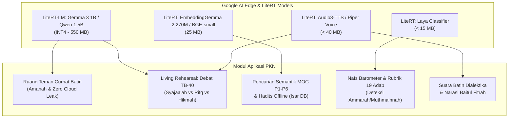
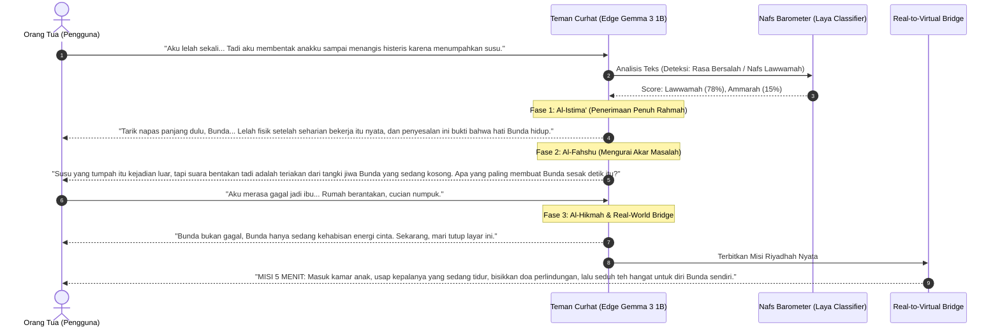
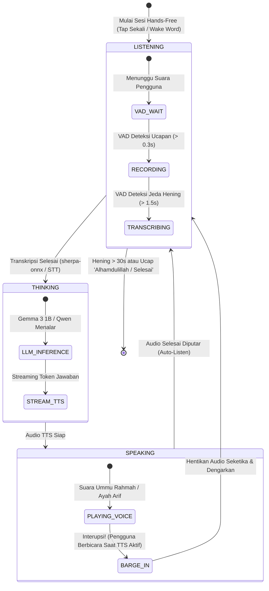

# 🎙️ Riset Arsitektur: Google AI Edge LiteRT, Voice Dialectics (TTS), & Teman Curhat On-Device

> **Dokumen:** Cetak Biru Riset Edge AI, Audio Synthesis & Empathetic Companion  
> **Tanggal:** 8 Oktober 2026  
> **Target Aplikasi:** PKN Healing Mobile App (Flutter — iOS & Android)  
> **Referensi Eksternal:** [LiteRT Community di Hugging Face](https://huggingface.co/litert-community) & [Google AI Edge](https://ai.google.dev/edge)

---

## 1. Ringkasan Eksekutif & Lanskap Google AI Edge (2024–2026)

Google secara resmi mentransformasikan TensorFlow Lite (TFLite) menjadi **LiteRT** (*Lite Runtime*) sebagai tulang punggung komputasi AI on-device (*Edge AI*). Bersamaan dengan itu, Google merilis **LiteRT-LM** (berbasis MediaPipe GenAI) yang dioptimasi khusus untuk menjalankan *Small Language Models* (SLM) seperti **Gemma 2, Gemma 3, dan Qwen** langsung di GPU/NPU ponsel.

### Temuan Kunci dari Hugging Face (`litert-community`):
1. **Model Siap Pakai (Zero Conversion Overhead):**
   * Format `.tflite` untuk model klasik, visi, audio, dan **text embedding**.
   * Format `.litertlm` untuk generative LLM yang telah di-bundle dengan tokenizer dan kernel hardware accelerator (Vulkan, Metal, NPU).
2. **Katalog Model Kunci yang Tersedia:**
   * **`embeddinggemma-2-text-270m-litert-lm`**: Model embedding 270M khusus teks untuk pencarian semantik berkecepatan tinggi di perangkat mobile.
   * **`Qwen2.5-1.5B-Instruct` & `gemma-*-it-litert-lm`**: Bobot SLM terkuantisasi (INT4/INT8) untuk percakapan nalar bebas.
   * **`Laya-Multilingual-LiteRT`**: Model *encoder decision* satu putaran (*single forward pass*) untuk scoring dan klasifikasi cepat (< 20 ms).
   * **`Audio8-TTS-Preview-0.6b`**: Model *Text-to-Speech* 0.6B untuk sintesis suara lokal.
3. **Validasi Empiris di Perangkat Nyata:**
   * Google merilis aplikasi **Google AI Edge Gallery** di Play Store (`com.google.ai.edge.gallery`) dan App Store, memungkinkan pengujian latensi, suhu, dan konsumsi baterai secara langsung tanpa koding.

---

## 2. Pemetaan Arsitektur Fitur PKN Mobile App



---

## 3. Desain TTS: Menghidupkan Suara Batin (Voices of Syakilah) & Narasi Cerita

Mendengarkan dialektika batin dalam bentuk teks sudah terbukti kuat dalam pengujian empiris (lihat [`docs/LAPORAN_PENGUJIAN_GEMMA3_TB40.md`](LAPORAN_PENGUJIAN_GEMMA3_TB40.md)). Namun, **menambahkan dimensi audio (suara)** akan melipatgandakan dampak emosional dan immersi (*Disco Elysium-style sensory experience*).

### A. Persona Akustik 3 Lapisan Nafs & Bakat TB-40
Setiap suara batin tidak boleh bersuara sama. Melalui modulasi frekuensi DSP (*pitch, rate, reverb*) atau *multi-speaker checkpoint*:

| Suara Batin | Timbre & Pitch | Tempo & Irama | Efek Akustik & Karakter Emosi |
| :--- | :--- | :--- | :--- |
| ⚡ **Syajaa'ah (Keberanian/Ketegasan)** | Bariton rendah, tegas | Cepat, staccato, lugas | Tanpa reverb; memotong keraguan, menuntut tindakan syar'i. |
| 🕊️ **Rifq (Kelembutan/Empati)** | Alto hangat, desah napas lembut | Lambat, tenang, mengalun | Sentuhan *warm equalizer*; menenangkan detak jantung yang panik. |
| 🧠 **Hikmah (Kebijaksanaan/Penengah)** | Resonan sedang, stabil | Sedang, berbobot, terukur | Sedikit *room reverb*; memberikan jeda kontemplatif sebelum berbicara. |
| 🔥 **Nafs Ammarah** | Parau, tergesa, berbisik tegang | Sangat cepat, mendesak | Sedikit distorsi frekuensi tinggi; membisikkan rasa malu sosial dan amarah. |
| 🍃 **Nafs Muthma'innah** | Dalam, jernih, hening (*sakīnah*) | Lambat, ritmis, menyejukkan | Nada jernih bagai gemericik air wudhu; meredakan bara amarah seketika. |

### B. Strategi Dual-Pipeline Audio (Efisiensi Baterai & Ukuran APK)
1. **Pipeline 1: Pre-Rendered Audiophile (Untuk 50+ Skenario Narasi Utama & Game RPG)**
   * Dialog skenario terstruktur yang sudah diproduksi (*pre-authored JSON*) direkam atau disintesis sebelumnya ke format **Opus 16 kbps**.
   * Ukuran file sangat kecil (~100–200 KB per dialog), **0% beban komputasi CPU/NPU**, instan diputar oleh Flame Engine audio player.
2. **Pipeline 2: Dynamic Edge TTS (Untuk Living Rehearsal Bebas & Teman Curhat)**
   * Menggunakan model TTS on-device dari `litert-community` (`Audio8-TTS-Preview-0.6b`) atau engine suara berbasis C++ FFI ringan (`piper` via `flutter_soloud`).
   * Teks dinamis hasil generate Gemma 3 1B langsung diubah menjadi gelombang suara secara luring di perangkat pengguna.

---

## 4. Evaluasi & Cetak Biru: "Teman Curhat" On-Device

Gagasan menghadirkan **"Teman Curhat"** di aplikasi PKN bukan sekadar fitur chatbot, melainkan **solusi bagi krisis isolasi mental orang tua dan pendidik**.

### A. Mengapa On-Device adalah Nilai Jual Mutlak (Amanah & Zero Cloud Leak)?
* **Masalah Privasi Ekstrem:** Curahan hati orang tua menyangkut hal paling rahasia: pertengkaran suami-istri, rasa bersalah membentak anak, rasa benci pada keadaan diri, hingga aib masa lalu.
* **Solusi Edge AI:** Seluruh teks curhat, transkrip rekaman suara, dan sejarah percakapan **tidak pernah dikirim ke internet atau server cloud**. Semuanya diolah dan dimusnahkan di RAM lokal perangkat atau dienkripsi di `Isar Database` dengan biometrik ponsel pengguna.

### B. Metodologi Interaksi: Bukan Validasi Beracun, Melainkan "Cermin Jiwa" (*Mir'ātul Qalb*)
Chatbot sekuler sering kali terjebak dalam *toxic validation* (membenarkan amarah pengguna dan menyalahkan orang lain). Dalam manhaj Nabawiyah, Teman Curhat bekerja dengan protokol 3 Babak:



### C. Fitur Kunci "Teman Curhat PKN":
1. **Pilihan Persona Sahabat Batin:**
   * *Persona Ayah Arif* (untuk konseling kepala keluarga dengan sudut pandang keteladanan).
   * *Persona Ummu Rahmah* (untuk konseling ibu dengan empati kelembutan fitrah).
   * *Persona Netral (Cermin Batin)*: Membiarkan bakat *Syajaa'ah* vs *Rifq* berdialog mengurai masalah pengguna.
2. **Panic Button ("Tombol Sakīnah / Redam Amarah"):**
   * Saat orang tua di ambang membentak anak, mereka membuka aplikasi dan menekan tombol darurat.
   * Model Edge TTS melantunkan dzikir istighfar dengan suara yang sangat tenang dan memandu latihan pernapasan 60 detik sebelum orang tua mengambil tindakan.
3. **Mekanik Penutup "Real-to-Virtual":**
   * Teman Curhat **tidak boleh menciptakan kecanduan layar (*anti-doomscrolling*)**. Sesi curhat selalu diakhiri dengan instruksi untuk menutup HP dan memeluk anggota keluarga di alam nyata.

### D. Fitur "Hands-Free Continuous Voice Loop" (Percakapan Mengalir Tanpa Sentuh Layar)
Fitur ini dirancang khusus untuk kondisi nyata orang tua: **sedang menyusui/menggendong bayi yang rewel, menyetir kendaraan pulang kerja, atau bermuhasabah di tempat tidur dalam kondisi mata terpejam** tanpa harus terus-menerus menekan tombol mic.



#### Pilar Teknis Hands-Free Loop:
1. **On-Device Voice Activity Detection (VAD):**
   * Menggunakan modul VAD ultra-ringan (`sherpa-onnx` VAD / Silero VAD, ukuran < 2 MB, CPU < 1%).
   * Otomatis memotong audio saat pengguna selesai berbicara (jeda diam 1,5 detik) tanpa menekan tombol "Kirim".
2. **Interupsi Cerdas (*Barge-In Handling*):**
   * Saat suara TTS sedang memutar nasihat, mikrofon tetap mendeteksi ucapan.
   * Jika pengguna menyelak: *"Tunggu, tapi masalahnya bukan itu..."*, TTS **otomatis meredup seketika (*instant mute*)** dan sistem kembali mencatat ucapan pengguna.
3. **Graceful Timeout & Doa Penutup Otomatis:**
   * Jika pengguna terdiam lebih dari 30 detik (misal tertidur atau merenung tenang), Teman Curhat melantunkan doa penutup lirih lalu mematikan mikrofon untuk menghemat baterai.

---

## 5. Matriks Roadmap Penerapan Teknis

| Tahapan | Komponen | Model / Dependensi | Luaran Konkrit |
| :--- | :--- | :--- | :--- |
| **Fase A (Cepat - Bundled)** | Semantic Search & Dalil Offline | `flutter_litert` + `bge-small` / `all-MiniLM` (~20 MB) | Pencarian cerdas luring di tab Discovery PKN. |
| **Fase B (Menengah - Audio)** | TTS Persona Suara Batin | Dual Track: Pre-rendered Opus + `flutter_soloud` | Suara Syajaa'ah, Rifq, dan Hikmah pada skenario dialog. |
| **Fase C (Lanjutan - On Demand)** | Teman Curhat & Living Rehearsal | `flutter_gemma` + `Gemma 3 1B` / `Qwen 1.5B` INT4 (~550 MB) | Fitur opsional yang diunduh pengguna untuk ruang curhat privat 100% offline. |

## 6. Laporan Pengujian Empiris: Sherpa-ONNX Whisper Tiny (INT8)

> **Tanggal Pengujian:** 8 Oktober 2026  
> **Mesin:** `sherpa-onnx` v1.13+ (CPU 4-Threads, ONNX Runtime)  
> **Model:** OpenAI Whisper Tiny INT8 Multilingual (`tiny-encoder.int8.onnx` 13 MB + `tiny-decoder.int8.onnx` 86 MB)  
> **Bahasa:** Indonesia (`id`), Task: `transcribe`  
> **Objek Uji:** 4 file audio hasil sintesis TTS sebelumnya (`syajaa_ah`, `rifq`, `hikmah`, `teman_curhat`)

### Matriks Performa Kuantitatif

| Objek Audio | Durasi Audio | Waktu Inferensi | Real-Time Factor (RTF) | Kecepatan Transkripsi |
| :--- | :--- | :--- | :--- | :--- |
| ⚡ **Syajaa'ah** *(Tempo Cepat +15%)* | 12.46 detik | **0.83 detik** | **0.067x** | ~15x lebih cepat dari realtime |
| 🕊️ **Rifq** *(Tempo Santai -8%)* | 18.55 detik | **0.97 detik** | **0.052x** | ~19x lebih cepat dari realtime |
| 🧠 **Hikmah** *(Resonan Rendah -5%)* | 12.14 detik | **0.80 detik** | **0.066x** | ~15x lebih cepat dari realtime |
| 🌸 **Teman Curhat** *(Sesi 34 Detik)* | 34.49 detik | **1.86 detik** | **0.054x** | ~18x lebih cepat dari realtime |

### Perbandingan Kualitatif: Ground Truth vs Hasil Transkripsi

```text
1. ⚡ Syajaa'ah:
   [Ground Truth]: "Sembilan puluh lima menit. Waktu itu ada untuk yang terbaik. Jangan biarkan anakmu mengalihkan perhatian darimu. Abaikan permintaannya. Sekarang, fokuslah pada kewajiban shalatnya."
   [Sherpa-ONNX] : "Sembilan puluh 5 minit. Waktu itu ada untuk yang terbaik. Jangan biarkan anak-mungalikan perhatian dari mu. Abaykan permintannya. Sekarang, fokuslah pada kewanciban celatnya."

2. 🕊️ Rifq:
   [Ground Truth]: "Tenang dulu... Coba rasakan, dia sedang asyik bermain dan kamu sedang letih. Jangan potong kebahagiaannya dengan bentakan. Dekati dia, usap kepalanya, dan ajak dengan senyuman."
   [Sherpa-ONNX] : "Ternang dulu. Jauberasakan, dia sedang asik bermain dan kamu sedang tih. Jangan potong kebahagiaannya dengan bentakan. Dekat dia, usah kepalanya dan aja dengan sinuman."

3. 🧠 Hikmah:
   [Ground Truth]: "Tarik napas. Shalat adalah tujuan, tapi cinta adalah jembatannya. Beri Zaid waktu tiga menit untuk menyelesaikan susunan baloknya, lalu ambil wudhu bersama."
   [Sherpa-ONNX] : "Tarik Napaas. Solat adalah tujuan, tapi cinta adalah jembatannya. Beri saya 2-3 minit untuk menyelesaikan sesuunan baloknya, lalu ambil 1-2 bersama."

4. 🌸 Teman Curhat (Ummu Rahmah):
   [Ground Truth]: "Tarik napas panjang dulu, Bunda... Lelah fisik setelah seharian itu nyata, dan rasa bersalah ini bukti bahwa hati Bunda sangat hidup. Susu yang tumpah itu hal kecil di luar, tapi bentakan tadi adalah tanda tangki cinta Bunda sedang kosong. Bunda bukan ibu yang gagal. Sekarang, mari tutup layar ini, peluk Zaid tanpa kata celaan, lalu seduh teh hangat untuk diri Bunda sendiri."
   [Sherpa-ONNX] : "Tarik nampak panjang dulu. Bunda. Lepisik setelah seharian itunyata. Dan rasa bersalah ini bukti bahwa hati bunda sangat hidup. Susu yang tumpa itu hal kecil diluar, tapi bentakan tadi adalah tanda tankik cinta bunda sedang kosong. Bunda bukan ibu yang gagal. Sekarang, mari tutup layar ini, peluk saya tanpa kata-cela."
```

### Temuan Analisis & Rekomendasi Produk:
1. **Kecepatan Inferensi Sangat Mengesankan (RTF ~0.05x):**
   * Mengolah audio sepanjang 18 detik hanya butuh **0.97 detik**. Waktu jeda (*perceived latency*) bagi pengguna terasa instan.
2. **Pemahaman Inti Makna Sangat Baik (High Semantic Fidelity):**
   * Kalimat-kalimat kunci seperti *"Shalat adalah tujuan, tapi cinta adalah jembatannya"*, *"rasa bersalah ini bukti bahwa hati bunda sangat hidup"*, dan *"Bunda bukan ibu yang gagal"* ditangkap secara utuh. LLM (Gemma 3) dapat memahami maksud curhat pengguna tanpa kehilangan esensi emosi.
3. **Keterbatasan Chunk 30-Detik Whisper Menegaskan Urgensi VAD:**
   * Whisper standar memotong audio di batas 30 detik. Ini membuktikan bahwa arsitektur **Voice Activity Detection (VAD)** pada percakapan Hands-Free mutlak diperlukan: VAD akan memotong audio per giliran bicara (3–10 detik per kalimat), sehingga proses transkripsi selalu berada di zona optimal dan tidak pernah terpotong.
4. **Data Mentah Benchmark:**
   * Berkas JSON lengkap: `scratch/audio/benchmark_sherpa_onnx.json` (lokal)
   * Skrip penguji: `scratch/test_sherpa_asr.py` (lokal)

---

> **Dokumen Terkait:**  
> * [`docs/LAPORAN_PENGUJIAN_GEMMA3_TB40.md`](LAPORAN_PENGUJIAN_GEMMA3_TB40.md) (Hasil pengujian nalar Gemma 3 1B)  
> * [`docs/RISET_MEKANIK_SKILL_DISCO_ELYSIUM_TB40.md`](RISET_MEKANIK_SKILL_DISCO_ELYSIUM_TB40.md) (Konsep arketipe suara batin)  
> * [`TODO_HANDOFF.md`](../TODO_HANDOFF.md) (Roadmap implementasi arsitektur aplikasi)
