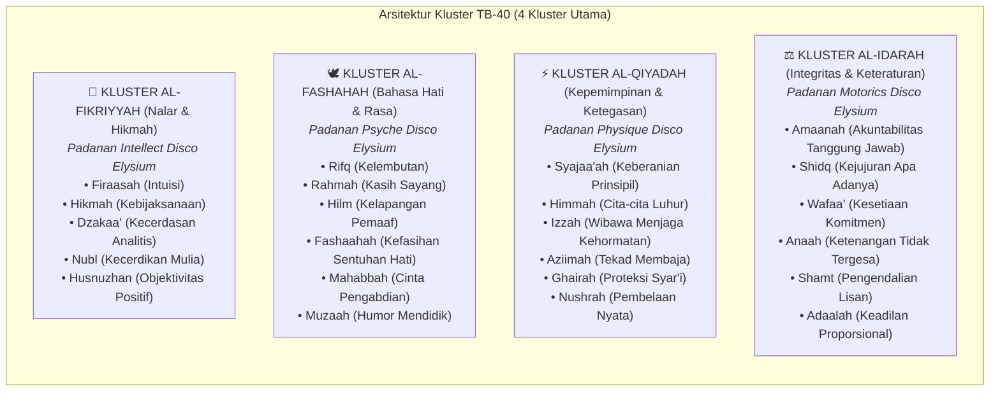

# 🧠 Riset Game Design: Mekanik Skill Disco Elysium Ditransformasikan ke TB-40
## *(The Voices of Syakilah: Menghidupkan 40 Bakat Nabawiyah Sebagai Suara Batin & Narasi Interaktif)*

> **Dokumen:** Analisis & Cetak Biru Mekanik RPG Naratif  
> **Tanggal:** 8 Oktober 2026  
> **Konsep Inti:** Mengadaptasi sistem 24 skill Disco Elysium ke dalam **Taksonomi 40 Bakat Nabawiyah (TB-40)** dari Manhaj Pendidikan Karakter Nabawiyah, menjadikannya sistem "Suara Fitrah" (*Voices of Syakilah*) yang berdialog di dalam batin pemain.

---

## 1. Dekonstruksi: Mengapa Sistem Skill Disco Elysium Begitu Revolusioner?

Di hampir semua RPG konvensional (D&D, Skyrim, Fallout), skill adalah **angka pasif** atau **tombol aksi** (misalnya: *Sneak: 50*, *Persuasion: +3*, *Lockpicking*).

Studio ZA/UM merombak paradigma ini dalam *Disco Elysium*:
1. **Skill adalah Kepribadian Batin (Anthropomorphic Inner Voices):**  
   Skill bukan angka bisu, melainkan **suara-suara di dalam kepala pemain**. Setiap skill memiliki cara pandang, watak, nada bicara, dan bias emosionalnya sendiri.
2. **Pemeriksaan Pasif di Teks Dialog (Passive Checks):**  
   Game melakukan lemparan dadu rahasia di latar belakang. Jika skill pemain mencukupi, skill tersebut tiba-tiba "menyelak" narasi dengan memberikan pengamatan tajam yang tidak disadari orang lain (misal: *Empathy* mendeteksi ketakutan di balik tatapan kasar, *Logic* menemukan inkonsistensi alibi).
3. **Debat Antar-Skill (Internal Arguments):**  
   Skill-skill saling bertengkar di dalam batin: *Logic* berdebat dengan *Inland Empire*, *Authority* menuntut kepatuhan sementara *Empathy* memohon belas kasih.
4. **Patologi Over-Investment (Cacat Berlebihan):**  
   Di Disco Elysium, **tidak ada skill yang murni baik**. Menginvestasikan terlalu banyak poin pada satu skill menciptakan kebutaan patologis:
   * *Authority* terlalu tinggi $\rightarrow$ Menjadi tiran paranoid yang haus dominasi.
   * *Logic* terlalu tinggi $\rightarrow$ Menjadi dingin, kaku, dan lumpuh saat menghadapi emosi irasional.
   * *Empathy* terlalu tinggi $\rightarrow$ Tenggelam dalam trauma orang lain hingga kehilangan ketegasan diri.
5. **Pemeriksaan Aktif Tanpa Game Over (White & Red Checks):**  
   Dadu 2D6 digunakan untuk tindakan krusial. Kegagalan lemparan bukan jalan buntu (*Game Over*), melainkan membuka cabang cerita yang tak terduga, memalukan, atau mengarahkan ke refleksi diri.

---

## 2. Paradigma TB-40 (Tafsir Bakat 40): Syakilah & Tazkiyatun Nafs

Dalam Al-Qur'an, Allah Subhanahu wa Ta'ala berfirman:
> *“Katakanlah: ‘Tiap-tiap orang berbuat menurut keadaannya (syakilatihi / bakat bawaan fitrahnya)...’”*  
> **(QS. Al-Isra’: 84)**

Dalam literatur resmi **Buku Tafsir Bakat** (karya Ustadz Abdul Kholiq di ekosistem [Wiki-PKN](https://github.com/decaller/wiki-pkn)), 40 pilar bakat fitrah bukanlah "alat tes kepribadian sekuler", melainkan **anugerah kecenderungan fitrah yang Allah tiupkan pada setiap jiwa**.

### Hubungan TB-40 dengan Tazkiyatun Nafs:
Sama persis dengan konsep patologi Disco Elysium, dalam manhaj Nabawiyah:
* **Jika bakat dipimpin oleh Nafs Muthma'innah & Adab:** Bakat tersebut memancar menjadi **Keutamaan Akhlak Luhur (*Al-Ihsan*)**.
* **Jika bakat dikuasai oleh Nafs Ammarah atau berlebihan (*Ifrath*):** Bakat tersebut tergelincir menjadi **Cacat Jiwa (*Al-Afat*)**!

| Pilar Bakat TB-40 | Suara Mulia (*Ihsan / Muthma'innah*) | Suara Cacat / Ekstrem (*Afat / Ammarah*) |
|---|---|---|
| **01. Himmah (Ambisi Luhur)** | Mendorong karya terbaik untuk akhirat. | Ambisius menuntut kesempurnaan; membebani anak demi gengsi orang tua (*Riya'*). |
| **07. Firaasah (Intuisi Batin)** | Membaca kepedihan anak yang tak terucap. | Paranoid, cepat menuduh anak berbohong (*Su'uzhan*). |
| **11. Hikmah (Kebijaksanaan)** | Menakar momen yang tepat sebelum berbicara. | Ragu-ragu, *overthinking*, menunda batasan yang mendesak. |
| **18. Syajaa'ah (Keberanian)** | Tegas melindungi prinsip tauhid dan syariat. | Arogansi kekuasaan, melampiaskan amarah fisik (*Ghadhab*). |
| **31. Rifq (Kelembutan)** | Merendahkan nada suara, merangkul saat gelisah. | Permisif, tidak berani menegur kesalahan anak. |
| **39. Hilm (Kelapangan Dada)** | Menahan amarah saat diprovokasi tantrum anak. | Memendam racun kepahitan dalam diam (*Silent treatment*). |

---

## 3. Peta Transformasi: Disco Elysium $\rightarrow$ TB-40

Disco Elysium membagi 24 skill ke dalam 4 Atribut (*Intellect, Psyche, Physique, Motorics*).  
Dalam PKN RPG, 40 bakat TB-40 dikelompokkan ke dalam **4 Kluster Peradaban** (atau 6 Rumpun Fitrah):



---

## 4. Mekanik Permainan: Bagaimana Sistem TB-40 Bekerja di Layar?

### 4.1. Pemilihan Bakat Dominan Karakter (Syakilah Matrix)
Setiap karakter (misal: *Abu Zaid sang Ayah* atau *Zaid sang Anak*) tidak memiliki nilai maksimal di 40 bakat sekaligus. Di awal skenario, karakter memiliki:
* **2–3 Bakat Puncak (Signature Talents - Level 4–5):** Bakat yang paling sering bersuara dan dominan menentukan insting awal.
* **Bakat Menengah (Level 2–3):** Dapat diaktifkan melalui muhasabah batin atau lemparan dadu.
* **Bakat Terpendam (Level 0–1):** Jarang bersuara kecuali dipicu oleh kondisi krisis atau pemikiran dari *Kabinet Pemikiran*.

### 4.2. Passive Skill Check (Intervensi Suara Batin di Panel Dialog)
Ketika peristiwa terjadi di layar (misal anak menangis membanting mainan), sistem melakukan pengecekan pasif:

$$\text{Roll Pasif} = \text{Dadu Acak (1--12)} + \text{Tingkat Bakat TB-40}$$

Jika nilai melampaui ambang batas kesulitan (*DC / Difficulty Class*), suara bakat tersebut muncul di panel teks dialog dengan format khas:

```
[FIRAASAH — Sedang: Sukses]
"Perhatikan cara jari-jarinya bergetar saat memegang balok itu. Dia bukan sedang marah padamu; dia sedang menahan malu yang luar biasa karena tidak sengaja mengompol di balik celananya."

[HILM — Sulit: Gagal]
"Darahmu berdesir panas ke ubun-ubun. Kalimat anak 8 tahun ini terdengar persis seperti penolakan terhadap otoritas kepemimpinanmu di rumah!"

[RIFQ — Mudah: Sukses]
"Jangan berdiri menjulang di atas kepalanya seperti raksasa penegak hukum. Turunkan lututmu. Setarakan matamu dengan matanya."
```

### 4.3. Debat Multivokal Antar-Bakat (The Inner Council)
Sama seperti Disco Elysium, bakat-bakat ini saling berdialog dan mendebat respon pemain:

```
SYAJAA'AH:
"Tegakkan batasan sekarang! Shalat adalah tiang agama. Jangan biarkan dia menawar kewajiban ini!"

RIFQ:
"Tentu shalat tiang agama, wahai Syajaa'ah, tapi Rasulullah ﷺ bersabda: 'Ajaklah mereka saat 7 tahun dan baru beri ketegasan saat 10 tahun'. Dia baru 8 tahun! Sentuh hatinya dulu!"

HIKMAH:
"Dengarkan keduanya. Syajaa'ah benar tentang tujuannya, dan Rifq benar tentang metodenya. Duduklah di sampingnya, tanyakan apa yang sedang ia rasakan, baru gandeng tangannya ke tempat wudhu."
```

### 4.4. Active Skill Check: The Adab Roll (2D6)
Pada percabangan kritis, pemain dapat memilih tindakan yang memerlukan uji kematangan adab:

```
┌────────────────────────────────────────────────────────────────────────┐
│  🎲 [HILM — Menahan Diri & Tidak Membentak] (Peluang 72%)               │
│  Tingkat Kesulitan: 8 | Bonus Bakat (+3) | Bonus Wudhu (+2)            │
│  [Lempar Dadu 2D6]                                                     │
└────────────────────────────────────────────────────────────────────────┘
```

* **White Check (Dapat Diulang):** Jika gagal, pemain kehilangan 1 poin *Thuma'ninah* (stres naik), namun pemain dapat memilih untuk:
  * Mengambil air wudhu (menambah bonus +2).
  * Mengucapkan ta'awwudz dan istighfar.
  * Mencoba kembali dialog dengan kepala lebih dingin.
* **Red Check (Satu Kali Penentu):** Uji coba respon krusial (misal: pengakuan maaf yang tulus kepada anak) yang langsung mengubah arah cabang cerita.

### 4.5. Dua Barometer Batin (Sanity & Relational Health)
Menggantikan *Health* dan *Morale* dari Disco Elysium:
1. **Thuma'ninah Pool (Ketenangan Batin Pemain - 1 s.d. 5 Bar):**
   * Berkurang jika pemain terus-menerus gagal menahan provokasi amarah.
   * Jika mencapai 0, karakter mengalami kondisi **"Ledakan Ghadhab"** (terjebak bisikan *Nafs Ammarah*, membentak anak, dan memicu penyesalan).
2. **Tangki Cinta Anak (Relational Safety - 0 s.d. 100):**
   * Cerminan rasa aman anak terhadap figur orang tua/guru.
   * Tidak boleh diisi dengan manipulasi hadiah materiil, melainkan dengan kehadiran penuh (*Tiga Bahasa Mendidik: Bahasa Tubuh, Mata, Hati*).

---

## 5. Hubungan TB-40 dengan Thought Cabinet (Kabinet Pemikiran)

Di Disco Elysium, *Thought Cabinet* memungkinkan detektif memikirkan gagasan filosofis selama beberapa jam dalam game untuk mengubah atribut karakternya.

Di PKN RPG, ini diubah menjadi **Kabinet Muhasabah & Pemikiran Tarbiyah**:

```
┌──────────────────────────────────────────────────────────────┐
│ 💭 KABINET PEMIKIRAN AKTIF (Slot 1/3)                         │
│ "Koneksi Sebelum Koreksi" (Connection Before Correction)     │
├──────────────────────────────────────────────────────────────┤
│ Status: Sedang Direnungkan (Tersisa 4 Jam / Selesai Babak 1) │
│                                                              │
│ Selama Proses:                                               │
│ • -1 Syajaa'ah (Merasa ragu apakah ketegasan selama ini tepat)│
│                                                              │
│ Setelah Terinternalisasi Penuh:                              │
│ • +2 Rifq (Kelembutan bahasa meningkat pesat)                │
│ • Membuka opsi dialog [MUMTAZ] saat menghadapi anak tantrum  │
│ • Bisikan Nafs Ammarah berkurang frekuensinya sebesar 40%    │
└──────────────────────────────────────────────────────────────┘
```

### Daftar Contoh Pemikiran Tarbiyah:
1. **"Hakikat Anak Adalah Amanah, Bukan Hak Milik":**
   * *Efek:* Menghilangkan respon gengsi ego saat anak tidak menurut di depan umum; menaikkan bakat *Tawaadhu'* dan *Hilm*.
2. **"Tiga Bahasa Mendidik (Lutut, Mata, Hati)":**
   * *Efek:* Membuka opsi tindakan fisik *Bahasa Tubuh* (berlutut sejajar mata) yang otomatis memberi bonus +3 pada seluruh cek *Rahmah*.
3. **"Fase Thufulah Adalah Ladang Bermain Riang":**
   * *Efek:* Mengunci dorongan membebani anak balita dengan tuntutan akademis; menaikkan bakat *Muzaah* (humor) dan *Basyaasyah* (senyuman).

---

## 6. Simulasi Nyata: Naskah Skenario dengan Sistem TB-40

Berikut adalah prototipe naskah adegan saat Abu Zaid (Ayah) baru pulang kerja dan mendapati Zaid (8 tahun, Tamyiz) menolak shalat Ashar:

---

### [Layar: Ruang Tamu Baitul Fitrah — Menjelang Maghrib]
*(Suara adzan baru saja selesai. Di lantai karpet, menara balok kayu setinggi satu meter berdiri megah. Zaid sedang menaruh balok terakhir dengan nafas tertahan.)*

**Abu Zaid:** "Zaid, adzan Ashar sudah selesai 20 menit lalu. Ayo wudhu sekarang, Nak."

**Zaid:** *(Tanpa menoleh, tangan tetap memegang balok)* "Bentar lagi, Yah! Tinggal satu balok ini... jangan diganggu dulu!"

---

`[Pemeriksaan Pasif Dimulai...]`

* `[FIRAASAH — DC 9: SUKSES (Roll 7 + Bakat 3 = 10)]`  
  **Firaasah:** *"Perhatikan pundaknya yang tegang. Zaid sudah berusaha menyusun menara ini sejak jam dua siang. Di matanya, menara ini adalah mahakarya terbesar abad ini. Jika kamu memaksanya beranjak sekarang tanpa menghargai menara itu, dia akan menganggap shalat sebagai perusak kebahagiaannya."*

* `[HIMMAH — DC 10: SUKSES (Roll 8 + Bakat 3 = 11)]`  
  **Himmah:** *"Kamu lelah mencari nafkah seharian demi masa depan anak ini. Apakah begini caramu mendidiknya menjadi pemimpin? Jangan biarkan dia menunda shalat demi seonggok kayu mainan!"*

* `[HILM — DC 11: GAGAL (Roll 5 + Bakat 2 = 7)]`  
  **Hilm:** *"Kamu ingin bersabar, tapi kepalamu berdenyut nyeri. Kata-kata 'jangan diganggu dulu' terdengar sangat lancang di telingamu."*

---

`[PILIHAN DIALOG PEMAIN]`

1. **[SYAJAA'AH — Ketegasan Keras]**  
   "Zaid! Ayah tidak peduli dengan balok itu! Shalat itu kewajiban pada Allah! Tinggalkan sekarang atau Ayah robohkan menaramu!"  
   *(Konsekuensi: Mengorbankan Tangki Cinta -25, memicu tangisan anak, membuka Jalur Islah).*

2. **[AMARAH / TANPA FILTER — Melampiaskan Lelah]**  
   *(Menghela nafas kasar sambil merebut balok dari tangannya)* "Selalu saja begini kalau disuruh shalat! Kamu ini susah sekali diatur!"

3. **[RIFQ — Memerlukan Pemikiran 'Koneksi Sebelum Koreksi' — TERKUNCI 🔒]**  
   *(Berlutut di samping menara, mengagumi karyanya)* "Masya Allah, tinggi sekali menara ini, Zaid... Ayah temani pasang balok terakhirnya, lalu kita berdua wudhu bersama untuk shalat, setuju?"  
   *(Ketuk gembok untuk membaca Learning Tooltip: Dalil HR. Muslim tentang kelembutan).*

4. **[WHITE CHECK: ANA'AH — DC 8 (Peluang 65%)]**  
   *(Menahan nafas 3 detik, meletakkan tas kerja di sofa, lalu mendekat dengan tenang tanpa menaikkan suara).*

---

*(Jika Pemain Memilih Opsi 4 dan Sukses):*

`[ANA'AH — SUKSES]`  
Detak jantungmu yang terburu-buru melambat. Kamu melepaskan tas kerjamu, menghembuskan nafas perlahan, dan duduk di karpet tepat di sebelah Zaid. Bau debu kayu tercium lembut.

**Abu Zaid:** "Kokoh sekali menaranya, Zaid. Sudah berapa lama bikin ini?"

Zaid mendongak. Matanya yang tadinya defensif kini berbinar.  
**Zaid:** "Dari tadi siang, Yah! Lihat, tinggal atap kubahnya..."

`[RELATIONSHIP MEMORY]`  
✨ *Zaid merasa karyanya dihargai oleh ayahnya. Ketegangannya mereda.*

---

## 7. Keunggulan Mekanik TB-40 Dibanding Game Biasa

1. **Memanusiakan Pengasuhan & Karakter:**  
   Pemain tidak lagi diperlakukan sebagai "robot pengambil keputusan", melainkan sebagai manusia berjiwa yang merasakan kelelahan batin, dorongan amarah, namun dibimbing oleh fitrah kenabian.
2. **Sarana Belajar Karakter Nabawiyah Secara Sastrawi:**  
   Pemain belajar kosakata adab turats (*Hilm, Rifq, Firaasah, Ana'ah, Himmah*) bukan melalui hafalan kamus yang membosankan, melainkan dengan **merasakan langsung fungsinya dalam dinamika batin keluarga**.
3. **Sangat Ringan & Efisien Diterapkan di Flutter:**  
   Sistem ini tidak membutuhkan engine 3D atau komputasi grafis berat. Seluruh mekanik dijalankan melalui **state machine Riverpod**, struktur data **JSON Graph Node Tree**, dan antarmuka teks native Flutter yang sangat cepat dan hemat baterai.

---

> *“Kelemahlembutan tidaklah berada pada sesuatu melainkan akan menghiasinya, dan tidaklah kelembutan itu dicabut dari sesuatu melainkan akan memperburuknya.”*  
> **(HR. Muslim no. 2594)**
