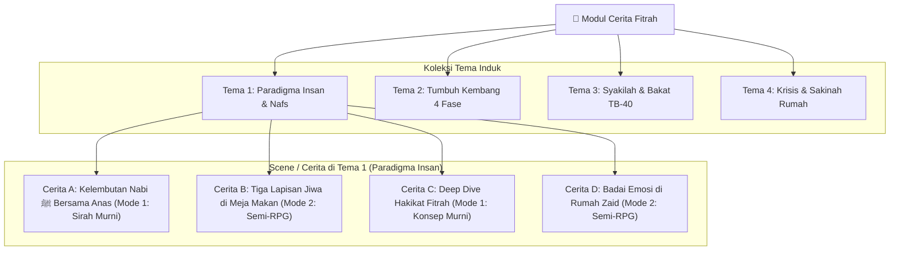
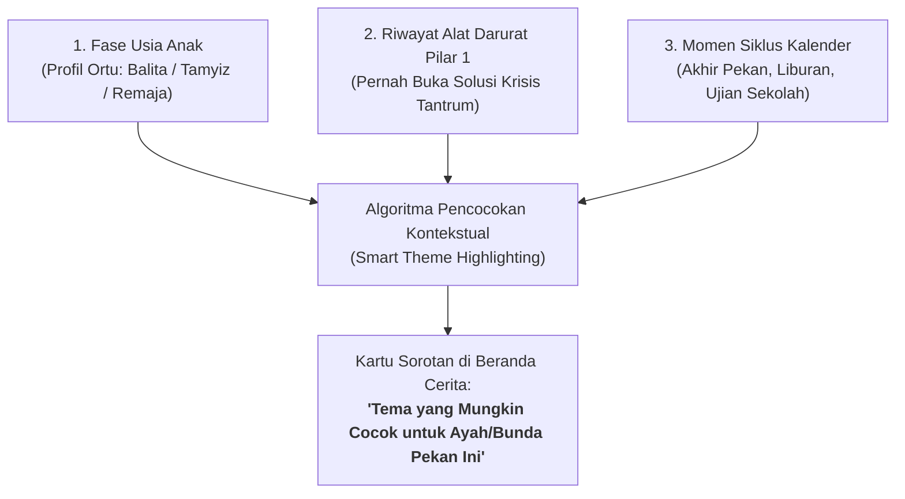

# 📖 Spesifikasi Arsitektur Cerita: Dual-Mode & Sandbox Bertema
## *(Mode 1: Narasi Sirah Murni Kontemplatif × Mode 2: Semi-RPG Disco Elysium Sandbox Mandiri)*

> **Dokumen:** Spesifikasi Desain Konten & Arsitektur Alur Cerita  
> **Tanggal:** 8 Oktober 2026  
> **Status:** Cetak Biru Resmi Pengembangan Fitur Cerita PKN Mobile

---

## 1. Ikhtisar Struktur: Hierarki Tema & Scene Mandiri

Sistem penceritaan PKN Mobile diorganisasikan ke dalam **Tema-Tema Utama** yang memayungi beberapa **Scene / Cerita Terpisah**:



### Karakteristik Struktur:
1. **Tema sebagai Payung Kurikulum:** Setiap tema mewakili satu topik besar manhaj PKN (misal: *Paradigma Insan*, *Tumbuh Kembang Fitrah*, *Bakat TB-40*).
2. **Koleksi Scene Modular:** Di dalam tema, terdapat rangkaian cerita A, B, C, dst. Pengguna dapat memilih cerita mana yang ingin diakses tanpa harus menyelesaikan secara linear yang kaku.
3. **Bebas Akses (Anti-Lock):** Tidak ada cerita yang digembok karena belum menyelesaikan cerita lain. Pengguna bebas belajar sesuai kebutuhan masalah mereka saat itu.

---

## 2. Mode 1: Cerita Murni Tanpa Interaksi (Sirah, Hadits & Deep Dive)

Mode ini ditujukan bagi pengguna yang ingin **menimba ilmu, meresapi hikmah, dan menenangkan jiwa (*Thuma'ninah*)** tanpa beban membuat keputusan atau melempar dadu.

```
┌────────────────────────────────────────────────────────────────────────┐
│ 📜 MODE 1: CERITA MURNI TANPA INTERAKSI                                │
├────────────────────────────────────────────────────────────────────────┤
│ • Pengalaman Baca Khusyuk & Santai (Zero Stress / Zero Decision Load)  │
│ • Konten: Sirah Nabawiyah bersanad, atsar sahabat, dan hadits shahih   │
│ • Deep Dive: Pembahasan konsep manhaj secara sastrawi & filosofis      │
│ • Tipografi: Ayat Al-Qur'an (Amiri Font), terjemah resmi, syarah turats│
│ • Fitur Pendukung: Audio pembacaan latar, bookmark mutiara hikmah      │
└────────────────────────────────────────────────────────────────────────┘
```

### 2.1. Karakteristik & Pengalaman Pengguna (UX)
* **Estetika Oiloil UI (Calm Reading):** Ruang baca bersih, jarak baris lapang (*leading* 1.6), ukuran font nyaman (16pt), bebas pop-up atau interupsi gamifikasi.
* **Format Sajian:**
  1. **Naratif Sirah:** Cerita sejarah kenabian yang menghidupkan kembali suasana Madinah (misal: bagaimana Rasulullah ﷺ memperlakukan Anas bin Malik selama 10 tahun tanpa sekalipun berkata *"Mengapa kamu lakukan ini?"*).
  2. **Teks Nash Berharakat:** Potongan hadits atau ayat Al-Qur'an berharakat lengkap dengan atribusi sumber yang terverifikasi.
  3. **Deep Dive Konseptual:** Pembahasan mendalam mengenai kaidah jiwa (*Tazkiyatun Nafs*) yang dapat direnungkan orang tua/guru di waktu istirahat malam.

---

## 3. Mode 2: Semi-RPG Disco Elysium (Sandbox Mandiri per Tema)

Mode ini adalah **laboratorium latihan batin interaktif (*Interactive Rehearsal*)** yang mengadopsi mekanisme naratif *Disco Elysium*:

```
┌────────────────────────────────────────────────────────────────────────┐
│ 🎭 MODE 2: SEMI-RPG DISCO ELYSIUM SANDBOX                              │
├────────────────────────────────────────────────────────────────────────┤
│ • Dialog Multivokal & Suara Batin TB-40 (The Voices of Syakilah)       │
│ • Mekanik Riyadhoh: Pilihan bukan bakatnya memakan kuota Tangki Cinta  │
│ • Mekanik Recharge: Wudhu, istighfar, atau event tatapan mata anak     │
│ • Multi-Karakter: Bisa ada Ayah, Ibu, Anak, Kakek dalam 1 tema         │
│ • ISOLASI SANDBOX: Progress & stat karakter TIDAK berpengaruh ke tema  │
│   lain (Setiap tema adalah eksperimen tertutup yang bersih & segar)     │
└────────────────────────────────────────────────────────────────────────┘
```

### 3.1. Aturan Emas: Isolasi Sandbox (Theme-Isolated Progression)
Pengguna tidak perlu khawatir "merusak status karakter" atau takut membuat kesalahan permanen:
1. **Statistik Tidak Dibawa Antar-Tema (*Zero Cross-Theme Penalty*):**  
   Jika di Tema *Paradigma Insan* Tangki Cinta Ayah terkuras habis karena salah memilih respon, kondisi tersebut **TIDAK terbawa** saat ia membuka Tema *Tumbuh Kembang Fitrah*.
2. **Setiap Tema Memiliki Keadaan Awal Segar (*Fresh State*):**  
   Setiap tema berfungsi sebagai panggung studi kasus mandiri dengan parameter karakter yang disesuaikan dengan konteks tema tersebut.
3. **Multi-Karakter Fleksibel dalam Satu Tema:**  
   Dalam satu tema, pemain dapat mengendalikan lebih dari satu karakter sesuai alur skenario (misal: babak 1 memainkan Zaid si anak tamyiz, babak 2 memainkan Abu Zaid sang ayah, babak 3 memainkan Kakek Usman).

### 3.2. Sinergi Mekanik di Mode 2:
1. **The Voices of Syakilah:** Suara-suara bakat TB-40 (*Syajaa'ah, Rifq, Hilm, Firaasah, Hikmah*) menyela narasi dan berdebat di kepala karakter.
2. **Sistem Riyadhoh:** Semua respon terbuka sejak awal, namun respon di luar bakat alami memotong kuota *Tangki Cinta* yang lebih besar.
3. **Sistem Recharge:** Pemain dapat mengisi ulang Tangki Cinta melalui aksi batin (*wudhu, istighfar*) atau terisi otomatis saat momen haru (*anak memeluk, adzan berkumandang*).
4. **Jalur Islah (No Game Over):** Kesalahan adab tidak menamatkan permainan, melainkan membuka alur rekonsiliasi dan permohonan maaf kepada anak.

---

## 4. Matriks Perbandingan: Mode 1 vs Mode 2

| Parameter | Mode 1: Cerita Murni (Sirah & Deep Dive) | Mode 2: Semi-RPG Sandbox (Disco Elysium) |
|---|---|---|
| **Interaksi Pengguna** | Pasif / Membaca / Menyimak audio | Interaktif / Memilih opsi / Mengelola batin |
| **Beban Kognitif** | Nol (Menenteramkan, thuma'ninah) | Terarah (Melatih kepekaan dan pengambilan keputusan) |
| **Fokus Konten** | Sejarah Sirah Nabawiyah, Nash Hadits, Konsep | Dilema krisis keluarga riil, studi kasus adab |
| **Sistem Mekanik** | Tanpa dadu, tanpa biaya cinta, tanpa lock | Kuota Tangki Cinta, Biaya Riyadhoh, Suara TB-40 |
| **Cakupan Karakter** | Tokoh sejarah / narator manhaj | Multi-karakter yang dapat dimainkan (Ayah, Ibu, Anak) |
| **Progress & Simpanan** | Catatan bacaan & bookmark mutiara | State sandbox lokal (tersimpan hanya di tema aktif) |

---

## 5. Standar Format Data Luring (Unified Schema JSON)

Kedua mode ini disatukan dalam struktur JSON terpadu di [`prototype/v0/assets/data/scenarios/`](../prototype/v0/assets/data/scenarios/):

```json
{
  "themeId": "theme_paradigma_insan_01",
  "themeTitle": "Tema 1: Paradigma Insan & Tazkiyatun Nafs",
  "themeSummary": "Memahami hakikat tiga lapisan jiwa, fitrah suci anak, dan kelembutan kenabian.",
  "stories": [
    {
      "storyId": "story_01_sirah_anas",
      "mode": "PURE_NARRATIVE",
      "title": "Cerita A: Sepuluh Tahun Bersama Sang Teladan",
      "subtitle": "Kisah Anas bin Malik radhiyallahu 'anhu dan Kelembutan Nabawiyah",
      "audioTrackUrl": "assets/audio/sirah_anas_10_years.mp3",
      "sections": [
        {
          "type": "NARRATIVE_TEXT",
          "content": "Sepuluh tahun Anas bin Malik melayani Rasulullah ﷺ sejak usia belia. Dalam kurun waktu yang panjang itu, tidak pernah sekalipun beliau mendengar bentakan atau keluhan kasar."
        },
        {
          "type": "ARABIC_HADITH_CARD",
          "arabic": "مَا قَالَ لِي أُفٍّ قَطُّ، وَلاَ قَالَ لِشَيْءٍ فَعَلْتُهُ: لِمَ فَعَلْتَهُ؟",
          "translation": "'Beliau tidak pernah sekalipun berkata kepadaku: Ah! Dan tidak pernah mencelaku atas apa yang aku lakukan: Mengapa kamu lakukan ini?' (HR. Bukhari)",
          "source": "Shahih Al-Bukhari no. 6038"
        },
        {
          "type": "DEEP_DIVE_REFLECTION",
          "title": "Refleksi Manhaj: Hakikat Hati yang Bersih",
          "content": "Kelembutan Rasulullah ﷺ bukan kelemahan, melainkan buah dari thuma'ninah jiwa yang tidak pernah tersulut oleh ego hawa nafsu..."
        }
      ]
    },
    {
      "storyId": "story_02_rpg_krisis_meja_makan",
      "mode": "SEMI_RPG",
      "title": "Cerita B: Ujian Menahan Amarah Saat Lelah",
      "subtitle": "Studi Kasus Meja Makan di Baitul Fitrah",
      "sandboxConfig": {
        "isIsolated": true,
        "initialLoveTank": 40,
        "activeCharacters": ["char_ayah_01", "char_zaid_01"]
      },
      "nodes": [
        {
          "nodeId": "node_table_01",
          "activeCharacter": "char_ayah_01",
          "narrative": "Gelas kaca tersenggol dan air teh manis tumpah membasahi dokumen kerja Ayah di meja makan...",
          "innerVoices": [
            { "talent": "HILM", "speech": "Jangan berteriak. Dokumen bisa dicetak ulang, tapi rasa percaya diri anak yang hancur butuh bertahun-tahun untuk pulih." },
            { "talent": "SYAJAA'AH", "speech": "Dia harus belajar bertanggung jawab atas kecerobohannya!" }
          ],
          "choices": [
            {
              "text": "Tarik nafas, dekap anak: 'Tidak apa-apa, Nak. Ayo kita ambil lap bersama.'",
              "tier": "MUMTAZ",
              "riyadhohCost": { "base": 30, "talent": "Rifq", "discountPerLevel": 7 }
            },
            {
              "text": "Membentak dengan nada tinggi: 'Bisa hati-hati tidak kalau makan?!'",
              "tier": "MUNKAR",
              "riyadhohCost": { "base": 0 }
            }
          ]
        }
      ]
    }
  ]
}
```

---

## 6. Integrasi Antarmuka Pengguna (UI Wireframe)

### 6.1. Tampilan Beranda Tema (*Theme Hub Screen*)
Menampilkan katalog tema dengan pemisahan lencana mode yang jelas:

```
┌────────────────────────────────────────────────────────┐
│ 📚 TEMA 1: PARADIGMA INSAN & TAZKIYATUN NAFS           │
│ Sub-judul: Membangun Cara Pandang Kenabian Terhadap Jiwa│
├────────────────────────────────────────────────────────┤
│ DAFTAR CERITA & SCENE:                                 │
│                                                        │
│ 📜 CERITA A: Sepuluh Tahun Bersama Sang Teladan        │
│    [ Lencana: Cerita Sirah Murni ] [ ⏱️ 6 Menit ]      │
│    Intisari: Kisah shahabat Anas bin Malik ra.         │
│                                                        │
│ 🎭 CERITA B: Ujian Menahan Amarah di Meja Makan        │
│    [ Lencana: Semi-RPG Sandbox ] [ 🎮 Interaktif ]     │
│    Karakter: Ayah Syabab & Anak Tamyiz                 │
│                                                        │
│ 📜 CERITA C: Deep Dive Tiga Lapisan Jiwa               │
│    [ Lencana: Pembahasan Konsep ] [ ⏱️ 8 Menit ]       │
│    Intisari: Membedah Nafs Ammarah & Muthma'innah      │
│                                                        │
│ 🎭 CERITA D: Badai Emosi di Kamar Zaid                 │
│    [ Lencana: Semi-RPG Sandbox ] [ 🎮 Interaktif ]     │
│    Karakter: Bunda Madrasah & Balita Thufulah          │
└────────────────────────────────────────────────────────┘
```

---

## 7. Rangkuman Manfaat bagi Pengembang & Pengguna

1. **Bagi Pengguna:**  
   * **Bebas Tekanan:** Jika sedang lelah di malam hari, pengguna bisa memilih **Mode 1** untuk mendengar sirah yang menenteramkan tanpa perlu berpikir keras.
   * **Bebas Eksperimen:** Saat bermain **Mode 2**, pengguna tidak takut "merusak akun" karena setiap tema adalah sandbox yang terisolasi.
2. **Bagi Tim Pengembang Flutter:**  
   * **Arsitektur State Super Ramping:** Riverpod hanya perlu mengelola state lokal skenario yang sedang aktif. Tidak ada database global yang rawan korup atau dependensi rumit antar bab.
   * **Skalabilitas Konten Tinggi:** Penulis konten manhaj dapat terus menambahkan Tema 5, 6, 7 dan Scene A, B, C cukup dengan menambahkan berkas JSON tanpa merombak arsitektur kode aplikasi.

---

## 8. Strategi Distribusi: Rilis Tema Mingguan & Kurasi Cerdas Kontekstual

### 8.1. Nilai Tambah Rilis Mingguan (*Weekly Theme Drops*)
Karena setiap tema adalah **sandbox mandiri yang terisolasi**, sistem ini membuka model distribusi konten yang sangat dinamis dan berkelanjutan:
1. **Pembaruan Ringan Tanpa Rilis Ulang Aplikasi:**  
   Menambahkan tema baru tidak memerlukan kompilasi ulang APK/iOS atau migrasi skema database yang berisiko. Cukup menambahkan berkas JSON baru (dapat diunduh secara ringan via Over-The-Air / CDN lokal).
2. **Ritme Edukasi Berkelanjutan (*Sustainable Editorial Cadence*):**  
   Tim asatidzah dan penulis konten memiliki target kerja yang terarah dan realistis: **1 pekan = 1 tema terfokus** (berisi 1–2 naskah sirah kontemplatif di Mode 1 + 1 studi kasus dilema di Mode 2).
3. **Mencegah Kejenuhan & Overload Belajar:**  
   Pengguna tidak diserbu ratusan modul sekaligus yang memicu rasa kewalahan (*information fatigue*). Setiap pekan membawa tema baru yang segar untuk direnungkan sekeluarga.

### 8.2. Mekanisme Kurasi Cerdas (*Smart Contextual Highlighting*)
Aplikasi tidak menyajikan tema secara acak, melainkan memberikan **sorotan kontekstual yang lembut (*Gentle Highlighting*)** berdasarkan 3 pemicu alami:



1. **Kesesuaian Fase Tumbuh Kembang Anak (*Developmental Phase Matching*):**  
   * Jika pada profil awal orang tua mencatat memiliki anak usia 8 tahun (fase Tamyiz), sistem memberikan kartu sorotan:  
     > 💡 *“Cocok untuk Ayah Pekan Ini: Menumbuhkan Nalar Shalat & Tanggung Jawab Tamyiz (Tema 3).”*
2. **Sinergi Lintas Pilar (Jembatan dari Kotak Perkakas Pilar 1):**  
   * Jika seorang ibu baru saja mengakses panduan darurat *"Tantrum Balita di Tempat Umum"* pada Kotak Perkakas Pilar 1, beranda modul cerita akan menampilkan tautan latihan:  
     > 🎭 *“Ingin mengasah ketenangan batin saat anak menangis? Coba simulasi studi kasus: Mengurai Emosi Balita di Meja Makan.”*
3. **Penyelarasan Siklus Waktu & Kehidupan (*Life Cycle & Temporal Matching*):**  
   * **Menjelang Akhir Pekan:** Highlight tema dialog ayah-anak (*Kisah Luqman*).
   * **Musim Liburan Sekolah:** Highlight tema pengasuhan di alam terbuka dan pencegahan adiksi gawai.
   * **Bulan Ramadhan / Dzulhijjah:** Highlight tema sirah ibadah riang dan adab pengorbanan.

### 8.3. Prinsip Anti-Guilt UX dalam Pengarsipan Tema
Sesuai nilai dasar PKN yang menolak gamifikasi beracun:
* **Tidak Ada Label Intimidatif:** Dilarang menggunakan notifikasi yang memicu rasa bersalah (misal: *"Kamu melewatkan tema pekan lalu!"* atau *"Tema akan hangus dalam 24 jam!"*).
* **Khazanah Arsip Permanen (*Theme Vault*):** Seluruh tema yang pernah dirilis tetap tersimpan rapi di perpustakaan tema dan dapat diakses kapan saja tanpa batas waktu.

