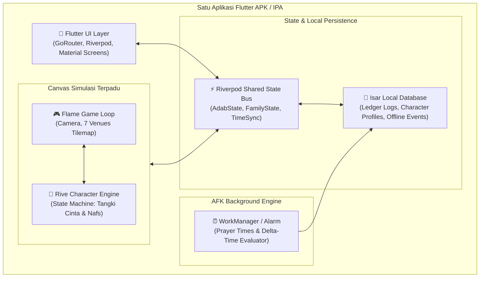

# Analisa Kebutuhan Stack Teknis: "Baitul Fitrah & Madinah Virtual"
### Evaluasi Komparatif Mode Game (2D Isometrik vs 3D) dan Arsitektur Unified Bundle di Flutter

> **Status Dokumen:** Rekomendasi Arsitektur & Analisa Kelayakan Teknis  
> **Target Ekosistem:** Aplikasi Mobile Tunggal (*Unified Flutter Binary Bundle*)  
> **Konstrain Utama:** 
> 1. Modul game simulasi kehidupan & modul microlearning PKN harus berada dalam **satu aplikasi Flutter** yang sama (tanpa aplikasi terpisah).
> 2. Kinerja responsif (60–120 FPS), konsumsi baterai rendah, ukuran installer ramping ($< 50\text{ MB}$), serta mendukung simulasi **Idle / AFK** (*Away From Keyboard*) tanpa menguras daya perangkat.

---

## Daftar Isi
1. [Prinsip Arsitektur "Unified Flutter Bundle"](#1-prinsip-arsitektur-unified-flutter-bundle)
2. [Analisis Kebutuhan Sub-Sistem Game](#2-analisis-kebutuhan-sub-sistem-game)
3. [Evaluasi Mendalam Opsi Mode Game (2D vs 3D)](#3-evaluasi-mendalam-opsi-mode-game-2d-vs-3d)
   - [Opsi 1: 2D Isometrik Pure Dart (Flame Engine + Tiled)](#opsi-1-2d-isometrik-pure-dart-flame-engine--tiled)
   - [Opsi 2: 2D Vektor Dinamis & State Machine (Flame + Rive Hybrid)](#opsi-2-2d-vektor-dinamis--state-machine-flame--rive-hybrid)
   - [Opsi 3: 3D Low-Poly Native Flutter (Flutter Scene / Impeller 3D)](#opsi-3-3d-low-poly-native-flutter-flutter-scene--impeller-3d)
   - [Opsi 4: 3D High-Fidelity Embedded (Unity via Flutter Unity Widget)](#opsi-4-3d-high-fidelity-embedded-unity-via-flutter-unity-widget)
   - [Opsi 5: 3D Open-Source Embedded (Godot Engine via Native Bridge)](#opsi-5-3d-open-source-embedded-godot-engine-via-native-bridge)
4. [Matriks Perbandingan Komparatif (Benchmark & Kriteria)](#4-matriks-perbandingan-komparatif-benchmark--kriteria)
5. [Arsitektur Sub-Sistem AFK (Delta-Time Simulation Algorithm)](#5-arsitektur-sub-sistem-afk-delta-time-simulation-algorithm)
6. [Rekomendasi Tumpukan Teknologi ("The Golden Stack")](#6-rekomendasi-tumpukan-teknologi-the-golden-stack)
7. [Diagram Alur Integrasi Sistem (System Architecture)](#7-diagram-alur-integrasi-sistem-system-architecture)
8. [Roadmap Implementasi Bertahap di Flutter](#8-roadmap-implementasi-bertahap-di-flutter)

---

## 1. Prinsip Arsitektur "Unified Flutter Bundle"

Menyatukan aplikasi edukasi *utility* (feed artikel, audio player, rubrik fast-tap) dengan modul simulasi kehidupan (*The Sims style*) di dalam satu kode Flutter mengharuskan kita mematuhi 4 pilar arsitektur:

```
┌────────────────────────────────────────────────────────────────────────┐
│                   UNIFIED FLUTTER APPLICATION SHELL                   │
├───────────────────────────────────┬────────────────────────────────────┤
│     MODUL EDUKASI & UTILITY       │       MODUL SIMULASI & GAME        │
│  • Feed 6 Pilar MOC PKN           │  • 7 Venue Komunitas Virtual       │
│  • Micro-learning Deck 5 Menit    │  • Virtual Human (Tangki Cinta)    │
│  • Pemutar Audio Sirah Latar      │  • Simulasi Waktu Otonom (AFK)     │
│  • Fast-Tap Rubric 19 Butir Adab  │  • Skenario Pilihan Respons Adab   │
├───────────────────────────────────┴────────────────────────────────────┤
│                STATE MANAGEMENT & PERSISTENSI TUNGGAL                  │
│       • Flutter Riverpod (State Synchronization & Reactive Bus)       │
│       • Isar Database / Drift (Local DB & Welcome Back Ledger)         │
│       • Background WorkManager (Jadwal Shalat & Notifikasi Ringan)    │
└────────────────────────────────────────────────────────────────────────┘
```

1. **Zero Context Switching**: Pengguna tidak merasa berpindah ke aplikasi lain. Transisi dari membaca artikel ke menengok rumah virtual berlangsung instan dalam satu navigasi `GoRouter`.
2. **Shared State (Satu Kebenaran Data)**: Ketika pengguna mencentang jurnal adab nyata di tab edukasi, indikator *Tangki Cinta* avatar di tab simulasi seketika terisi tanpa perlu sinkronisasi API eksternal yang rumit.
3. **Optimasi Resource & Baterai**: Game canvas tidak boleh merender frame grafis ketika pengguna sedang berada di tab bacaan artikel atau saat aplikasi diminimalkan.
4. **Dukungan Offline-First**: Seluruh logika perilaku karakter, perhitungan AFK, dan teks skenario harus dapat berjalan 100% luring (*offline*).

---

## 2. Analisis Kebutuhan Sub-Sistem Game

Untuk mewujudkan 7 lokasi (*Rumah, Sekolah, Masjid, Taman, Pasar, Asrama, Tetangga*) dan karakter virtual yang responsif, dibutuhkan 5 sub-sistem utama:

| Sub-Sistem | Kebutuhan Fungsional | Tantangan Teknis di Flutter |
| :--- | :--- | :--- |
| **A. World & Map Renderer** | Menampilkan peta 7 lokasi dengan transisi kamera, zoom in/out, dan penataan furnitur/ruangan syar'i. | Performa rendering tilemap besar tanpa frame drop di perangkat entry-level. |
| **B. Character Avatar & Animation** | Karakter mengekspresikan emosi (menangis saat tangki cinta kosong, tersenyum, gerakan shalat, berpelukan). | Animasi skeletal/vektor yang luwes tanpa memperbesar ukuran APK. |
| **C. UI Overlay Ergonomics** | Menampilkan tombol aksi dialog, status bar nafs, dan kartu pilihan respons di atas kanvas game. | Integrasi seamless antara kanvas game dengan komponen Flutter Material/Cupertino. |
| **D. AFK Engine & Time Delta** | Menghitung kejadian selama pemain offline (jam shalat, adab mandiri, pending dilemma). | Logika matematika murni (*zero battery drain*) saat aplikasi ditutup. |
| **E. Audio & Ambient Soundscape** | Suara adzan merdu, gemercik air wudhu, desau angin taman, dan narasi sirah nabawiyah. | Sinkronisasi audio background tanpa konflik audio session. |

---

## 3. Evaluasi Mendalam Opsi Mode Game (2D vs 3D)

Berikut adalah analisis objektif terhadap 5 opsi teknologi yang dapat di-bundle ke dalam Flutter:

---

### Opsi 1: 2D Isometrik Pure Dart (Flame Engine + Tiled)
* **Paket Kunci**: `flame: ^1.18.0`, `flame_tiled: ^1.14.0`
* **Gaya Visual**: 2D Isometrik Pixel Art / Stylized Hand-drawn (mirip *Stardew Valley*, *Habbo Hotel*, *Kairosoft*, *Neko Atsume*).
* **Mekanisme**:
  * Peta 7 lokasi dirancang menggunakan editor visual **Tiled Map Editor** (`.tmx`), lalu diimpor langsung ke Flame Engine.
  * Karakter menggunakan *SpriteSheet* animasi (arah 4-sudut isometrik).
* **Kelebihan**:
  * **100% Murni Dart & Flutter**: Tidak ada ketergantungan binary C++/Java/Objective-C eksternal. Kompilasi build sangat cepat dan stabil di CI/CD.
  * **Ukuran Sangat Ramping**: Tambahan ukuran APK hanya sekitar **3–5 MB**.
  * **Efisiensi Baterai & RAM Luar Biasa**: Pemakaian RAM hanya 35–60 MB; FPS terkunci stabil di 60 FPS pada semua tipe HP Android dan iPhone.
  * **Ergonomi UI Terbaik**: Sangat mudah menempatkan widget Flutter asli (seperti `PknButton`, dialog kartu, atau badge adab) tepat di atas canvas game menggunakan `GameWidget(overlayBuilderMap: ...)`.
* **Kekurangan**:
  * Sudut kamera terkunci (isometrik tetap), tidak bisa rotasi kamera 3D bebas 360°.
  * Biaya pembuatan asset 2D sprite untuk banyak variasi pakaian/karakter membutuhkan banyak frame gambar.

---

### Opsi 2: 2D Vektor Dinamis & State Machine (Flame + Rive Hybrid)
* **Paket Kunci**: `flame: ^1.18.0`, `rive: ^0.13.0`, `flame_rive: ^1.10.0`
* **Gaya Visual**: Vektor Modern Kartun Halus (mirip *Duolingo World*, *Alto's Adventure*, *Monument Valley 2D*).
* **Mekanisme**:
  * Peta dan tata ruang dikelola oleh Flame Engine.
  * Setiap karakter Virtual Human adalah file **Rive (.riv)** yang memiliki *State Machine* bawaan.
  * Nilai *Tangki Cinta* atau *Nafs Ammarah* langsung dihubungkan ke input parameter di Rive:
    * `loveTank = 20` $\rightarrow$ avatar otomatis berwajah sayu dan menunduk.
    * `loveTank = 90` $\rightarrow$ avatar tersenyum ceria dan memancarkan aura binar.
    * `isPraying = true` $\rightarrow$ avatar melakukan siklus gerakan ruku' dan sujud secara anatomis presisi.
* **Kelebihan**:
  * **Ekspresi Emosi Paling Hidup**: Sangat tepat untuk konsep *Tazkiyatun Nafs* dan *Bahasa Hati*, di mana ekspresi wajah anak sangat penting.
  * **Ukuran File Vektor Sangat Mini**: Satu file animasi Rive dengan puluhan gerakan hanya berukuran **100–300 KB** (resolusi independen / tidak pecah di layar tablet 4K).
  * Tetap 100% berjalan dalam pipeline Flutter tanpa engine terpisah.
* **Kekurangan**:
  * Desainer grafis harus menguasai tools animasi Rive (bukan sekadar menggambar di Photoshop).

---

### Opsi 3: 3D Low-Poly Native Flutter (Flutter Scene / Impeller 3D)
* **Paket Kunci**: `flutter_scene: experimental`, `vector_math: ^2.1.4`
* **Gaya Visual**: 3D Stylized Low-Poly (mirip *Crossy Road*, *Pocket City*, *The Sims 1 Retro 3D*).
* **Mekanisme**:
  * Memanfaatkan arsitektur grafis terbaru Flutter (Impeller 3D Scene API).
  * Memuat model 3D bertipe `.gltf` atau `.glb` langsung ke canvas Flutter.
* **Kelebihan**:
  * Native di dalam Flutter tanpa native bridging view.
  * Mendukung pencahayaan dinamis 3D (misal: cahaya temaram saat adzan Maghrib, matahari terbit saat Subuh) dan rotasi kamera bebas.
* **Kekurangan**:
  * **Status Masih Eksperimental**: API `flutter_scene` belum berstatus *Production-Ready* di channel stabil Flutter; dokumentasi masih terbatas.
  * Diperlukan pipeline kompilasi shader offline (`shader_compiler`) yang cukup kompleks.

---

### Opsi 4: 3D High-Fidelity Embedded (Unity via Flutter Unity Widget)
* **Paket Kunci**: `flutter_unity_widget: ^2022.2.0`
* **Gaya Visual**: Full 3D Modern Realistis / Semi-Realistis (mirip *The Sims 4 Mobile*, *Animal Crossing: Pocket Camp*).
* **Mekanisme**:
  * Game dibangun penuh di dalam Unity Editor, kemudian di-export sebagai library native (Android AAR / iOS Framework) dan ditempelkan ke dalam widget Flutter.
* **Kelebihan**:
  * Grafis 3D kelas atas, physics engine matang, dan pasar aset 3D (Unity Asset Store) sangat melimpah untuk model rumah, perabotan, dan manusia.
* **Kekurangan**:
  * **Ukuran APK Membengkak Drastis**: Menambah ukuran instalasi sebesar **+60 MB hingga +120 MB**. Ini menjadi penghalang besar bagi target pengguna orang tua dan santri di daerah dengan keterbatasan kuota.
  * **Beban RAM & Baterai Berat**: Konsumsi RAM melonjak ke **200–350 MB**, memicu panas perangkat (*throttling*) dan baterai boros.
  * **Integrasi Ringkih (Fragile Bridge)**: Komunikasi antara Flutter dan Unity berjalan lewat jembatan pesan string (IPC), rawan terjadi crash (*out-of-memory*) saat berpindah tab.
  * **CI/CD Sangat Sulit**: Proses build di server otomatis (GitHub Actions) membutuhkan lisensi Unity dan memakan waktu kompilasi 3–5 kali lebih lama.

---

### Opsi 5: 3D Open-Source Embedded (Godot Engine via Native Bridge)
* **Paket Kunci**: `godot-flutter-embedder` / WebGL Canvas View
* **Gaya Visual**: 3D Stylized / 2.5D Ringan.
* **Mekanisme**:
  * Memanfaatkan engine open-source Godot 4 yang jauh lebih ringan daripada Unity.
* **Kelebihan**:
  * Open source (bebas lisensi komersial), binary size lebih kecil daripada Unity (+25–35 MB).
* **Kekurangan**:
  * Integrasi embedding Godot ke dalam Flutter masih didukung oleh proyek komunitas yang belum resmi didukung Google maupun Godot Foundation, berisiko tinggi saat upgrade versi Flutter OS baru.

---

## 4. Matriks Perbandingan Komparatif (Benchmark & Kriteria)

Skala penilaian: ⭐ (Sangat Buruk) hingga ⭐⭐⭐⭐⭐ (Sangat Unggul)

| Kriteria Evaluasi | Opsi 1: Flame 2D (Tiled) | Opsi 2: Flame + Rive (Hybrid) | Opsi 3: Flutter Scene 3D | Opsi 4: Unity Embedded 3D | Opsi 5: Godot Embedded |
| :--- | :---: | :---: | :---: | :---: | :---: |
| **Kesesuaian Bundle Flutter** | ⭐⭐⭐⭐⭐ (Pure Dart) | ⭐⭐⭐⭐⭐ (Pure Dart) | ⭐⭐⭐⭐ (Native Impeller)| ⭐⭐ (Native Bridge) | ⭐⭐⭐ (Community Bridge) |
| **Ukuran Tambahan APK** | ⭐⭐⭐⭐⭐ (+3 MB) | ⭐⭐⭐⭐⭐ (+4 MB) | ⭐⭐⭐⭐ (+8 MB) | ⭐ (+70–120 MB) | ⭐⭐⭐ (+30 MB) |
| **Konsumsi RAM & Baterai** | ⭐⭐⭐⭐⭐ (35-50 MB) | ⭐⭐⭐⭐⭐ (40-60 MB) | ⭐⭐⭐⭐ (70-90 MB) | ⭐ (250-400 MB) | ⭐⭐⭐ (120-180 MB) |
| **Kecepatan Render (FPS)** | 60–120 FPS Stabil | 60–120 FPS Stabil | 60 FPS (Tergantung GPU)| Sering Drop di Low-End | 60 FPS |
| **Keluwesan Ekspresi Adab** | ⭐⭐⭐ (Sprite Tetap) | ⭐⭐⭐⭐⭐ (Vektor Emosi) | ⭐⭐⭐⭐ (Skeletal 3D) | ⭐⭐⭐⭐⭐ (Morf 3D) | ⭐⭐⭐⭐ (3D Mesh) |
| **Kemudahan Integrasi UI** | ⭐⭐⭐⭐⭐ (Sangat Mudah) | ⭐⭐⭐⭐⭐ (Sangat Mudah) | ⭐⭐⭐⭐ (Mudah) | ⭐⭐ (Sangat Rumit) | ⭐⭐⭐ (Sedang) |
| **Simulasi AFK di Background** | ⭐⭐⭐⭐⭐ (Native Worker) | ⭐⭐⭐⭐⭐ (Native Worker) | ⭐⭐⭐⭐⭐ (Native Worker)| ⭐⭐ (Harus Stop Unity) | ⭐⭐⭐ (Native Worker) |
| **Kesiapan Produksi (Maturity)**| ⭐⭐⭐⭐⭐ (Stable) | ⭐⭐⭐⭐⭐ (Stable) | ⭐⭐ (Experimental) | ⭐⭐⭐ (Maintenance Berat)| ⭐⭐ (Eksperimen) |

---

## 5. Arsitektur Sub-Sistem AFK (Delta-Time Simulation Algorithm)

Fitur utama yang diminta pengguna adalah **kehidupan virtual tetap berjalan saat aplikasi ditutup (AFK)** dan kejadian dikumpulkan saat login kembali.

> [!IMPORTANT]
> **Prinsip Efisiensi Daya**: Game simulasi AFK yang cerdas **TIDAK menjalankan loop rendering grafis di latar belakang** (karena akan membunuh baterai dan dihentikan paksa oleh sistem operasi Android/iOS).  
> Sebaliknya, sistem menggunakan **"Algoritma Matematika Delta Waktu" (*Timestamp Delta Calculation*)**.

```
Saat Aplikasi Diminimalkan / Ditutup:
┌────────────────────────────────────────────────────────┐
│ 1. Simpan `last_exit_timestamp` = DateTime.now()       │
│ 2. Simpan status terakhir (Tangki Cinta, Adab, Waktu)  │
│ 3. Aktifkan WorkManager ringan untuk alarm adzan       │
└────────────────────────────────────────────────────────┘
                           │
                 [WAKTU BERLALU DI DUNIA NYATA]
                 (Pemain tidur / bekerja 6 jam)
                           │
Saat Aplikasi Dibuka Kembali (Login):
┌────────────────────────────────────────────────────────┐
│ 4. `delta_seconds` = now.difference(last_exit_timestamp)│
│ 5. Eksekusi `OfflineSimulationEngine.evaluate(delta)`  │
│    • Berapa waktu shalat yang terlewati?               │
│    • Berapa siklus penurunan/kenaikan tangki cinta?    │
│    • Jalankan Markov Chain Generator untuk peristiwa   │
│ 6. Tulis daftar peristiwa ke `WelcomeBackLedger`       │
│ 7. Tampilkan Layar Sinematik Ringkasan Kejadian (<100ms)│
└────────────────────────────────────────────────────────┘
```

### Logika Penghitungan Kejadian Mandiri:
1. **Pemeriksaan Jadwal Waktu Shalat**:
   Jika dalam rentang `delta_seconds` melewati waktu Zhuhur (misal pk 12.05):
   * Karakter dengan Adab Shalat **MM** $\rightarrow$ Otomatis sukses shalat berjamaah di masjid; catat log keberkahan: `+10 Sakinah Points`.
   * Karakter dengan Adab Shalat **BT** $\rightarrow$ Muncul peluang 70% terjadi konflik berebut mainan di kelas; masukkan ke antrean *Pending Dilemma* untuk diselesaikan pemain.
2. **Koleksi Embun Berkah (AFK Harvest)**:
   * Setiap jam offline menghasilkan $N$ butir embun keberkahan dari tanaman di *Hadiqatul Fitrah*, dengan batas tampung maksimal 12 jam (mencegah penumpukan tak terbatas).

---

## 6. Rekomendasi Tumpukan Teknologi ("The Golden Stack")

Berdasarkan analisis kelayakan teknis, stabilitas, efisiensi ukuran, serta keselarasan dengan manhaj PKN, **rekomendasi terbaik untuk diimplementasikan adalah: OPSI 2 (2D Isometrik Hybrid: Flame Engine + Rive Animation)**.

### Rincian Pustaka Paket (`pubspec.yaml`):

```yaml
dependencies:
  flutter:
    sdk: flutter

  # 1. State Management & Arsitektur Utama (Telah Terpasang)
  flutter_riverpod: ^2.6.1
  go_router: ^14.7.2
  google_fonts: ^6.2.1

  # 2. Game Engine 2D Isometrik & Peta Venues
  flame: ^1.18.0                # Game engine murni Flutter
  flame_tiled: ^1.14.0          # Parser peta 7 lokasi dari Tiled (.tmx)

  # 3. Ekspresi Wajah & Animasi Karakter Virtual Human
  rive: ^0.13.0                 # Vektor animasi ekspresif (Tangki Cinta & Nafs)
  flame_rive: ^1.10.0           # Jembatan integrasi Rive ke dalam Flame

  # 4. Database Lokal Cepat untuk Welcome Back Ledger
  isar: ^3.1.0+1                # Database NoSQL luring ultra-cepat
  isar_flutter_libs: ^3.1.0+1   # Binary SQLite/Isar ringkas
  path_provider: ^2.1.4

  # 5. Background Task Ringan untuk Jam Shalat & AFK
  workmanager: ^0.5.2           # Background scheduler ramah baterai
  flutter_local_notifications: ^17.2.2 # Notifikasi santun adzan & dilema anak

  # 6. Audio Lingkungan & Sirah
  audioplayers: ^6.0.0          # Pemutar audio suara alam & lantunan adzan
```

### Mengapa Kombinasi Flame + Rive adalah Pilihan Terbaik?
1. **Kedalaman Emosi Tanpa Beban Berat**: Rive memungkinkan mata avatar berkedip, menangis pelan, tersenyum haru, atau memeluk orang tua dengan kualitas animasi sehalus film kartun Pixar 2D, namun ukuran filenya di bawah 1 MB.
2. **Skalabilitas 7 Lokasi**: Flame Engine dengan mudah memuat peta 7 venue melalui sistem *Tiled Map Chunking* (hanya me-render area yang terlihat di layar pemain).
3. **Penyatuan Total dalam Flutter**: Seluruh state game dapat dibaca langsung oleh widget Flutter konvensional melalui *Riverpod Providers*.

---

## 7. Diagram Alur Integrasi Sistem (System Architecture)



---

## 8. Roadmap Implementasi Bertahap di Flutter

Pengembangan dapat dilakukan secara modular tanpa mengganggu fitur microlearning yang sudah berjalan:

```
┌────────────────────────────────────────────────────────────────────────┐
│                        ROADMAP TEKNIS IMPLEMENTASI                     │
├────────────────────────────────┬───────────────────────────────────────┤
│ SPRINT 1: PONDASI STATE & DB   │ • Setup schema database Isar untuk    │
│ (State & Ledger Engine)        │   `CharacterState` & `LedgerEvent`    │
│                                │ • Buat `DeltaTimeSimulationService`   │
│                                │ • Unit test algoritma AFK matematis   │
├────────────────────────────────┼───────────────────────────────────────┤
│ SPRINT 2: PROTOTIPE RUANG RUMAH│ • Tambahkan paket `flame` & `rive`    │
│ (Baitul Fitrah & Tangki Cinta) │ • Buat canvas 1 ruangan (Baitul Fitrah│
│                                │ • Tautkan parameter Tangki Cinta ke   │
│                                │   avatar anak (senyum vs menangis)    │
│                                │ • Overlay widget dialog respons PKN   │
├────────────────────────────────┼───────────────────────────────────────┤
│ SPRINT 3: AFK SCREEN & LEDGER  │ • Bangun layar sinematik UI           │
│ (The Welcome Back Ledger)      │   `WelcomeBackLedgerScreen` di Flutter│
│                                │ • Simulasi offline 4 jam & verifikasi │
│                                │   kejadian log otomatis               │
├────────────────────────────────┼───────────────────────────────────────┤
│ SPRINT 4: EKSPANSI 7 VENUES    │ • Integrasi Tiled map untuk Kuttab,   │
│ (Peta Komunitas Madani)        │   Masjid Jami', Taman Alam, dan Pasar │
│                                │ • Transisi kamera antar-wilayah       │
│                                │ • Integrasi audio adzan & alam        │
└────────────────────────────────┴───────────────────────────────────────┘
```

---

## 9. Kesimpulan

Membangun modul simulasi kehidupan virtual ala *The Sims* yang digabungkan dengan aplikasi microlearning PKN dalam **satu bundle Flutter** sangat layak (*technically feasible*) dan efisien jika menggunakan **Opsi 2: Flame Engine + Rive Vektor Hybrid**.

Pendekatan ini memberikan visual yang anggun dan menyentuh emosi fitrah, ukuran installer yang tetap di bawah $50\text{ MB}$, performa 60–120 FPS tanpa panas perangkat, serta kebebasan bagi pengguna untuk menikmati kehidupan kampung virtual secara santai melalui mekanisme **Idle / AFK** yang tidak adiktif.
