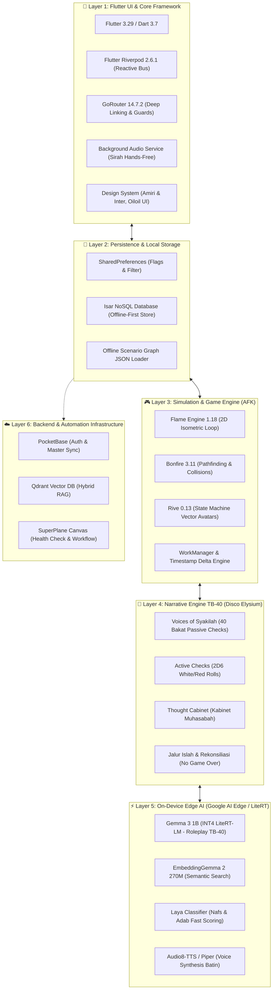
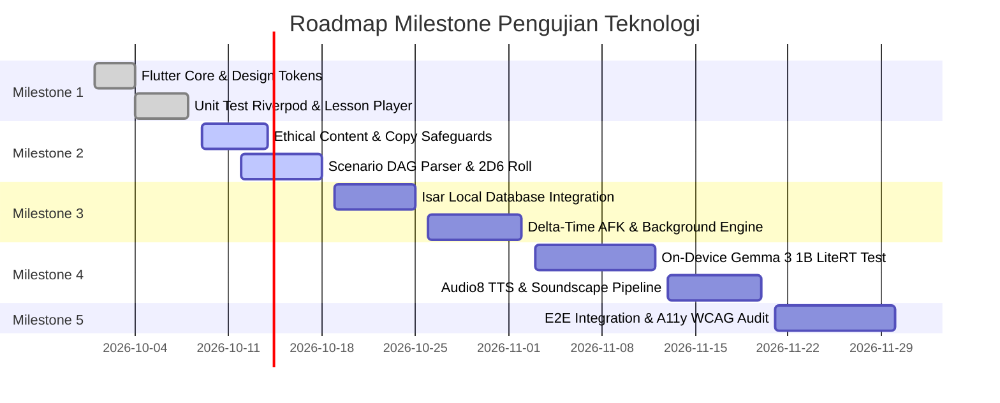

# 🧪 Dokumen Master TODO: Pengujian & Validasi Tumpukan Teknologi (Tech Stack Testing)
### PKN Healing Mobile App — Unified Flutter Architecture & Dual-Core Ecosystem

> **Status Dokumen:** Living Document / Active Verification Checklist  
> **Versi:** 1.0.0  
> **Terakhir Diperbarui:** 8 Oktober 2026  
> **Target Ekosistem:** Unified Flutter Binary (Android & iOS) + Local/Edge AI + Micro-Services  
> **Filosofi Pengujian:** *Zero-Crash, Calm-UX, Offline-First, Zero-Cloud-Leak (Privasi Batin Terjamin), High Syar'i Fidelity*

---

## 1. Peta Lanskap Teknologi & Arsitektur yang Diuji

Aplikasi **PKN Healing Mobile App** mengintegrasikan berbagai lapisan teknologi mutakhir dalam satu ekosistem:



---

## 2. Matriks Pengujian Komprehensif Berdasarkan Lapisan (TODO Checklist)

### 2.1. Layer 1: Mobile Core & UI Framework (Flutter & Dart)
Fokus: Stabilitas UI, routing navigasi, manajemen state reaktif, performa rendering font dalil, dan pemutar audio sirah.

| ID | Komponen / Target | Metode Uji | Kriteria Keberhasilan (Acceptance Criteria) | Status |
| :--- | :--- | :--- | :--- | :---: |
| **TEST-1.1** | Static Code Analysis | `flutter analyze` | 0 errors, 0 warnings, 0 lints violations di seluruh berkas Dart. | [x] |
| **TEST-1.2** | Unit Test Riverpod Controllers | `flutter test test/features/` | 13/13 unit test eksisting passing (Feed, LessonPlayer, Onboarding). | [x] |
| **TEST-1.3** | GoRouter Navigation & Deep Links | Widget Test & Manual | Transisi antar tab (`/feed`, `/lessons`, `/profile`) instan tanpa jank; back-navigation stack terjaga konsisten. | [ ] |
| **TEST-1.4** | Onboarding Diagnostic JTBD | Unit & Widget Test | Algoritma penentuan 6 kluster arketipe persona menghasilkan rekomendasi rute MOC yang 100% deterministik. | [x] |
| **TEST-1.5** | Arabic Dalil Rendering & Amiri Font | Visual & Layout Test | Teks ayat Al-Qur'an dan matan hadits render benar secara RTL (Right-to-Left) tanpa terpotong harakat di resolusi 320px s.d. tablet. | [ ] |
| **TEST-1.6** | Background Audio Session | Manual / Native Mock | Audio sirah tetap berputar saat layar HP dimatikan (*locked screen*) atau beralih ke aplikasi lain; integrasi lockscreen media control responsif. | [ ] |
| **TEST-1.7** | Fast-Tap Adab Rubric (BT-MT-BK-MM) | Widget Test | Interaksi tap 19 butir adab mencatat status kualitatif tanpa delay (< 16 ms) dan tidak memicu layout reflow. | [ ] |

---

### 2.2. Layer 2: Persistence & Local Storage (Offline-First)
Fokus: Kecepatan baca-tulis luring, integritas data jurnal adab, migrasi skema Isar, dan mitigasi korupsi data saat baterai habis.

| ID | Komponen / Target | Metode Uji | Kriteria Keberhasilan (Acceptance Criteria) | Status |
| :--- | :--- | :--- | :--- | :---: |
| **TEST-2.1** | SharedPreferences Storage Service | Unit Test | Penyimpanan bookmark gagasan, filter pilar MOC aktif, dan status onboarding selesai tersimpan presisten melintasi restart app. | [x] |
| **TEST-2.2** | Isar Database Schema Initialization | Integration Test | Database Isar terbuka dalam `< 50 ms` saat cold start tanpa blocking UI thread. | [ ] |
| **TEST-2.3** | CharacterEntity CRUD & Queries | Unit Test | Entitas karakter (fase usia, tangki cinta, status nafs, skor bakat) dapat dibuat, dibaca, dan diperbarui secara atomik. | [ ] |
| **TEST-2.4** | The Welcome Back Ledger Persistence | Stress Test | Mampu menyimpan hingga 1000+ entri `LedgerEventEntity` luring tanpa penurunan performa kueri (< 10 ms). | [ ] |
| **TEST-2.5** | ScenarioProgressEntity Integrity | Unit Test | Catatan riwayat pilihan dialog dan pencapaian cabang tersimpan utuh bahkan jika aplikasi di-*kill* paksa (*force kill*) di tengah skenario. | [ ] |
| **TEST-2.6** | Real-to-Virtual Mission Synchronization | Integration Test | Konfirmasi misi nyata (misal: pelukan tanpa gadget) mengupdate state entitas dan membuka reward virtual secara offline. | [ ] |

---

### 2.3. Layer 3: Simulation & Game Engine (Flame + Bonfire + Rive)
Fokus: Loop game 2D isometrik, deteksi tabrakan, pathfinding otonom, animasi vektor ekspresif, dan efisiensi algoritma AFK.

| ID | Komponen / Target | Metode Uji | Kriteria Keberhasilan (Acceptance Criteria) | Status |
| :--- | :--- | :--- | :--- | :---: |
| **TEST-3.1** | Flame Engine Game Loop & FPS Stability | FPS Profiler / DevTools | Kanvas berjalan stabil pada 60 FPS (atau 120 FPS pada display high-refresh-rate) di perangkat entry-level (RAM 3-4 GB). | [ ] |
| **TEST-3.2** | Bonfire Tiled Map & Collision Parsing | Visual / Collision Test | Karakter avatar tidak menembus dinding ruangan di peta *Baitul Fitrah* (kamar, dapur, musholla rumah); transisi pintu kamar bersekat usia 10 thn berfungsi normal. | [ ] |
| **TEST-3.3** | Autonomous NPC Pathfinding | Stress Test | NPC anak dan orang tua dapat bernavigasi mandiri ke musholla saat masuk waktu shalat tanpa terjebak (*path stuck*) di sudut peta. | [ ] |
| **TEST-3.4** | Rive State Machine Inputs Verification | Unit & Visual Test | Input `.riv` (`loveTankLevel`, `nafsState`, `triggerCry`, `triggerShalat`) mengubah ekspresi wajah (mata berkaca-kaca, senyum) dan gestur tubuh secara mulus tanpa lag. | [ ] |
| **TEST-3.5** | 24-Hour Dynamic Lighting System | Shader / Overlay Test | Perubahan warna pencahayaan lingkungan (Fajar, Siang Cerah, Senja, Malam) transisi secara gradual sesuai jam lokal perangkat tanpa spike CPU. | [ ] |
| **TEST-3.6** | Delta-Time AFK Offline Decay Calculation | Unit Test Math | Perhitungan rumus luruh Tangki Cinta ($\Delta t = t_{\text{resume}} - t_{\text{last\_exit}}$ dengan koefisien $\lambda$) tepat secara matematis dan dieksekusi instan (< 5 ms) saat resume. | [ ] |
| **TEST-3.7** | Zero-Battery Background Overhead | Battery Historian / Android Profiler | Tidak ada background rendering loop saat aplikasi ditutup; konsumsi baterai saat AFK murni 0% tambahan di luar OS background scheduler. | [ ] |

---

### 2.4. Layer 4: Narrative Engine & Mekanik TB-40 (Disco Elysium Style)
Fokus: Graf percabangan cerita, validasi skema JSON skenario, mekanisme dadu 2D6, kabinet muhasabah, dan rute rekonsiliasi.

| ID | Komponen / Target | Metode Uji | Kriteria Keberhasilan (Acceptance Criteria) | Status |
| :--- | :--- | :--- | :--- | :---: |
| **TEST-4.1** | Scenario JSON DAG Schema Validation | Automated Schema Test | Berkas `assets/data/scenarios/*.json` valid terhadap schema: setiap `choice` memiliki `targetNodeId` yang ada, tidak ada *dead-end* tanpa penyelesaian. | [x] |
| **TEST-4.2** | Voices of Syakilah (Passive Skill Checks) | Unit Test | Bakat TB-40 bersuara di kepala karakter jika nilai bakat memenuhi ambang batas (contoh: *Firaasah >= 12* mendeteksi kegelisahan anak tersembunyi). | [ ] |
| **TEST-4.3** | Active Checks Mechanics (2D6 Roll) | Unit Test Probability | Algoritma simulasi dadu $2D6 + \text{Skill Bonus} \ge \text{Target Difficulty}$ menghasilkan distribusi acak wajar; *Critical Success* (dobel 6) dan *Critical Flaw* (dobel 1) ditangani. | [ ] |
| **TEST-4.4** | White Check vs Red Check Gating | State Test | *White Check* yang gagal dapat diulang setelah pemain melakukan riyadhoh/wudhu/muhasabah; *Red Check* mengunci pilihan secara permanen pada sesi tersebut. | [ ] |
| **TEST-4.5** | Prerequisite Choice Gating (Mumtaz..Munkar) | Widget & State Test | Pilihan dialog tier tertinggi (*Mumtaz*) terkunci jika prasyarat belum terpenuhi; mengetuk pilihan terkunci memunculkan *Educational Learning Tooltip* (dalil & analisis gap). | [ ] |
| **TEST-4.6** | Thought Cabinet (Kabinet Muhasabah) | Unit & Timer Test | Pemikiran tarbiyah (misal: *"Koneksi Sebelum Koreksi"*) membutuhkan waktu internalisasi (misal: 30 menit AFK) sebelum memberikan bonus pasif permanen pada dialog. | [ ] |
| **TEST-4.7** | Jalur Islah & Rekonsiliasi (No Game Over) | Branching Scenario Test | Pemilihan respons yang keliru tidak memicu layar *"Game Over"*, melainkan konsekuensi alami relasional dan membuka cabang minta maaf / pemulihan adab (*Tazkiyah*). | [ ] |
| **TEST-4.8** | Multi-Character POV Relay Mode | Flow Test | Transisi sudut pandang bergantian (kendali Ayah $\rightarrow$ Ibu $\rightarrow$ Anak) dalam satu konflik adab berjalan mulus tanpa kehilangan konteks state dialog. | [ ] |

---

### 2.5. Layer 5: On-Device Edge AI, SLM & Voice Synthesis (Google AI Edge / LiteRT)
Fokus: Integrasi model bahasa kecil lokal, latensi inferensi, privasi percakapan curhat batin, kepatuhan peran syar'i, dan sintesis audio suara batin.

| ID | Komponen / Target | Metode Uji | Kriteria Keberhasilan (Acceptance Criteria) | Status |
| :--- | :--- | :--- | :--- | :---: |
| **TEST-5.1** | LiteRT-LM Runtime Integration | Hardware Bridge Test | Pustaka LiteRT-LM berhasil diinisialisasi pada Android (GPU Vulkan / NPU) dan iOS (Metal) tanpa crash. | [ ] |
| **TEST-5.2** | Gemma 3 1B On-Device Latency & Throughput | Benchmark Harness | Inferensi `gemma3:1b` (INT4, ~550 MB): Time-to-First-Token (TTFT) `< 1.2 detik`, kecepatan generasi `> 20 tokens/detik` di perangkat mid-range. | [ ] |
| **TEST-5.3** | Gemma 3 1B RAM & Thermal Footprint | Profiling Uji Beban | Penggunaan RAM/VRAM saat inferensi aktif `< 1.2 GB`; temperatur perangkat tidak memicu thermal throttling ekstrem setelah 5 putaran dialog. | [ ] |
| **TEST-5.4** | TB-40 Dialectics Roleplay Fidelity | Qualitative Benchmark | Model konsisten membedakan watak antar-bakat (misal: *Syajaa'ah* tegas syar'i vs *Rifq* lembut menyentuh hati vs *Hikmah* sintesis penengah) tanpa *mode collapse*. | [ ] |
| **TEST-5.5** | Zero Cloud Leak & Curhat Privacy Audit | Network Sniffer Test | Seluruh prompt percakapan di fitur "Ruang Teman Curhat Batin" diproses 100% lokal on-device; 0 byte data teks/suara dikirim ke internet saat offline maupun online. | [ ] |
| **TEST-5.6** | Syar'i Alignment & Safety Guardrails | Adversarial Prompting | Model menolak memberikan saran yang menyalahi syariat (misal membenarkan kekerasan fisik pada balita, menuduh munafik secara serampangan) dan mengarahkan kembali ke hikmah nabawiyah. | [ ] |
| **TEST-5.7** | EmbeddingGemma 2 270M Semantic Search | Latency & Recall Test | Pencarian makna bebas di feed artikel dan hadits mengembalikan kartu dalil yang relevan dalam waktu `< 30 ms` secara offline. | [ ] |
| **TEST-5.8** | Laya Classifier Fast Decision Pass | Benchmark Uji Cepat | Klasifikasi kondisi nafs (*Ammarah / Lawwamah / Muthma'innah*) dari jurnal observasi adab selesai dalam `< 20 ms` (single forward pass). | [ ] |
| **TEST-5.9** | On-Device TTS Audio Synthesis (Audio8 / Piper) | Audio Latency & Clarity | Sintesis suara batin dialektika menghasilkan ucapan bahasa Indonesia/Arab yang fasih, lafal jelas, latensi sintesis kalimat `< 800 ms`, ukuran model `< 40 MB`. | [ ] |

---

### 2.6. Layer 6: Backend, Vector Database & Workflow Automation
Fokus: Ketersediaan API PocketBase, performa pencarian vektor Qdrant, dan orkestrasi otomatis SuperPlane Canvas.

| ID | Komponen / Target | Metode Uji | Kriteria Keberhasilan (Acceptance Criteria) | Status |
| :--- | :--- | :--- | :--- | :---: |
| **TEST-6.1** | PocketBase Health & Connectivity | HTTP Health Probe | Endpoint `http://localhost:8090/api/health` merespons status `200 OK` dalam `< 100 ms`. | [ ] |
| **TEST-6.2** | PocketBase Data Sync & Conflict Resolution | Sync Integration Test | Sinkronisasi profil dan progres bookmark berhasil saat perangkat online kembali; resolusi konflik mengutamakan timestamp termutakhir (*last-write-wins*). | [ ] |
| **TEST-6.3** | Qdrant Vector DB Health & Vector Indexing | Vector Query Test | Endpoint `http://localhost:6335/healthz` merespons `200 OK`; pencarian kemiripan kosinus (*cosine similarity*) artikel MOC selesai `< 15 ms`. | [ ] |
| **TEST-6.4** | SuperPlane Manual & Scheduled Trigger | Canvas Execution Test | Node `manual-trigger-001` dan `schedule-trigger-002` di `superplane/canvas.yaml` berhasil mengeksekusi pipeline pengecekan PocketBase dan Qdrant tanpa error. | [ ] |
| **TEST-6.5** | SuperPlane Canvas Memory & Summary Display | Pipeline State Test | Node `upsert-ecosystem-status-005` berhasil menyimpan timestamp unix dan status `online` ke namespace `pknEcosystemHealth`; node display menampilkan summary hijau. | [ ] |

---

### 2.7. Layer 7: Non-Functional, Resource & Hardware Compatibility
Fokus: Ukuran binary aplikasi, waktu booting, pemakaian memori, kompatibilitas display, dan aksesibilitas (WCAG 2.1 AA).

| ID | Komponen / Target | Metode Uji | Kriteria Keberhasilan (Acceptance Criteria) | Status |
| :--- | :--- | :--- | :--- | :---: |
| **TEST-7.1** | Binary Footprint (APK & IPA Size) | Release Build Analysis | Ukuran APK Android Production `< 40 MB` (tanpa embedded SLM) dan `< 600 MB` (jika bundling Gemma 3 1B INT4 on-device). | [ ] |
| **TEST-7.2** | Cold Startup Time | Time-to-Interactive (TTI) | Waktu mulai dari ikon diketuk sampai layar beranda/feed siap menerima sentuhan `< 1.0 detik`. | [ ] |
| **TEST-7.3** | Runtime RAM Footprint (Utility Mode) | Memory Profiler | Konsumsi RAM saat membaca artikel dan kuis microlearning `< 35–45 MB`. | [ ] |
| **TEST-7.4** | Runtime RAM Footprint (Simulation Mode) | Memory Profiler | Konsumsi RAM saat canvas Flame + Bonfire aktif `< 60 MB`. | [ ] |
| **TEST-7.5** | Large Text Accessibility (Text Scaling 200%) | A11y Setting Test | Seluruh teks panduan darurat (*Lead TL;DR*) dan opsi kuis tetap terbaca, reflow dengan rapi, tanpa terpotong (*no clipping/overflow*) saat font scale OS disetel ke 200%. | [ ] |
| **TEST-7.6** | Touch Target Size Accessibility | Touch Bounds Inspection | Semua tombol aksi darurat dan pilihan adab memiliki area sentuh minimum `48x48 dp` (memenuhi standar WCAG 2.1 AA & Material Guidelines). | [ ] |
| **TEST-7.7** | Contrast Ratio Compliance | Color Contrast Audit | Kontras rasio teks terhadap latar belakang $\ge 4.5:1$ untuk teks normal dan $\ge 3.0:1$ untuk teks besar di tema Terang maupun Gelap (*Dark Theme*). | [ ] |

---

### 2.8. Layer 8: Ethical Safeguards, Content Safety & Anti-Guilt UX
Fokus: Menghilangkan risiko kekerasan fisik, mencegah pelabelan spiritual kaku, dan menjamin pengalaman bebas rasa bersalah.

| ID | Komponen / Target | Metode Uji | Kriteria Keberhasilan (Acceptance Criteria) | Status |
| :--- | :--- | :--- | :--- | :---: |
| **TEST-8.1** | Safeguarding Redaksi Tantrum (Temuan F1) | Content & Code Audit | Memastikan tidak ada teks yang memaksa pelukan fisik saat anak sedang meronta/disregulasi sensorik; kontak fisik harus selalu bersyarat atas kesediaan anak. | [ ] |
| **TEST-8.2** | Batas Syar'i Disiplin Shalat (Temuan F1) | Content & Syar'i Review | Memastikan tidak ada kalimat yang dapat disalahartikan sebagai legalisasi pemukulan keras setelah usia 10 tahun; redaksi selaras dengan kaidah *ghairu mubarrih* (pantang melukai & haram memukul wajah). | [ ] |
| **TEST-8.3** | Penghapusan Kode Engineering Internal (Temuan F2) | UX Copy Review | Tidak ada kode mentah internal (`P1-P6`, `T1-T5`, `D2`, `R1`) yang tampil di antarmuka navigasi utama orang tua; semua digantikan label tugas nyata (*Job-to-be-Done*). | [ ] |
| **TEST-8.4** | Non-Pathologizing Avatar Indicator (Temuan F9) | Visual & Copy Audit | Parameter *Tangki Cinta* dan *Nafs Barometer* pada simulasi disajikan dengan deskripsi naratif kontekstual dan disclaimer tegas bahwa ini adalah media fiksi edukatif, bukan alat psikometrik penilai anak kandung. | [ ] |
| **TEST-8.5** | Anti-Guilt UX Verification | Logic & Copy Audit | Pengguna yang tidak membuka aplikasi selama berhari-hari/berminggu-minggu TIDAK diberikan notifikasi yang memicu rasa bersalah (*zero guilt-tripping*); sambutan kembali disajikan dengan empati dan kelapangan dada. | [ ] |

---

## 3. Matriks Eksekusi Perintah Pengujian (Execution Guide)

Berikut kumpulan perintah CLI siap pakai untuk menjalankan verifikasi di lingkungan pengembangan lokal:

### 3.1. Pengujian Rutin Flutter & Dart
```bash
# Pastikan path flutter terdaftar
export PATH="$HOME/flutter/bin:$PATH"

# 1. Analisis statis kode (Wajib 0 issues)
flutter analyze

# 2. Jalankan seluruh automated unit & widget test
flutter test --reporter expanded

# 3. Jalankan test dengan kalkulasi coverage
flutter test --coverage
genhtml coverage/lcov.info -o coverage/html
```

### 3.2. Pengujian Validasi Skenario Cerita (JSON Schema)
```bash
# Uji integritas berkas skenario DAG JSON
python3 -c "
import json, glob, sys
files = glob.glob('assets/data/scenarios/*.json')
for f in files:
    with open(f) as fp:
        data = json.load(fp)
        nodes = {n['nodeId']: n for n in data.get('scenarioGraph', {}).get('nodes', [])}
        for n_id, node in nodes.items():
            for c in node.get('choices', []):
                target = c.get('targetNodeId')
                if target and target not in nodes:
                    print(f'❌ Broken link in {f}: {n_id} -> {target}')
                    sys.exit(1)
print(f'✅ All {len(files)} scenario graph files are consistent!')
"
```

### 3.3. Pengujian Infrastruktur Backend & SuperPlane
```bash
# Uji respons PocketBase
curl -I -s --max-time 5 http://localhost:8090/api/health | head -n 1

# Uji respons Qdrant Vector DB
curl -I -s --max-time 5 http://localhost:6335/healthz | head -n 1

# Uji eksekusi SuperPlane CLI
superplane apps active
```

### 3.4. Pengujian Model Gemma 3 1B Lokal (Ollama / LiteRT Harness)
```bash
# Uji kecepatan dan koherensi peran TB-40
ollama run gemma3:1b "Sebagai bakat Syajaa'ah (Ketegasan) dalam TB-40, bagaimana tanggapanmu dalam 2 kalimat ketika anak 8 tahun menolak shalat karena bermain?"
```

---

## 4. Jadwal & Prioritas Milestone Verifikasi



---

## 5. Ringkasan Status & Penanggung Jawab

| Lapisan Pengujian | Total Butir Uji | Lolos (Passed) | Dalam Antrean (Pending) | Persentase Selesai |
| :--- | :---: | :---: | :---: | :---: |
| **Layer 1: Mobile Core & UI** | 7 | 3 | 4 | **43%** |
| **Layer 2: Local Persistence** | 6 | 1 | 5 | **17%** |
| **Layer 3: Simulation & Game Engine** | 7 | 0 | 7 | **0%** |
| **Layer 4: Narrative Engine TB-40** | 8 | 1 | 7 | **12.5%** |
| **Layer 5: On-Device Edge AI & TTS** | 9 | 0 | 9 | **0%** |
| **Layer 6: Backend & Automation** | 5 | 0 | 5 | **0%** |
| **Layer 7: Non-Functional & A11y** | 7 | 0 | 7 | **0%** |
| **Layer 8: Ethical & Content Safety** | 5 | 0 | 5 | **0%** |
| **TOTAL KESELURUHAN** | **54** | **5** | **49** | **9.3%** |

---

> 📌 **Catatan Pengembang:**  
> Setiap penambahan paket pada `pubspec.yaml`, perubahan model database Isar, atau integrasi bobot model LiteRT baru **wajib menambahkan dan memperbarui checklist pengujian pada dokumen ini**.
