# Peta User Journey Aplikasi Mobile PKN (Pendidikan Karakter Nabawiyah)

> Dokumen ini merumuskan **App User Journey (Perjalanan Pengguna Aplikasi Mobile)** untuk seluruh kluster persona yang diadaptasi dari repositori keilmuan `wiki-pkn/analisis-desain/persona/`. 
>
> Setiap perjalanan dirancang dengan mengacu pada filosofi **Tazkiyatun Nafs**, tanpa jebakan gamifikasi adiktif/toksik (tanpa streak shaming, tanpa leaderboard komparatif), mengutamakan prinsip **Lead TL;DR < 10 detik**, **Micro-learning Deck 3–5 menit**, pemutar **Audio Sirah & Tazkiyah luring**, serta rubrik adab kualitatif otentik (**BT - MT - BK - MM**).

---

## Daftar Isi
1. [Taksonomi 5 Ranah Ekosistem & Matriks Persona](#1-taksonomi-5-ranah-ekosistem--matriks-persona)
2. [Prinsip Desain Pengalaman Pengguna (UX Foundations)](#2-prinsip-desain-pengalaman-pengguna-ux-foundations)
3. [Ranah 1: Pengasuhan Keluarga](#3-ranah-1-pengasuhan-keluarga)
   - [01a — Ayah / Bapak (Kepala Keluarga & Penegak Visi)](#persona-01a--ayah--bapak-kepala-keluarga--penegak-visi)
   - [01b — Ibu / Bunda (Madrasah Utama & Pengasuh Harian)](#persona-01b--ibu--bunda-madrasah-utama--pengasuh-harian)
   - [01 — Orang Tua Pemula (Transisi Pasutri Baru & Balita)](#persona-01--orang-tua-pemula-transisi-pasutri-baru)
4. [Ranah 2: Guru & Pendidik](#4-ranah-2-guru--pendidik)
   - [02a — Guru Pengajar Fase Thufulah (2–7 Tahun / PAUD & TK)](#persona-02a--guru-fase-thufulah-27-tahun--paud--tk)
   - [02b — Guru Pengajar Fase Tamyiz (7–10 Tahun / SD Kelas Bawah)](#persona-02b--guru-fase-tamyiz-710-tahun--sd-kelas-bawah)
   - [02c — Guru Pengajar Fase Murahaqah (10–14 Tahun / SMP & MTs)](#persona-02c--guru-fase-murahaqah-1014-tahun--smp--mts)
   - [02d — Guru & Pembimbing Fase Baligh & Syabab (14–18+ Tahun / SMA & Pemuda)](#persona-02d--guru--pembimbing-fase-baligh--syabab-1418-tahun)
   - [02e — Instruktur & Pembimbing Fase Dewasa (Mahasiswa, Pra-Nikah, Konseling)](#persona-02e--instruktur--pembimbing-fase-dewasa)
   - [02 — Guru Pelaksana (Umum)](#persona-02--guru-pelaksana-umum)
5. [Ranah 3: Tata Kelola Institusi](#5-ranah-3-tata-kelola-institusi)
   - [03a — Pengelola Lembaga Formal (SIT, Madrasah, Sekolah KOSP)](#persona-03a--pengelola-lembaga-formal-sit-madrasah-kosp)
   - [03b — Pengelola Lembaga Non-Formal (Kuttab, Homeschooling, TPQ)](#persona-03b--pengelola-lembaga-non-formal-kuttab-homeschooling-tpq)
   - [03 — Pengelola Lembaga (Umum)](#persona-03--pengelola-lembaga-umum)
6. [Ranah 4: Otoritas Keilmuan & Pengkaji](#6-ranah-4-otoritas-keilmuan--pengkaji)
   - [04 — Fasilitator Kajian & Da'i (Silabus Daurah & Presentasi)](#persona-04--fasilitator-kajian--dai)
   - [05 — Penelaah Sumber & Peneliti Dalil (Verifikasi Turats & Sanad)](#persona-05--penelaah-sumber--peneliti-dalil)
7. [Ranah 5: Pelajar & Pembelajar Mandiri](#7-ranah-5-pelajar--pembelajar-mandiri)
   - [06 — Siswa & Santri (Pelajar Muda & Pembelajar Bakat TB-40)](#persona-06--siswa--santri-pelajar-muda--bakat-tb-40)
   - [07 — Masyarakat Umum & Pembelajar Mandiri (Self-Improvement & Tazkiyatun Nafs)](#persona-07--masyarakat-umum--pembelajar-mandiri)
8. [Matriks Perbandingan Lintas Persona](#8-matriks-perbandingan-lintas-persona)
9. [Arsitektur Implementasi Mobile (Flutter & Riverpod)](#9-arsitektur-implementasi-mobile-flutter--riverpod)

---

## 1. Taksonomi 5 Ranah Ekosistem & Matriks Persona

```mermaid
flowchart TD
    App["PKN Mobile App Ekosistem"]
    
    R1["Ranah 1: Pengasuhan Keluarga"]
    R2["Ranah 2: Guru & Pendidik"]
    R3["Ranah 3: Tata Kelola Lembaga"]
    R4["Ranah 4: Otoritas Keilmuan"]
    R5["Ranah 5: Pelajar & Mandiri"]
    
    App --> R1
    App --> R2
    App --> R3
    App --> R4
    App --> R5
    
    R1 --> P01a["01a: Ayah (Qawwamun)"]
    R1 --> P01b["01b: Bunda (Madrasah Utama)"]
    R1 --> P01["01: Ortu Pemula"]
    
    R2 --> P02a["02a: Thufulah (2-7 th)"]
    R2 --> P02b["02b: Tamyiz (7-10 th)"]
    R2 --> P02c["02c: Murahaqah (10-14 th)"]
    R2 --> P02d["02d: Baligh (14-18+ th)"]
    R2 --> P02e["02e: Dewasa & Pra-Nikah"]
    R2 --> P02["02: Guru Umum"]
    
    R3 --> P03a["03a: Formal (SIT/Madrasah)"]
    R3 --> P03b["03b: Non-Formal (Kuttab/HS)"]
    R3 --> P03["03: Pengelola Umum"]
    
    R4 --> P04["04: Fasilitator Kajian"]
    R4 --> P05["05: Peneliti Dalil"]
    
    R5 --> P06["06: Siswa & Santri TB-40"]
    R5 --> P07["07: Self-Improvement"]
```

---

## 2. Prinsip Desain Pengalaman Pengguna (UX Foundations)

1. **Anti-Guilt UX**: Pengguna (terutama ibu rumah tangga dan ayah lelah) sering dihantui *parenting guilt*. Aplikasi tidak boleh menampilkan indikator kegagalan yang menakut-nakuti atau kata-kata menghakimi.
2. **Lead TL;DR Prioritas**: Informasi krusial diringkas dalam 2–3 kalimat di awal setiap kartu (*executive lead*) sehingga dapat dicerna dalam 10 detik saat situasi darurat di rumah/kelas.
3. **Micro-Learning Deck (Swipe 5 Langkah)**: Setiap modul disajikan dalam 5 kartu vertikal yang interaktif:
   - Kartu 1: Fenomena Nyata & Kesalahan Umum
   - Kartu 2: Kaidah Manhaj & Dalil Inti
   - Kartu 3: Kuis Interaktif / Simulasi Pilihan Respons
   - Kartu 4: Kalimat Respons Praktis (*Actionable Script*)
   - Kartu 5: Do'a Refleksi Jiwa & Muhasabah
4. **Metrik Adab Non-Komparatif**: Tidak ada leaderboard publik atau nilai angka semu. Penilaian adab menggunakan 4 tingkat fitrah:
   - **BT** (*Belum Tampak*)
   - **MT** (*Mulai Tampak*)
   - **BK** (*Berkembang*)
   - **MM** (*Membudaya*)
5. **Mode Audio & Hands-Free**: Mendukung audio transkrip sirah nabawiyah di latar belakang saat berkendara, memasak, atau piket malam.

---

## 3. Ranah 1: Pengasuhan Keluarga

### Persona 01a — Ayah / Bapak (Kepala Keluarga & Penegak Visi)
*Rujukan Profil:* [01a-ayah-bapak.md](personas/01a-ayah-bapak.md)

- **Latar Belakang & Tegangan Batin:** 
  Ayah bekerja seharian di luar rumah, memiliki waktu terbatas (30–60 menit bersama anak per hari). Ingin menjalankan peran kepemimpinan spiritual (*Qawwamun*) dan menegakkan visi aqidah tanpa bentakan kasar atau sikap lepas tangan (*tafrith*).
- **JTBD (Job-to-be-Done):**
  > *"Ketika saya pulang kerja dengan tubuh lelah dan mendapati anak menolak shalat atau membangkang, saya ingin panduan prinsipil yang ringkas dalam 3 menit, agar saya dapat menegakkan batasan adab secara tegas dan berwibawa tanpa melukai batin anak."*
- **Konteks Pemicu Mobile (Triggers):**
  - Di dalam KRL/mobil saat perjalanan pulang kerja (17.30–18.30 WIB).
  - Sabtu pagi saat berencana mengadakan dialog keluarga akhir pekan.
  - Saat istri mengadu: *"Mas, anak kita mulai berani membantah dan malas shalat."*
- **Alur Onboarding (JTBD Flow):**
  - *Peran:* Ayah / Kepala Keluarga
  - *Fase Fokus:* Tamyiz (7–10 th) atau Murahaqah (10–14 th)
  - *Bottleneck:* Anak Menolak / Menunda Shalat
  - *Waktu Harian:* 3 Menit Sehari (Executive Lead TL;DR)
  - *Output Profil:* `Ayah • Qawwamun & Penegak Visi Nabawiyah` $\rightarrow$ Pilar P4 (*Praktik Keluarga*) & P2 (*Tumbuh Kembang*).
- **Momen "Aha!" (60 Detik Pertama):**
  Membaca kartu Lead TL;DR: *"Batas Tegas Shalat 7 vs 10 Tahun: Perintah usia 7 bernada gembira dan teladan, sanksi tegas baru berlaku usia 10 tahun tanpa pukulan ke wajah. Terapkan 'Tiga Bahasa Mendidik': Bahasa Tubuh tenang, tatap mata anak setara, jangan berteriak dari ruang lain."*
- **Siklus Retensi Harian & Mingguan:**
  - *Harian (Malam, 3 menit):* Membuka 1 kartu studi kasus ayah di feed atau mendengarkan audio kutipan Luqman saat wudhu.
  - *Mingguan (Akhir pekan):* Membuka panduan *"3 Pertanyaan Dialog Hati Ayah & Anak"* untuk ngobrol santai saat sarapan berdua.
- **Titik Gesek (Friction) & Solusi Aplikasi:**
  - *Friction:* Artikel panjang bertele-tele membuat ayah malas membaca saat lelah.
  - *Solusi:* Toggle *"Mode Eksekutif 3-Menit"* yang langsung menyembunyikan narasi panjang dan hanya memunculkan: (1) Prinsip, (2) Contoh Ucapan, (3) Batas Syar'i.
- **Milestone Keberhasilan:**
  Ayah mampu menahan diri dari membentak, menyepakati pembagian peran tarbiyah dengan istri, dan anak berwudhu shalat atas kesadaran adab (MT $\rightarrow$ BK).

---

### Persona 01b — Ibu / Bunda (Madrasah Utama & Pengasuh Harian)
*Rujukan Profil:* [01b-ibu-bunda.md](personas/01b-ibu-bunda.md)

- **Latar Belakang & Tegangan Batin:**
  Ibu mendampingi anak sepanjang hari. Menghadapi ledakan emosi anak, keributan saudara, serta kelelahan fisik dan batin (*caregiver burnout*). Hatinya sering tertekan oleh rasa bersalah (*mom guilt*) ketika terpancing berteriak.
- **JTBD (Job-to-be-Done):**
  > *"Ketika anak saya tantrum berguling-guling atau menolak tidur di malam hari sementara energi saya habis, saya ingin tahu kalimat verbal tepat yang harus diucapkan dalam waktu kurang dari 60 detik, agar situasi tenang dan hati saya tidak hancur oleh rasa bersalah."*
- **Konteks Pemicu Mobile (Triggers):**
  - Jam darurat tantrum: pagi hari saat berangkat sekolah atau sore hari menjelang maghrib.
  - Larut malam saat anak tertidur (21.30–22.30 WIB) saat ibu butuh memulihkan jiwa (*tazkiyatun nafs*).
  - Saat sendirian di dapur sambil menyiapkan makanan.
- **Alur Onboarding (JTBD Flow):**
  - *Peran:* Ibu / Bunda (Madrasah Utama)
  - *Fase Fokus:* Thufulah (2–7 th) atau Tamyiz (7–10 th)
  - *Bottleneck:* Anak Tantrum / Sulit Regulasi Emosi atau Kelelahan Pengasuhan
  - *Waktu Harian:* 5 Menit Sehari (Interactive Primer Deck)
  - *Output Profil:* `Bunda • Madrasah Utama & Pusat Kelekatan` $\rightarrow$ Pilar P4 (*Praktik Keluarga*) & P1 (*Mulai di Sini*).
- **Momen "Aha!" (60 Detik Pertama):**
  Menemukan tombol *"Pusat Krisis Emosi Cepat"* berisi panduan kata per kata: *"Peluk anak dari samping, jangan paksa dia berhenti menangis. Ucapkan: 'Bunda tahu kamu kecewa karena mainan disimpan. Bunda di sini sampai kamu merasa tenang.' Tunggu 2 menit tanpa ceramah."*
- **Siklus Retensi Harian & Mingguan:**
  - *Harian (Pagi & Siang):* Kartu respons Bahasa Hati instan yang di-bookmark.
  - *Harian (Malam):* Audio do'a & muhasabah *"Tazkiyatun Nafs Bunda: Memaafkan Diri dan Membasuh Lelah Pengasuhan"*.
  - *Mingguan:* Pengamatan adab harian dengan Fast-Tap Rubric (kelembutan, adab makan).
- **Titik Gesek (Friction) & Solusi Aplikasi:**
  - *Friction:* Tangan basah/sibuk menggendong anak; teks kecil sulit dibaca satu tangan.
  - *Solusi:* Font besar dengan kontras tinggi, tombol aksi satu jempol (*bottom sheet navigation*), dan fitur pemutar suara instan (*Text-to-Speech / Voice Note Asatidzah*).
- **Milestone Keberhasilan:**
  Ibu berhasil melewati 3 episode tantrum tanpa berteriak, frekuensi tantrum anak menurun, dan tangki cinta ibu kembali terisi.

---

### Persona 01 — Orang Tua Pemula (Transisi Pasutri Baru)
*Rujukan Profil:* [01-orang-tua-pemula.md](personas/01-orang-tua-pemula.md)

- **Latar Belakang & Tegangan Batin:**
  Pasangan muda dengan bayi atau balita pertama. Belum pernah mendengar istilah PKN, bingung membedakan antara mitos pengasuhan, tren psikologi modern, dan manhaj Islam.
- **JTBD (Job-to-be-Done):**
  > *"Ketika kami baru memiliki anak pertama dan dihujani begitu banyak nasihat bertentangan, kami ingin memahami peta dasar pendidikan anak dalam Islam dengan bahasa yang sederhana, agar kami memiliki arah yang jelas sejak dini."*
- **Konteks Pemicu Mobile (Triggers):**
  - Saat menimang anak di malam hari.
  - Diskusi berdua di akhir pekan mengenai persiapan masa depan anak.
- **Alur Onboarding (JTBD Flow):**
  - *Peran:* Ayah/Bunda Pemula
  - *Fase Fokus:* Thufulah (2–7 th)
  - *Bottleneck:* Kelelahan Pengasuhan & Butuh Arah Jelas
  - *Waktu Harian:* 5 Menit Sehari
  - *Output Profil:* Pilar P1 (*Mulai di Sini: Peta Konsep Tarbiyah*)
- **Momen "Aha!" (60 Detik Pertama):**
  Melihat visual *Peta 4 Fase Usia Tarbiyah* (Thufulah $\rightarrow$ Tamyiz $\rightarrow$ Murahaqah $\rightarrow$ Syabab) dengan penjelasan satu kalimat untuk masing-masing fase.
- **Siklus Retensi:**
  Modul *"Primer 5 Hari Orang Tua Pemula"* yang membuka 1 konsep kunci per hari: Fitrah Keimanan, Tangki Cinta, Keteladanan, Tiga Bahasa Mendidik, dan Adab Sehari-hari.
- **Milestone Keberhasilan:**
  Memahami istilah dasar fitrah tanpa kebingungan dan mampu menyepakati prinsip rumah tangga bersama pasangan.

---

## 4. Ranah 2: Guru & Pendidik

### Persona 02a — Guru Fase Thufulah (2–7 Tahun / PAUD & TK)
*Rujukan Profil:* [02a-guru-thufulah.md](personas/02a-guru-thufulah.md)

- **Latar Belakang & Tegangan Batin:**
  Guru PAUD/TK/RA yang bertanggung jawab merawat fitrah bermain dan kecintaan pertama anak pada Allah. Menghadapi tekanan dari sebagian orang tua yang menuntut calistung dini yang kaku.
- **JTBD (Job-to-be-Done):**
  > *"Ketika merancang kegiatan sentra bermain atau menghadapi anak yang menangis di kelas, saya ingin ide apersepsi sirah nabawiyah gembira dan dalil fitrah bermain, agar pembelajaran bernilai adab tanpa paksaan kognitif berat."*
- **Konteks Pemicu Mobile (Triggers):**
  - Jam 06.30 WIB sebelum anak-anak tiba di sekolah (mencari cerita pembuka kelas).
  - Saat jeda istirahat ketika menyiapkan narasi untuk grup komunikasi wali murid.
- **Alur Onboarding (JTBD Flow):**
  - *Peran:* Guru & Pendidik Karakter
  - *Fase Fokus:* Fase Thufulah (2–7 Tahun)
  - *Bottleneck:* Bingung Membaca Bakat & Karakter Unik
  - *Waktu Harian:* 5 Menit Sehari
  - *Output Profil:* `Pendidik Fitrah Thufulah • Perawat Fitrah Bermain` $\rightarrow$ Pilar P5 (*Lembaga & Guru*) & P2 (*Tumbuh Kembang*).
- **Momen "Aha!" (60 Detik Pertama):**
  Melihat *"Bank Cerita Sirah 3 Menit: Rasulullah ﷺ Bermain Kuda-kudaan dengan Hasan & Husain"* lengkap dengan pertanyaan pemantik rasa syukur untuk anak usia 4–5 tahun.
- **Siklus Retensi Harian & Mingguan:**
  - *Harian:* Membuka kartu cerita apersepsi sebelum jam mengajar dimulai.
  - *Mingguan:* Mengisi rubrik observasi adab kemandirian (meletakkan sepatu, berbagi mainan) dengan status BT/MT/BK/MM.
- **Milestone Keberhasilan:**
  Menjelaskan filosofi *fitrah bermain* dengan tenang kepada orang tua siswa dan mendokumentasikan jurnal adab anak tanpa angka kaku.

---

### Persona 02b — Guru Fase Tamyiz (7–10 Tahun / SD Kelas Bawah)
*Rujukan Profil:* [02b-guru-tamyiz.md](personas/02b-guru-tamyiz.md)

- **Latar Belakang & Tegangan Batin:**
  Guru kelas 1–4 SD/MI. Mengemban amanah hadits shalat usia 7 tahun (*Muruu awladakum bish-shalah*). Sering frustrasi melihat murid berlarian di lorong saat jam shalat Zhuhur berjamaah atau mulai berani menyontek.
- **JTBD (Job-to-be-Done):**
  > *"Ketika jam shalat berjamaah tiba dan murid-murid saling dorong serta gaduh, saya ingin pendekatan pembiasaan tertib yang menyentuh kesadaran logika anak, tanpa perlu guru berteriak-teriak marah di mikrofon."*
- **Konteks Pemicu Mobile (Triggers):**
  - 15 menit sebelum azan Zhuhur di sekolah.
  - Sore hari saat menyusun RPP integrasi adab dan sains/matematika.
- **Alur Onboarding (JTBD Flow):**
  - *Peran:* Guru & Pendidik Karakter
  - *Fase Fokus:* Fase Tamyiz (7–10 Tahun)
  - *Bottleneck:* Disiplin Shalat & Keteraturan Adab
  - *Output Profil:* `Pendidik Adab Tamyiz • Penegak Keteraturan Nalar` $\rightarrow$ Pilar P5 & P2.
- **Momen "Aha!" (60 Detik Pertama):**
  Membaca strategi *"Kemitraan Tertib Shalat 7 Tahun: Hadits Nabi ﷺ tidak memerintahkan sanksi di usia ini, melainkan repetisi 5.000 kali pembiasaan penuh kehangatan. Bentuk kelompok shalat mandiri dengan giliran muazin cilik."*
- **Siklus Retensi:**
  - *Harian:* Fast-check rubrik keteraturan wudhu dan adab di kelas.
  - *Mingguan:* Mengunduh kartu inspirasi kisah shahabat cilik (Ibnu Abbas & Anas bin Malik).
- **Milestone Keberhasilan:**
  Suasana shalat berjamaah tertib melalui kesadaran diri santri; laporan adab mingguan terisi lengkap dengan catatan deskriptif.

---

### Persona 02c — Guru Fase Murahaqah (10–14 Tahun / SMP & MTs)
*Rujukan Profil:* [02c-guru-murahaqah.md](personas/02c-guru-murahaqah.md)

- **Latar Belakang & Tegangan Batin:**
  Guru SMP, pengasuh asrama pesantren, atau guru BK. Menghadapi santri yang mengalami badai pubertas, konflik geng pertemanan, rasa malu aurat, dan berlakunya sanksi syar'i hadits usia 10 tahun.
- **JTBD (Job-to-be-Done):**
  > *"Ketika santri usia 12 tahun mulai menentang aturan asrama atau melanggar batasan adab, saya ingin panduan sanksi disiplin mendidik yang sesuai batas syar'i, agar kewibawaan aturan terjaga tanpa merusak harga diri santri."*
- **Konteks Pemicu Mobile (Triggers):**
  - Saat piket malam asrama (20.30–22.00 WIB) ketika menangani santri melanggar jam malam.
  - Sesi konseling BK dengan murid yang kecanduan game online atau medsos.
- **Alur Onboarding (JTBD Flow):**
  - *Peran:* Guru & Pendidik Karakter
  - *Fase Fokus:* Fase Murahaqah (10–14 Tahun)
  - *Bottleneck:* Disiplin & Batas Toleransi Syar'i
  - *Output Profil:* `Pendidik Murahaqah • Pengawal Kematangan Malu & Disiplin Syar'i` $\rightarrow$ Pilar P5 & P2.
- **Momen "Aha!" (60 Detik Pertama):**
  Membaca batasan syar'i sanksi: *"Hadits usia 10 tahun melarang memukul wajah, melarang mencederai fisik, dan tujuan sanksi adalah menghentikan maksiat, bukan balas dendam amarah guru. Wajib didahului dialog tabayyun."*
- **Siklus Retensi:**
  Menggunakan template *"Prosedur Mediasi Konflik Remaja"* dan panduan fiqih thaharah (mimpi basah/haid) yang santun.
- **Milestone Keberhasilan:**
  Menyelesaikan perselisihan santri tanpa kekerasan; santri menghargai privasi dan adab pemisahan tempat tidur (*madhaji'*).

---

### Persona 02d — Guru & Pembimbing Fase Baligh & Syabab (14–18+ Tahun)
*Rujukan Profil:* [02d-guru-baligh-syabab.md](personas/02d-guru-baligh-syabab.md)

- **Latar Belakang & Tegangan Batin:**
  Pendidik SMA/Aliyah atau musyrif mahasantri. Murid telah berstatus mukallaf, menghadapi kebingungan penentuan arah hidup/jurusan kuliah, serta godaan syahwat di era digital.
- **JTBD (Job-to-be-Done):**
  > *"Ketika membimbing santri SMA merancang masa depan, saya ingin instrumen pemetaan 40 Bakat Nabawiyah (TB-40) dan panduan menjaga kehormatan diri (iffah), agar mereka tumbuh menjadi pemuda mukallaf yang mandiri dan berintegritas."*
- **Konteks Pemicu Mobile:**
  - Sesi halaqah mingguan atau konseling bimbingan karir.
- **Alur Onboarding:**
  - *Peran:* Guru & Pembimbing Pemuda
  - *Fase Fokus:* Fase Baligh & Syabab (14+ Tahun)
  - *Bottleneck:* Bingung Membaca Bakat & Karakter Unik (TB-40)
  - *Output Profil:* `Pembimbing Syabab • Arsitek Kematangan Aqil Baligh & TB-40` $\rightarrow$ Pilar P3 (*Bakat TB-40*) & P5.
- **Momen "Aha!":**
  Akses langsung ke ringkasan 4 Kluster Bakat TB-40 (*Al-Qiyadah, Al-Fashahah, Al-Idarah, Al-Fikriyyah*) dengan contoh peran shahabat nabi.
- **Milestone Keberhasilan:**
  Santri menyelesaikan asesmen TB-40 dan memiliki rencana kontribusi hidup (*syakilah*) yang jelas.

---

### Persona 02e — Instruktur & Pembimbing Fase Dewasa
*Rujukan Profil:* [02e-pembimbing-dewasa.md](personas/02e-pembimbing-dewasa.md)

- **Latar Belakang & Tegangan Batin:**
  Fasilitator kelas pra-nikah, dosen, atau konselor keluarga. Menghadapi orang dewasa yang membawa trauma pola asuh masa lalu (*inner child*) yang belum terselesaikan.
- **JTBD (Job-to-be-Done):**
  > *"Ketika membimbing calon pengantin atau guru baru yang memiliki trauma pengasuhan masa lalu, saya ingin materi pemulihan jiwa (Tazkiyatun Nafs) berbasis Al-Qur'an dan Sunnah, agar mereka pulih sebelum memikul amanah keluarga atau murid."*
- **Konteks Pemicu Mobile:**
  - Menyiapkan slide seminar malam atau modul konseling individual.
- **Alur Onboarding:**
  - *Peran:* Pembimbing Dewasa & Konselor
  - *Fase Fokus:* Fase Dewasa (18+ Tahun)
  - *Bottleneck:* Pemulihan Jiwa (*Recovery Luka Pengasuhan*)
  - *Output Profil:* `Instruktur Tazkiyah • Pembimbing Kedewasaan Jiwa & Rekonsiliasi` $\rightarrow$ Pilar P1 & P4.
- **Momen "Aha!":**
  Membaca bagan *"Tiga Lapisan Jiwa: Ammarah $\rightarrow$ Lawwamah $\rightarrow$ Muthmainnah"* dan langkah syar'i taubat, ridha, dan permaafan orang tua.
- **Milestone Keberhasilan:**
  Peserta kursus mampu mengurai luka masa kecil tanpa menyalahkan orang tua secara destruktif.

---

### Persona 02 — Guru Pelaksana (Umum)
*Rujukan Profil:* [02-guru-pelaksana.md](personas/02-guru-pelaksana.md)

- **Latar Belakang & Tegangan Batin:**
  Pendidik sekolah umum yang ingin mengadopsi prinsip PKN secara praktis tanpa harus menguasai ratusan istilah teori.
- **JTBD (Job-to-be-Done):**
  > *"Ketika menyusun rencana mengajar mingguan, saya ingin instrumen siap pakai seperti lembar observasi adab dan teknik apersepsi 5 menit, agar kelas saya lebih berkarakter tanpa menambah beban administrasi."*
- **Konteks Pemicu:**
  - Jam kosong di ruang guru atau evaluasi akhir pekan.
- **Alur Onboarding:**
  - *Peran:* Guru & Pendidik Karakter
  - *Output Profil:* `Guru Pelaksana KBM • Fasilitator Adab Kelas` $\rightarrow$ Pilar P5 (*Lembaga & Guru*).
- **Momen "Aha!":**
  Menggunakan *"Fast-Tap Rubric"* 19 Butir Adab di aplikasi untuk mencatat perkembangan murid dalam 30 detik tanpa kertas berserakan.
- **Milestone Keberhasilan:**
  Membuat laporan kemajuan adab murid yang disukai wali murid saat pembagian rapor.

---

## 5. Ranah 3: Tata Kelola Institusi

### Persona 03a — Pengelola Lembaga Formal (SIT, Madrasah, KOSP)
*Rujukan Profil:* [03a-pengelola-lembaga-formal.md](personas/03a-pengelola-lembaga-formal.md)

- **Latar Belakang & Tegangan Batin:**
  Kepala Sekolah atau Direktur Yayasan. Terjepit antara tuntutan regulasi dinas/kemenag (akreditasi, e-rapor, kurikulum KOSP) dengan idealisme pendidikan adab nabawiyah. Khawatir guru mengalami *institutional burnout*.
- **JTBD (Job-to-be-Done):**
  > *"Ketika merancang kalender program tahunan sekolah, saya ingin instrumen penyaring berbasis Maqashid Syariah, agar kami dapat memangkas program seremonial yang melelahkan guru dan memfokuskan energi pada adab nyata anak."*
- **Konteks Pemicu Mobile:**
  - Saat rapat pimpinan yayasan atau evaluasi akhir semester.
- **Alur Onboarding:**
  - *Peran:* Pengelola Lembaga & Mudir
  - *Bottleneck:* Burnout Guru & Beban Kurikulum
  - *Output Profil:* `Pengelola Lembaga Formal • Arsitek Integrasi KOSP & Adab` $\rightarrow$ Pilar P5 (*Lembaga & Guru*).
- **Momen "Aha!":**
  Melihat *"The Maqashid Program Filter (Dharuriyyat, Hajiyyat, Tahsiniyyat)"* yang menunjukkan bahwa program seremonial berbiaya tinggi sering berada di kuadran tahsiniyyat yang membebani fitrah guru.
- **Milestone Keberhasilan:**
  Menerbitkan SOP iklim adab sekolah resmi dan menyederhanakan program kerja tahunan sehingga dewan guru bekerja dengan bahagia (*Ruuhul Mudarris*).

---

### Persona 03b — Pengelola Lembaga Non-Formal (Kuttab, Homeschooling, TPQ)
*Rujukan Profil:* [03b-pengelola-lembaga-nonformal.md](personas/03b-pengelola-lembaga-nonformal.md)

- **Latar Belakang & Tegangan Batin:**
  Mudir Kuttab atau inisiator homeschooling mandiri. Bebas dari regulasi dinas yang kaku, namun harus membangun kurikulum murni Al-Qur'an & Sirah dari nol dan menuntut kemitraan 100% dari wali santri.
- **JTBD (Job-to-be-Done):**
  > *"Ketika mendirikan atau menjalankan kuttab/komunitas homeschooling, saya ingin rujukan silabus kurikulum adab murni dan format kontrak komitmen orang tua, agar ekosistem belajar di rumah dan lembaga seirama."*
- **Konteks Pemicu Mobile:**
  - Rapat bulanan bersama wali santri atau pembinaan musyrif/guru baru.
- **Alur Onboarding:**
  - *Peran:* Pengelola Lembaga Non-Formal / Kuttab
  - *Output Profil:* `Mudir Kuttab & Komunitas • Penjaga Manhaj Adab Murni` $\rightarrow$ Pilar P5 & P6.
- **Momen "Aha!":**
  Format lembar evaluasi portofolio naratif tanpa ranking yang langsung dapat diekspor menjadi laporan berkala kepada orang tua santri.
- **Milestone Keberhasilan:**
  Orang tua santri aktif terlibat dalam pembiasaan adab rumah tangga dan kurikulum Sirah terlaksana dengan konsisten.

---

### Persona 03 — Pengelola Lembaga (Umum)
*Rujukan Profil:* [03-pengelola-lembaga.md](personas/03-pengelola-lembaga.md)

- **Latar Belakang:**
  Pengurus yayasan pendidikan atau panitia pendirian sekolah Islam baru yang membutuhkan peta tahapan transformasi.
- **JTBD:**
  > *"Ketika merencanakan adopsi PKN di yayasan, saya ingin mengukur kesiapan lembaga secara objektif agar perubahan budaya berjalan bertahap dan tidak menimbulkan kepanikan pada guru dan orang tua."*
- **Milestone Keberhasilan:**
  Menyelesaikan audit mandiri *8 Standar Implementasi PKN* di aplikasi dan menentukan prioritas pembenahan tahun pertama.

---

## 6. Ranah 4: Otoritas Keilmuan & Pengkaji

### Persona 04 — Fasilitator Kajian & Da'i
*Rujukan Profil:* [04-fasilitator-kajian.md](personas/04-fasilitator-kajian.md)

- **Latar Belakang & Tegangan Batin:**
  Pemateri kajian, penceramah parenting Islami, atau fasilitator majelis ta'lim. Membutuhkan susunan materi dakwah yang terstruktur, kaya dalil shahih, dan memiliki alur pedagogis yang mudah dipahami jamaah.
- **JTBD (Job-to-be-Done):**
  > *"Ketika menyiapkan materi kajian atau khutbah jumat tentang tarbiyah anak, saya ingin silabus tematik siap saji dengan matan dalil terverifikasi dan poin presentasi padat, agar pesan saya menyentuh hati jamaah tanpa miskonsepsi."*
- **Konteks Pemicu Mobile:**
  - Di ruang tunggu sebelum mengisi kajian atau malam sebelum jadwal pengajian.
- **Alur Onboarding:**
  - *Peran:* Da'i & Fasilitator Kajian
  - *Output Profil:* `Fasilitator Majelis Tarbiyah • Penyebar Nilai Nabawiyah` $\rightarrow$ Pilar P6 (*Khazanah Dalil*) & P1.
- **Momen "Aha!":**
  Fitur *"Kartu Dalil & Khutbah Sheet"* yang menampilkan teks Arab berharakat, takhrij hadits, dan 3 poin hikmah praktis dalam satu layar.
- **Milestone Keberhasilan:**
  Menyampaikan materi parenting nabawiyah secara runut dan jamaah mengunduh aplikasi untuk mempraktikkan lembar do'a harian.

---

### Persona 05 — Penelaah Sumber & Peneliti Dalil
*Rujukan Profil:* [05-penelaah-sumber.md](personas/05-penelaah-sumber.md)

- **Latar Belakang & Tegangan Batin:**
  Asatidzah, penuntut ilmu syar'i, atau peneliti akademis. Tidak puas dengan klaim sepihak tanpa sanad; ingin memeriksa keshahihan dalil, derajat hadits, dan kitab turats rujukan (Al-Ghazali, Ibnu Qayyim, Ibnu Taimiyyah).
- **JTBD (Job-to-be-Done):**
  > *"Ketika membaca konsep PKN (seperti hadits shalat usia 7/10 tahun atau pemisahan tempat tidur), saya ingin menelusuri nomor hadits, sanad, takhrij ulama, dan teks aslinya, agar saya dapat memastikan akurasi keilmuan dan membedakan antara dalil nash dengan ijtihad perumus."*
- **Konteks Pemicu Mobile:**
  - Sesi telaah kitab atau ketika menjawab pertanyaan kritis di grup fatwa/konsultasi syariah.
- **Alur Onboarding:**
  - *Peran:* Peneliti Dalil & Penelaah Turats
  - *Output Profil:* `Peneliti Dalil & Turats • Verifikator Nash Nabawiyah` $\rightarrow$ Pilar P6 (*Khazanah Dalil*).
- **Momen "Aha!":**
  Widget *Arabic Dalil Card* yang dilengkapi tombol buka syarah, derajat shahih/hasan, rujukan kitab bab & nomor hadits, serta batas kontekstual pemakaian.
- **Milestone Keberhasilan:**
  Memvalidasi keabsahan dalil konsep PKN dan menjadi duta penyebar metodologi tarbiyah yang selamat dari hadits dha'if munkar.

---

## 7. Ranah 5: Pelajar & Pembelajar Mandiri

### Persona 06 — Siswa & Santri (Pelajar Muda & Bakat TB-40)
*Rujukan Profil:* [06-siswa-santri.md](personas/06-siswa-santri.md)

- **Latar Belakang & Tegangan Batin:**
  Santri pesantren, pelajar SMP/SMA, atau mahasiswa baru (13–20 tahun). Gelisah mencari jati diri, bingung memilih jurusan, dan muak dengan konten nasihat yang bernada menceramahi (*boomer lecturing*).
- **JTBD (Job-to-be-Done):**
  > *"Ketika saya merasa minder atau bingung menentukan jurusan kuliah dan masa depan, saya ingin instrumen asesmen bakat yang seru dan jujur, agar saya tahu kelebihan fitrah yang Allah ciptakan dalam diri saya tanpa dibanding-bandingkan dengan orang lain."*
- **Konteks Pemicu Mobile:**
  - Malam hari di kamar tidur/asrama saat santai bersama smartphone.
- **Alur Onboarding (JTBD Flow):**
  - *Peran:* Santri, Siswa & Pembelajar Mandiri
  - *Fase Fokus:* Fase Baligh & Syabab (14+ Tahun)
  - *Bottleneck:* Bingung Membaca Bakat & Karakter Unik (TB-40)
  - *Output Profil:* `Penjelajah Fitrah TB-40 • Pembelajar Mandiri Muda` $\rightarrow$ Pilar P3 (*Bakat TB-40*).
- **Momen "Aha!" (60 Detik Pertama):**
  Mengisi kuis interaktif 5 pertanyaan awal TB-40 dan langsung melihat peta radar 4 kluster bakat dirinya (*misal: Dominan Al-Fashahah - Komunikator & Penulis*).
- **Siklus Retensi:**
  Mempelajari adab menuntut ilmu (*Adab Thalabul Ilmi*) dan tips menundukkan pandangan di media sosial melalui kartu micro-learning santai.
- **Milestone Keberhasilan:**
  Percaya diri dengan peran fitrah penciptaannya, tidak minder dengan nilai matematika jika bakatnya di bidang bahasa, serta menjaga adab kepada guru dan orang tua.

---

### Persona 07 — Masyarakat Umum & Pembelajar Mandiri
*Rujukan Profil:* [07-masyarakat-pengembangan-diri.md](personas/07-masyarakat-pengembangan-diri.md)

- **Latar Belakang & Tegangan Batin:**
  Profesional muda, pekerja kantoran, atau individu dewasa. Sering mengalami stres kerja, kecemasan batin (*anxiety*), atau kehampaan spiritual meskipun mapan secara materi. Menginginkan *self-improvement* yang bernafaskan Islam, bukan sekuler.
- **JTBD (Job-to-be-Done):**
  > *"Ketika saya merasa hampa, mudah tersinggung, atau cemas dengan arah hidup saya, saya ingin panduan pembersihan jiwa (Tazkiyatun Nafs) yang aplikatif dalam kehidupan modern, agar hati saya kembali tenang (thuma'ninah) dan terhubung dengan Allah."*
- **Konteks Pemicu Mobile:**
  - Saat jeda istirahat kantor siang hari atau malam hari sebelum tidur (*winding down*).
- **Alur Onboarding:**
  - *Peran:* Pembelajar Mandiri & Pengembangan Diri
  - *Bottleneck:* Kelelahan Batin & Pencarian Makna Hidup
  - *Output Profil:* `Pembelajar Tazkiyah • Penata Ketenangan Jiwa (Sakinah)` $\rightarrow$ Pilar P1 & P4.
- **Momen "Aha!":**
  Mendengarkan audio renungan 7 menit *"Memahami Nafs Lawwamah: Mengapa Kita Menyesal Setelah Marah dan Cara Memperbaikinya"*.
- **Milestone Keberhasilan:**
  Membangun kebiasaan muhasabah malam hari tanpa *self-blame* destruktif; hubungan dengan keluarga dan rekan kerja menjadi lebih santun melalui *Bahasa Hati*.

---

## 8. Matriks Perbandingan Lintas Persona

| Persona | Pemicu Utama (Trigger) | Kebutuhan Informasi Kunci | Fitur Unggulan Mobile | Metrik Keberhasilan Kualitatif |
| :--- | :--- | :--- | :--- | :--- |
| **01a Ayah** | Anak malas shalat, perjalanan pulang kerja | Batas disiplin syar'i 7 vs 10 th, dialog Luqman | Mode Eksekutif 3-Menit, Audio Dalil | Tegas tanpa membentak, hadir bermakna |
| **01b Bunda** | Balita tantrum, caregiver burnout | Kalimat respon verbal instan, tangki cinta | Pusat Krisis Emosi Cepat, Audio Do'a Ibu | Respon < 1 menit tenang, bebas rasa bersalah |
| **01 Ortu Pemula** | Bingung tren parenting bertentangan | Peta 4 fase usia, istilah dasar fitrah | Deck Primer 5 Hari, Glosarium Interaktif | Memahami tahapan anak tanpa panik |
| **02a Guru Thufulah** | Desakan calistung dini, anak menangis | Cerita sirah gembira, fitrah bermain | Bank Cerita Sirah 3-Menit, Panduan Sentra | Pembelajaran riang tanpa sanksi dogma |
| **02b Guru Tamyiz** | Kegaduhan shalat Zhuhur, anak bohong | Pembiasaan shalat 7 th, RPP adab sains | Fast-Tap Rubric Adab, Template Apersepsi | Shalat tertib atas inisiatif mandiri |
| **02c Guru Murahaqah** | Pelanggaran aturan asrama, gejolak pubertas | SOP pemisahan kasur, batas sanksi 10 th | Panduan Mediasi Remaja, Fiqih Thaharah | Disiplin tegak tanpa luka batin santri |
| **02d Guru Syabab** | Kebingungan masa depan, godaan syahwat | Asesmen TB-40 SMA, konsep Aqil Baligh | Kalkulator Bakat Syakilah, Iffah Guide | Murid mukallaf mandiri & berorientasi misi |
| **02e Pembimbing Dewasa**| Peserta seminar membawa luka masa lalu | Tiga lapisan jiwa, recovery hutang asuh | Modul Tazkiyah Mendalam, Bagan Anatomi Jiwa | Peserta damai dengan masa lalunya |
| **02 Guru Pelaksana** | Butuh instrumen adab tanpa repot | Rubrik penilaian karakter, aktivitas kelas | Fast-Tap Rubric 19 Butir (BT-MM) | Laporan adab deskriptif siap dibagikan |
| **03a Pengelola Formal** | Beban dinas vs idealisme adab | Penyelarasan KOSP, filter program maqashid | The Maqashid Filter, 8 Standar SOP | Guru tidak burnout, program esensial fokus |
| **03b Pengelola Kuttab**| Merancang kurikulum adab dari nol | Format portofolio naratif, kontrak ortu | Template Jurnal Fitrah, Form Kemitraan | Sinergi 100% lembaga & orang tua |
| **03 Pengelola Umum** | Audit kesiapan transformasi lembaga | Peta kesiapan bertahap, pembagian peran | Radar Kesiapan 8 Standar | Rencana strategis adab terukur |
| **04 Fasilitator Kajian** | Menyiapkan kajian majelis ta'lim | Silabus daurah tematik, dalil berharakat | Slide Outline Generator, Dalil Sheet | Jamaah paham konsep secara runut |
| **05 Peneliti Dalil** | Menguji klaim konsep dan hadits | Matan, sanad, takhrij, derajat shahih/hasan| Dalil Card Explorer, Status Registry | Verifikasi ilmiah valid, bebas hadits palsu |
| **06 Siswa & Santri** | Galau jurusan & pencarian jati diri | Kuis bakat TB-40, adab thalabul ilmi | Kuis Radar TB-40 Santri, Adab Gen-Z | Tahu bakat fitrahnya, percaya diri beradab |
| **07 Pembelajar Mandiri**| Stres kerja, kekosongan spiritual | Muhasabah harian, adab pergaulan kerja | Audio Night Tazkiyah, Jurnal Syukur | Hati tenang (*thuma'ninah*), terhubung Allah |

---

## 9. Arsitektur Implementasi Mobile (Flutter & Riverpod)

Seluruh User Journey di atas terhubung langsung secara modular dengan arsitektur kode Flutter dalam repositori:

1. **State Onboarding Dinamis (`lib/features/onboarding/`)**:
   - `JTBDRepository` di `jtbd_data.dart` mengelompokkan amanah peran utama ke dalam persona ekosistem.
   - `OnboardingState` menghitung arketipe persona, pilar MOC rekomendasi (`P1` s.d. `P6`), dan teks deskripsi trajektori personal.
   - Pilihan pengguna disimpan secara persisten di `StorageService` (`SharedPreferences`).

2. **Feed Terpersonalisasi Berbasis Pilar MOC (`lib/features/feed/`)**:
   - Filter 6 Pilar MOC (`p1_mulai`, `p2_fase`, `p3_bakat`, `p4_keluarga`, `p5_lembaga`, `p6_dalil`).
   - Setiap kartu gagasan (`IdeaCard`) memuat **Lead TL;DR**, **Takeaway Actionable**, dan referensi silang ke persona yang relevan.

3. **Pemain Modul Primer Interaktif (`lib/features/lessons/`)**:
   - Format 5 kartu swipe vertikal (Teks $\rightarrow$ Pilihan Ganda / Skenario $\rightarrow$ Swipe Poll $\rightarrow$ Refleksi Do'a).
   - Pemutar audio terintegrasi (*background playback support*) untuk menyimak naskah Sirah dan Tazkiyatun Nafs secara hands-free.

4. **Pelaporan Adab Kualitatif (`AdabGrowthReportScreen`)**:
   - Pemantauan 19 Butir Adab Nabawiyah tanpa poin angka beracun.
   - Visualisasi tingkat capaian: **BT (Belum Tampak)**, **MT (Mulai Tampak)**, **BK (Berkembang)**, dan **MM (Membudaya)**.
